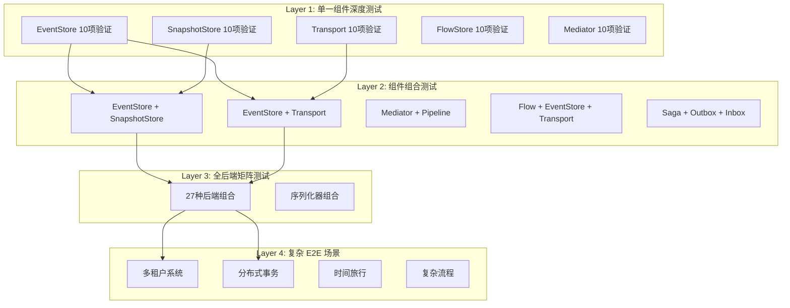

# Design Document: Enhanced Testing for Catga Framework

## Overview

本设计文档定义了 Catga CQRS 框架增强测试的技术方案。在现有 2200+ 测试的基础上，增加 50 个新的测试需求，重点关注：
- 复杂 E2E 场景验证
- 组件组合测试（单一和组合）
- 单一组件深度验证
- 错误处理和恢复
- 性能回归和弹性测试

## Architecture

### 测试架构层次



## Components and Interfaces

### 1. 测试基础设施增强

#### 1.1 组合测试基类

```csharp
public abstract class ComponentCombinationTestBase<TStore1, TStore2>
{
    protected TStore1 Store1 { get; private set; }
    protected TStore2 Store2 { get; private set; }
    
    protected abstract (TStore1, TStore2) CreateStores(IServiceProvider sp);
    
    [SetUp]
    public virtual async Task Setup()
    {
        var services = ConfigureServices();
        var sp = services.BuildServiceProvider();
        (Store1, Store2) = CreateStores(sp);
        await InitializeStores();
    }
}
```


#### 1.2 后端矩阵测试框架

```csharp
public class BackendMatrixTestFramework
{
    public enum BackendType { InMemory, Redis, NATS }
    
    public static IEnumerable<(BackendType eventStore, BackendType transport, BackendType flowStore)> 
        GetAllCombinations()
    {
        var backends = new[] { BackendType.InMemory, BackendType.Redis, BackendType.NATS };
        return from es in backends
               from t in backends
               from fs in backends
               select (es, t, fs);
    }
    
    public static IServiceCollection ConfigureBackends(
        this IServiceCollection services,
        BackendType eventStore,
        BackendType transport,
        BackendType flowStore)
    {
        // Configure based on backend types
        return services;
    }
}
```

#### 1.3 故障注入框架

```csharp
public class FaultInjectionMiddleware
{
    public enum FaultType
    {
        NetworkTimeout,
        ConnectionFailure,
        SerializationError,
        VersionConflict,
        ResourceExhaustion
    }
    
    public void InjectFault(FaultType fault, double probability = 0.1)
    {
        // Inject faults based on configuration
    }
    
    public void ClearFaults()
    {
        // Remove all fault injections
    }
}
```

#### 1.4 性能基准框架

```csharp
public class PerformanceBenchmarkFramework
{
    public class Baseline
    {
        public double ThroughputOpsPerSec { get; set; }
        public double LatencyP99Ms { get; set; }
        public long MemoryUsageBytes { get; set; }
        public TimeSpan StartupTime { get; set; }
    }
    
    public async Task<Baseline> MeasureBaseline()
    {
        // Measure current performance
    }
    
    public void AssertNoRegression(Baseline current, Baseline baseline, double tolerance = 0.1)
    {
        // Assert performance hasn't regressed
    }
}
```

## Data Models

### 测试场景数据模型

```csharp
// 多租户测试数据
public record TenantContext(
    string TenantId,
    string TenantName,
    Dictionary<string, object> Configuration,
    QuotaLimits Limits
);

public record QuotaLimits(
    int MaxOrders,
    int MaxEventsPerSecond,
    long MaxStorageBytes
);

// 分布式事务测试数据
public record SagaStep(
    string StepId,
    string StepName,
    Func<Task<StepResult>> Execute,
    Func<Task> Compensate,
    TimeSpan Timeout
);

public record StepResult(
    bool Success,
    object Data,
    Exception Error
);

// 时间旅行测试数据
public record TimeTravelQuery(
    string AggregateId,
    DateTime Timestamp,
    int? Version
);

// 性能测试数据
public record PerformanceMetrics(
    double ThroughputOpsPerSec,
    LatencyPercentiles Latency,
    ResourceUsage Resources,
    DateTime MeasuredAt
);

public record LatencyPercentiles(
    double P50Ms,
    double P95Ms,
    double P99Ms,
    double P999Ms
);

public record ResourceUsage(
    long MemoryBytes,
    double CpuPercent,
    int ThreadCount,
    int ConnectionCount
);
```

## Correctness Properties

*A property is a characteristic or behavior that should hold true across all valid executions of a system—essentially, a formal statement about what the system should do.*

### Property 1: 组件组合一致性

*For any* valid combination of EventStore and SnapshotStore backends, loading an aggregate SHALL produce identical results regardless of backend choice.

**Validates: Requirements 31**

```csharp
[Property]
public Property ComponentCombination_EventStoreSnapshotStore_ConsistentResults()
{
    return Prop.ForAll(
        AggregateGenerators.AggregateWithEventsAndSnapshot(),
        BackendGenerators.BackendPair(),
        async (aggregate, backends) =>
        {
            var (es1, ss1) = CreateStores(backends.Item1, backends.Item2);
            var (es2, ss2) = CreateStores(backends.Item1, backends.Item2);
            
            // Save to both combinations
            await SaveAggregate(es1, ss1, aggregate);
            await SaveAggregate(es2, ss2, aggregate);
            
            // Load from both
            var loaded1 = await LoadAggregate(es1, ss1, aggregate.Id);
            var loaded2 = await LoadAggregate(es2, ss2, aggregate.Id);
            
            return AggregateEquals(loaded1, loaded2);
        });
}
```

### Property 2: 全后端矩阵一致性

*For any* operation performed on all 27 backend combinations, the results SHALL be functionally equivalent.

**Validates: Requirements 38**

```csharp
[Property]
public Property BackendMatrix_AllCombinations_FunctionallyEquivalent()
{
    return Prop.ForAll(
        OperationGenerators.RandomOperation(),
        async (operation) =>
        {
            var results = new List<OperationResult>();
            
            foreach (var combo in BackendMatrixTestFramework.GetAllCombinations())
            {
                var services = new ServiceCollection()
                    .ConfigureBackends(combo.eventStore, combo.transport, combo.flowStore);
                var sp = services.BuildServiceProvider();
                
                var result = await ExecuteOperation(sp, operation);
                results.Add(result);
            }
            
            return results.All(r => r.IsEquivalentTo(results[0]));
        });
}
```

### Property 3: 故障注入下的数据一致性

*For any* operation with random fault injection (10% failure rate), the system SHALL maintain data consistency.

**Validates: Requirements 16**

```csharp
[Property]
public Property FaultInjection_RandomFailures_MaintainsConsistency()
{
    return Prop.ForAll(
        OperationGenerators.RandomOperation(),
        Gen.Choose(1, 100).ToArbitrary(),
        async (operation, seed) =>
        {
            var faultInjector = new FaultInjectionMiddleware();
            faultInjector.InjectFault(FaultType.NetworkTimeout, 0.1);
            
            try
            {
                await ExecuteOperation(operation);
                var isConsistent = await VerifyConsistency();
                return isConsistent;
            }
            finally
            {
                faultInjector.ClearFaults();
            }
        });
}
```

### Property 4: 性能无回归

*For any* operation, the current performance SHALL NOT regress more than 10% from baseline.

**Validates: Requirements 11, 12, 13**

```csharp
[Property]
public Property Performance_NoRegression_Within10Percent()
{
    return Prop.ForAll(
        OperationGenerators.RandomOperation(),
        async (operation) =>
        {
            var baseline = await LoadBaseline();
            var current = await MeasurePerformance(operation);
            
            var throughputRatio = current.ThroughputOpsPerSec / baseline.ThroughputOpsPerSec;
            var latencyRatio = current.Latency.P99Ms / baseline.Latency.P99Ms;
            var memoryRatio = (double)current.Resources.MemoryBytes / baseline.Resources.MemoryBytes;
            
            return throughputRatio >= 0.9 &&
                   latencyRatio <= 1.1 &&
                   memoryRatio <= 1.1;
        });
}
```

### Property 5: 多租户数据隔离

*For any* two tenants performing operations concurrently, tenant A's data SHALL NOT be visible to tenant B.

**Validates: Requirements 1**

```csharp
[Property]
public Property MultiTenant_DataIsolation_NoLeakage()
{
    return Prop.ForAll(
        TenantGenerators.TenantPair(),
        OperationGenerators.TenantOperation(),
        async (tenants, operation) =>
        {
            // Execute operations for both tenants
            await ExecuteForTenant(tenants.TenantA, operation);
            await ExecuteForTenant(tenants.TenantB, operation);
            
            // Query tenant A's data
            var tenantAData = await QueryTenantData(tenants.TenantA.TenantId);
            
            // Verify no tenant B data is visible
            return !tenantAData.Any(d => d.TenantId == tenants.TenantB.TenantId);
        });
}
```

### Property 6: Saga 补偿顺序

*For any* saga with N steps, when step M fails, compensation SHALL execute for steps M-1 down to 1 in reverse order.

**Validates: Requirements 2**

```csharp
[Property]
public Property Saga_Compensation_ReverseOrder()
{
    return Prop.ForAll(
        SagaGenerators.SagaWithSteps(5, 10),
        Gen.Choose(2, 10).ToArbitrary(),
        async (saga, failAtStep) =>
        {
            var executionLog = new List<string>();
            
            // Execute saga with failure at specific step
            await ExecuteSagaWithFailure(saga, failAtStep, executionLog);
            
            // Verify compensation order
            var compensationSteps = executionLog
                .Where(log => log.StartsWith("Compensate:"))
                .Select(log => int.Parse(log.Split(':')[1]))
                .ToList();
            
            var expectedOrder = Enumerable.Range(1, failAtStep - 1).Reverse().ToList();
            return compensationSteps.SequenceEqual(expectedOrder);
        });
}
```

### Property 7: 时间旅行查询一致性

*For any* aggregate and timestamp T, querying state at T SHALL return the same result regardless of when the query is executed.

**Validates: Requirements 3**

```csharp
[Property]
public Property TimeTravel_Query_ConsistentResults()
{
    return Prop.ForAll(
        AggregateGenerators.AggregateWithHistory(),
        TimestampGenerators.PastTimestamp(),
        async (aggregate, timestamp) =>
        {
            // Query at timestamp T immediately
            var result1 = await QueryAggregateAtTime(aggregate.Id, timestamp);
            
            // Wait and query again
            await Task.Delay(100);
            var result2 = await QueryAggregateAtTime(aggregate.Id, timestamp);
            
            return AggregateEquals(result1, result2);
        });
}
```

### Property 8: 读写分离最终一致性

*For any* command that updates an aggregate, all read models SHALL eventually reflect the update within a bounded time.

**Validates: Requirements 5**

```csharp
[Property]
public Property ReadWriteSeparation_EventualConsistency_BoundedTime()
{
    return Prop.ForAll(
        CommandGenerators.UpdateCommand(),
        async (command) =>
        {
            // Execute command
            await ExecuteCommand(command);
            
            // Wait for eventual consistency (max 5 seconds)
            var deadline = DateTime.UtcNow.AddSeconds(5);
            while (DateTime.UtcNow < deadline)
            {
                var readModels = await QueryAllReadModels(command.AggregateId);
                if (readModels.All(rm => rm.Version >= command.ExpectedVersion + 1))
                    return true;
                
                await Task.Delay(100);
            }
            
            return false; // Timeout
        });
}
```

### Property 9: 网络故障恢复无数据丢失

*For any* operation that experiences network failure, the system SHALL retry and complete without data loss.

**Validates: Requirements 6**

```csharp
[Property]
public Property NetworkFailure_Recovery_NoDataLoss()
{
    return Prop.ForAll(
        OperationGenerators.WriteOperation(),
        async (operation) =>
        {
            var faultInjector = new FaultInjectionMiddleware();
            faultInjector.InjectFault(FaultType.NetworkTimeout, 0.5); // 50% failure
            
            try
            {
                await ExecuteWithRetry(operation);
                
                // Verify data was persisted
                var persisted = await VerifyDataPersisted(operation.Id);
                return persisted;
            }
            finally
            {
                faultInjector.ClearFaults();
            }
        });
}
```

### Property 10: 长时间运行稳定性

*For any* system running for 24 hours under load, memory usage SHALL remain stable (no leaks).

**Validates: Requirements 19**

```csharp
[Fact] // Not a property test due to time constraint
public async Task LongRunning_24Hours_StableMemory()
{
    var baseline = GC.GetTotalMemory(true);
    var measurements = new List<long>();
    
    var cts = new CancellationTokenSource(TimeSpan.FromHours(24));
    
    while (!cts.Token.IsCancellationRequested)
    {
        // Execute operations
        await ExecuteRandomOperations(100);
        
        // Measure memory every 5 minutes
        await Task.Delay(TimeSpan.FromMinutes(5), cts.Token);
        GC.Collect();
        measurements.Add(GC.GetTotalMemory(false));
    }
    
    // Verify no significant memory growth
    var growth = measurements.Last() - baseline;
    var growthPercent = (double)growth / baseline;
    
    Assert.True(growthPercent < 0.2, $"Memory grew by {growthPercent:P}");
}
```

## Error Handling

### 错误分类和处理策略

```csharp
public enum ErrorCategory
{
    Transient,      // Retry automatically
    Permanent,      // Fail fast
    Degraded,       // Continue with reduced functionality
    Critical        // Shutdown gracefully
}

public class ErrorHandler
{
    public async Task<T> HandleError<T>(
        Func<Task<T>> operation,
        ErrorCategory category,
        int maxRetries = 3)
    {
        switch (category)
        {
            case ErrorCategory.Transient:
                return await RetryWithBackoff(operation, maxRetries);
            
            case ErrorCategory.Permanent:
                return await operation(); // Let exception propagate
            
            case ErrorCategory.Degraded:
                return await FallbackOperation(operation);
            
            case ErrorCategory.Critical:
                await ShutdownGracefully();
                throw new CriticalErrorException();
            
            default:
                throw new ArgumentException($"Unknown category: {category}");
        }
    }
}
```

## Testing Strategy

### 测试执行策略

#### 1. 单一组件深度测试
- 每个组件 10 项深度验证
- 覆盖所有边界条件
- 性能基准测试
- 并发安全测试

#### 2. 组件组合测试
- 两两组合测试
- 三组件组合测试
- 全链路组合测试
- 跨后端组合测试

#### 3. 后端矩阵测试
- 27 种后端组合 (3^3)
- 每种组合运行核心测试套件
- 验证功能等价性
- 性能对比分析

#### 4. E2E 场景测试
- 多租户系统
- 分布式事务
- 时间旅行查询
- 复杂流程编排
- 读写分离

#### 5. 弹性测试
- 故障注入测试
- 混沌工程测试
- 灾难恢复测试
- 长时间运行测试

### 测试分类标签

```csharp
[Trait("Category", "ComponentDepth")]
[Trait("Category", "ComponentCombination")]
[Trait("Category", "BackendMatrix")]
[Trait("Category", "ComplexE2E")]
[Trait("Category", "Resilience")]
[Trait("Category", "PerformanceRegression")]
[Trait("Component", "EventStore")]
[Trait("Component", "SnapshotStore")]
[Trait("Component", "Transport")]
[Trait("Combination", "EventStore+SnapshotStore")]
[Trait("Combination", "EventStore+Transport")]
[Trait("Backend", "InMemory+Redis+NATS")]
```

### 测试执行顺序

1. **单一组件深度测试** (并行执行)
   - EventStore 深度测试
   - SnapshotStore 深度测试
   - Transport 深度测试
   - FlowStore 深度测试
   - 其他组件深度测试

2. **组件组合测试** (串行执行)
   - 两组件组合
   - 三组件组合
   - 全链路组合

3. **后端矩阵测试** (并行执行，每个组合独立)
   - 27 种组合并行测试

4. **复杂 E2E 测试** (串行执行)
   - 多租户场景
   - 分布式事务
   - 时间旅行
   - 复杂流程

5. **弹性测试** (串行执行)
   - 故障注入
   - 混沌工程
   - 长时间运行

### CI/CD 集成

```yaml
test-enhanced:
  strategy:
    matrix:
      test-category:
        - ComponentDepth
        - ComponentCombination
        - BackendMatrix
        - ComplexE2E
        - Resilience
  steps:
    - name: Run ${{ matrix.test-category }} Tests
      run: dotnet test --filter "Category=${{ matrix.test-category }}"
      timeout-minutes: 60
    
    - name: Upload Results
      uses: actions/upload-artifact@v3
      with:
        name: test-results-${{ matrix.test-category }}
        path: TestResults/
```

### 性能基准管理

```csharp
public class PerformanceBaselineManager
{
    private const string BaselineFile = "performance-baseline.json";
    
    public async Task SaveBaseline(PerformanceMetrics metrics)
    {
        var json = JsonSerializer.Serialize(metrics);
        await File.WriteAllTextAsync(BaselineFile, json);
    }
    
    public async Task<PerformanceMetrics> LoadBaseline()
    {
        if (!File.Exists(BaselineFile))
            throw new FileNotFoundException("Baseline not found. Run baseline tests first.");
        
        var json = await File.ReadAllTextAsync(BaselineFile);
        return JsonSerializer.Deserialize<PerformanceMetrics>(json);
    }
    
    public void CompareAndAlert(PerformanceMetrics current, PerformanceMetrics baseline)
    {
        var regressions = new List<string>();
        
        if (current.ThroughputOpsPerSec < baseline.ThroughputOpsPerSec * 0.9)
            regressions.Add($"Throughput regressed: {current.ThroughputOpsPerSec} < {baseline.ThroughputOpsPerSec * 0.9}");
        
        if (current.Latency.P99Ms > baseline.Latency.P99Ms * 1.1)
            regressions.Add($"Latency regressed: {current.Latency.P99Ms} > {baseline.Latency.P99Ms * 1.1}");
        
        if (regressions.Any())
            throw new PerformanceRegressionException(string.Join("; ", regressions));
    }
}
```
