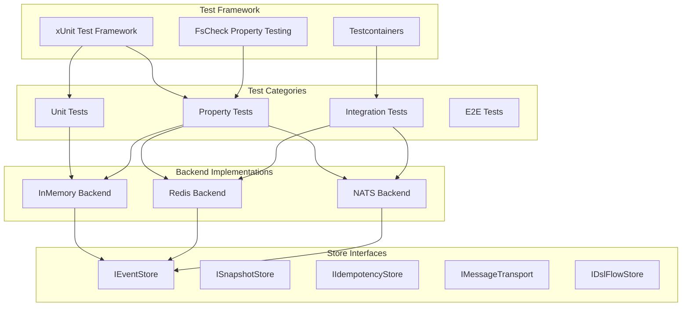
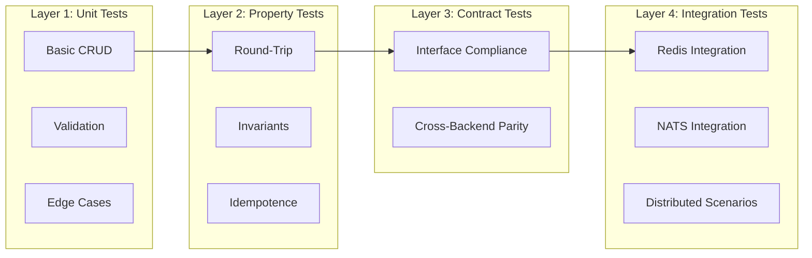

# Design Document: TDD Validation for Catga Framework

## Overview

本设计文档定义了对 Catga CQRS 框架进行全面 TDD 验证测试的技术方案。采用属性测试（Property-Based Testing）和单元测试相结合的方式，对 InMemory、Redis、NATS 三种后端的所有组件进行系统性验证。

## Architecture

### 测试架构



### 测试分层策略



## Components and Interfaces

### 1. 测试基础设施

#### 1.1 TestContainers 配置

```csharp
public class RedisContainerFixture : IAsyncLifetime
{
    public RedisContainer Container { get; private set; }
    public string ConnectionString => Container.GetConnectionString();
    
    public async Task InitializeAsync()
    {
        Container = new RedisBuilder()
            .WithImage("redis:7-alpine")
            .Build();
        await Container.StartAsync();
    }
    
    public async Task DisposeAsync() => await Container.DisposeAsync();
}

public class NatsContainerFixture : IAsyncLifetime
{
    public NatsContainer Container { get; private set; }
    public string ConnectionString => Container.GetConnectionString();
    
    public async Task InitializeAsync()
    {
        Container = new NatsBuilder()
            .WithImage("nats:2.10-alpine")
            .WithCommand("-js") // Enable JetStream
            .Build();
        await Container.StartAsync();
    }
    
    public async Task DisposeAsync() => await Container.DisposeAsync();
}
```

#### 1.2 通用测试基类

```csharp
public abstract class StoreTestBase<TStore> where TStore : class
{
    protected TStore Store { get; private set; }
    protected IServiceProvider ServiceProvider { get; private set; }
    
    protected abstract TStore CreateStore(IServiceProvider sp);
    protected abstract void ConfigureServices(IServiceCollection services);
    
    [SetUp]
    public virtual void Setup()
    {
        var services = new ServiceCollection();
        ConfigureServices(services);
        ServiceProvider = services.BuildServiceProvider();
        Store = CreateStore(ServiceProvider);
    }
    
    [TearDown]
    public virtual void TearDown()
    {
        (ServiceProvider as IDisposable)?.Dispose();
    }
}
```

### 2. 属性测试生成器

#### 2.1 事件生成器

```csharp
public static class EventGenerators
{
    public static Arbitrary<StoredEvent> StoredEventArbitrary()
    {
        return Gen.zip3(
            Arb.Generate<Guid>(),
            Arb.Generate<NonEmptyString>(),
            Gen.Choose(1, 1000)
        ).Select(t => new StoredEvent
        {
            EventId = t.Item1,
            EventType = t.Item2.Get,
            Version = t.Item3,
            Data = GenerateRandomPayload(),
            Timestamp = DateTime.UtcNow
        }).ToArbitrary();
    }
    
    public static Arbitrary<List<StoredEvent>> EventSequenceArbitrary()
    {
        return Gen.ListOf(StoredEventArbitrary().Generator)
            .Where(list => list.Count > 0 && list.Count <= 100)
            .Select(list => AssignSequentialVersions(list))
            .ToArbitrary();
    }
    
    private static List<StoredEvent> AssignSequentialVersions(List<StoredEvent> events)
    {
        for (int i = 0; i < events.Count; i++)
            events[i].Version = i + 1;
        return events;
    }
}
```

#### 2.2 快照生成器

```csharp
public static class SnapshotGenerators
{
    public static Arbitrary<SnapshotData> SnapshotArbitrary()
    {
        return Gen.zip3(
            Arb.Generate<Guid>(),
            Gen.Choose(1, 10000),
            Gen.ArrayOf(Arb.Generate<byte>().Generator)
        ).Select(t => new SnapshotData
        {
            AggregateId = t.Item1,
            Version = t.Item2,
            Data = t.Item3,
            Timestamp = DateTime.UtcNow
        }).ToArbitrary();
    }
}
```

#### 2.3 消息生成器

```csharp
public static class MessageGenerators
{
    public static Arbitrary<TestMessage> MessageArbitrary()
    {
        return Gen.zip(
            Arb.Generate<Guid>(),
            Arb.Generate<NonEmptyString>()
        ).Select(t => new TestMessage
        {
            Id = t.Item1,
            Content = t.Item2.Get,
            Timestamp = DateTime.UtcNow
        }).ToArbitrary();
    }
}
```

### 3. 契约测试接口

#### 3.1 EventStore 契约

```csharp
public interface IEventStoreContract
{
    // Round-trip property
    Task AppendThenRead_ReturnsIdenticalEvents(string streamId, List<StoredEvent> events);
    
    // Version invariant
    Task Version_EqualsEventCount(string streamId, List<StoredEvent> events);
    
    // Concurrency property
    Task ConcurrentAppends_NoEventsLost(string streamId, List<List<StoredEvent>> eventBatches);
    
    // Ordering property
    Task Events_ReturnedInAppendOrder(string streamId, List<StoredEvent> events);
}
```

#### 3.2 SnapshotStore 契约

```csharp
public interface ISnapshotStoreContract
{
    // Round-trip property
    Task SaveThenLoad_ReturnsIdenticalSnapshot(SnapshotData snapshot);
    
    // Latest version property
    Task OnlyLatestSnapshot_IsRetrievable(string aggregateId, List<SnapshotData> snapshots);
}
```

#### 3.3 Transport 契约

```csharp
public interface ITransportContract
{
    // Delivery property
    Task AllSubscribers_ReceivePublishedMessages(string topic, TestMessage message, int subscriberCount);
    
    // Ordering property
    Task Messages_DeliveredInOrder(string topic, List<TestMessage> messages);
    
    // Request-response property
    Task Response_MatchesRequestCorrelation(TestMessage request);
}
```

## Data Models

### 测试数据模型

```csharp
// 测试事件
public record TestEvent(
    Guid EventId,
    string EventType,
    long Version,
    byte[] Data,
    DateTime Timestamp,
    Dictionary<string, string> Metadata
);

// 测试快照
public record TestSnapshot(
    Guid AggregateId,
    long Version,
    byte[] State,
    DateTime Timestamp
);

// 测试消息
public record TestMessage(
    Guid Id,
    string Content,
    DateTime Timestamp,
    string CorrelationId
);

// 测试流程状态
public record TestFlowState(
    string FlowId,
    string FlowType,
    string Status,
    Dictionary<string, object> Data,
    int CurrentStep,
    DateTime CreatedAt,
    DateTime UpdatedAt
);

// 测试结果
public record TestResult(
    bool Success,
    string Message,
    TimeSpan Duration,
    Exception Exception
);
```

## Correctness Properties

*A property is a characteristic or behavior that should hold true across all valid executions of a system—essentially, a formal statement about what the system should do. Properties serve as the bridge between human-readable specifications and machine-verifiable correctness guarantees.*

### Property 1: EventStore Round-Trip Consistency

*For any* valid event sequence and stream ID, appending events to the EventStore then reading them back SHALL return events with identical EventId, EventType, Version, Data, and Timestamp.

**Validates: Requirements 1.17, 7.18, 13.15, 18.1**

```csharp
[Property]
public Property EventStore_RoundTrip_PreservesAllData()
{
    return Prop.ForAll(
        EventGenerators.EventSequenceArbitrary(),
        Arb.Generate<NonEmptyString>().ToArbitrary(),
        async (events, streamId) =>
        {
            await Store.AppendAsync(streamId.Get, events, ExpectedVersion.Any);
            var loaded = await Store.ReadAsync(streamId.Get);
            
            return events.SequenceEqual(loaded, new StoredEventComparer());
        });
}
```

### Property 2: EventStore Version Invariant

*For any* stream with N appended events, the stream version SHALL equal N.

**Validates: Requirements 1.18, 7.6, 13.9**

```csharp
[Property]
public Property EventStore_Version_EqualsEventCount()
{
    return Prop.ForAll(
        EventGenerators.EventSequenceArbitrary(),
        Arb.Generate<NonEmptyString>().ToArbitrary(),
        async (events, streamId) =>
        {
            await Store.AppendAsync(streamId.Get, events, ExpectedVersion.Any);
            var version = await Store.GetVersionAsync(streamId.Get);
            
            return version == events.Count;
        });
}
```

### Property 3: EventStore Ordering Guarantee

*For any* sequence of events appended to a stream, reading the stream SHALL return events in the exact order they were appended.

**Validates: Requirements 1.2, 7.2, 13.2**

```csharp
[Property]
public Property EventStore_Read_PreservesAppendOrder()
{
    return Prop.ForAll(
        EventGenerators.EventSequenceArbitrary(),
        Arb.Generate<NonEmptyString>().ToArbitrary(),
        async (events, streamId) =>
        {
            await Store.AppendAsync(streamId.Get, events, ExpectedVersion.Any);
            var loaded = await Store.ReadAsync(streamId.Get);
            
            return events.Select(e => e.EventId)
                .SequenceEqual(loaded.Select(e => e.EventId));
        });
}
```

### Property 4: EventStore Concurrent Safety

*For any* set of concurrent append operations to the same stream, no events SHALL be lost and the final version SHALL equal the total number of events appended.

**Validates: Requirements 1.19, 7.19, 24.2**

```csharp
[Property]
public Property EventStore_ConcurrentAppends_NoDataLoss()
{
    return Prop.ForAll(
        Gen.ListOf(EventGenerators.EventSequenceArbitrary().Generator)
            .Where(l => l.Count >= 2 && l.Count <= 10)
            .ToArbitrary(),
        Arb.Generate<NonEmptyString>().ToArbitrary(),
        async (eventBatches, streamId) =>
        {
            var tasks = eventBatches.Select(batch => 
                Store.AppendAsync(streamId.Get, batch, ExpectedVersion.Any));
            
            await Task.WhenAll(tasks);
            
            var loaded = await Store.ReadAsync(streamId.Get);
            var totalExpected = eventBatches.Sum(b => b.Count);
            
            return loaded.Count == totalExpected;
        });
}
```

### Property 5: SnapshotStore Round-Trip Consistency

*For any* valid snapshot, saving then loading SHALL return a snapshot with identical AggregateId, Version, and Data.

**Validates: Requirements 2.13, 8.11, 14.11, 19.1**

```csharp
[Property]
public Property SnapshotStore_RoundTrip_PreservesAllData()
{
    return Prop.ForAll(
        SnapshotGenerators.SnapshotArbitrary(),
        async (snapshot) =>
        {
            await Store.SaveAsync(snapshot);
            var loaded = await Store.LoadAsync(snapshot.AggregateId);
            
            return loaded != null &&
                   loaded.AggregateId == snapshot.AggregateId &&
                   loaded.Version == snapshot.Version &&
                   loaded.Data.SequenceEqual(snapshot.Data);
        });
}
```

### Property 6: SnapshotStore Latest Version Only

*For any* aggregate with multiple snapshots saved at different versions, loading SHALL return only the snapshot with the highest version.

**Validates: Requirements 2.14, 8.4**

```csharp
[Property]
public Property SnapshotStore_Load_ReturnsLatestVersion()
{
    return Prop.ForAll(
        Gen.ListOf(SnapshotGenerators.SnapshotArbitrary().Generator)
            .Where(l => l.Count >= 2)
            .Select(l => l.Select((s, i) => s with { Version = i + 1 }).ToList())
            .ToArbitrary(),
        async (snapshots) =>
        {
            var aggregateId = Guid.NewGuid();
            foreach (var snapshot in snapshots)
            {
                await Store.SaveAsync(snapshot with { AggregateId = aggregateId });
            }
            
            var loaded = await Store.LoadAsync(aggregateId);
            var maxVersion = snapshots.Max(s => s.Version);
            
            return loaded?.Version == maxVersion;
        });
}
```

### Property 7: IdempotencyStore Exactly-Once Semantics

*For any* message ID, marking as processed then checking SHALL return true, and concurrent mark operations SHALL result in exactly one successful mark.

**Validates: Requirements 3.12, 3.13, 9.9**

```csharp
[Property]
public Property IdempotencyStore_MarkThenCheck_ReturnsTrue()
{
    return Prop.ForAll(
        Arb.Generate<Guid>().ToArbitrary(),
        async (messageId) =>
        {
            await Store.MarkAsProcessedAsync(messageId.ToString());
            var isProcessed = await Store.IsProcessedAsync(messageId.ToString());
            
            return isProcessed;
        });
}

[Property]
public Property IdempotencyStore_ConcurrentMarks_ExactlyOnce()
{
    return Prop.ForAll(
        Arb.Generate<Guid>().ToArbitrary(),
        Gen.Choose(2, 10).ToArbitrary(),
        async (messageId, concurrency) =>
        {
            var results = await Task.WhenAll(
                Enumerable.Range(0, concurrency)
                    .Select(_ => Store.TryMarkAsProcessedAsync(messageId.ToString())));
            
            return results.Count(r => r) == 1; // Exactly one success
        });
}
```

### Property 8: Transport Delivery Guarantee

*For any* published message and set of active subscribers, all subscribers SHALL receive the message.

**Validates: Requirements 4.17, 10.10, 15.13, 20.1**

```csharp
[Property]
public Property Transport_Publish_AllSubscribersReceive()
{
    return Prop.ForAll(
        MessageGenerators.MessageArbitrary(),
        Gen.Choose(1, 10).ToArbitrary(),
        async (message, subscriberCount) =>
        {
            var received = new ConcurrentBag<TestMessage>();
            var subscriptions = Enumerable.Range(0, subscriberCount)
                .Select(_ => Transport.SubscribeAsync<TestMessage>("test-topic", 
                    msg => { received.Add(msg); return Task.CompletedTask; }))
                .ToList();
            
            await Task.WhenAll(subscriptions);
            await Transport.PublishAsync("test-topic", message);
            await Task.Delay(100); // Allow delivery
            
            return received.Count == subscriberCount &&
                   received.All(m => m.Id == message.Id);
        });
}
```

### Property 9: Transport Message Ordering

*For any* sequence of messages published to a topic, subscribers SHALL receive messages in the same order they were published.

**Validates: Requirements 4.9, 4.10, 20.3**

```csharp
[Property]
public Property Transport_Messages_DeliveredInOrder()
{
    return Prop.ForAll(
        Gen.ListOf(MessageGenerators.MessageArbitrary().Generator)
            .Where(l => l.Count >= 2 && l.Count <= 20)
            .ToArbitrary(),
        async (messages) =>
        {
            var received = new List<TestMessage>();
            await Transport.SubscribeAsync<TestMessage>("test-topic",
                msg => { received.Add(msg); return Task.CompletedTask; });
            
            foreach (var msg in messages)
                await Transport.PublishAsync("test-topic", msg);
            
            await Task.Delay(100);
            
            return messages.Select(m => m.Id)
                .SequenceEqual(received.Select(m => m.Id));
        });
}
```

### Property 10: FlowStore State Persistence

*For any* valid flow state, saving then loading SHALL return a state with identical FlowId, FlowType, Status, Data, and CurrentStep.

**Validates: Requirements 5.16, 11.11, 16.11, 21.1**

```csharp
[Property]
public Property FlowStore_RoundTrip_PreservesState()
{
    return Prop.ForAll(
        FlowStateGenerators.FlowStateArbitrary(),
        async (flowState) =>
        {
            await Store.SaveAsync(flowState);
            var loaded = await Store.LoadAsync(flowState.FlowId);
            
            return loaded != null &&
                   loaded.FlowId == flowState.FlowId &&
                   loaded.FlowType == flowState.FlowType &&
                   loaded.Status == flowState.Status &&
                   loaded.CurrentStep == flowState.CurrentStep;
        });
}
```

### Property 11: FlowStore Checkpoint Consistency

*For any* flow with checkpoints, restoring from a checkpoint SHALL produce a state consistent with the checkpoint version.

**Validates: Requirements 5.17, 11.10, 16.10, 21.2**

```csharp
[Property]
public Property FlowStore_Checkpoint_RestoresConsistentState()
{
    return Prop.ForAll(
        FlowStateGenerators.FlowStateArbitrary(),
        Gen.Choose(1, 10).ToArbitrary(),
        async (flowState, checkpointStep) =>
        {
            // Save initial state
            await Store.SaveAsync(flowState);
            
            // Create checkpoint
            var checkpoint = await Store.CreateCheckpointAsync(flowState.FlowId);
            
            // Modify state
            var modifiedState = flowState with { CurrentStep = checkpointStep + 5 };
            await Store.SaveAsync(modifiedState);
            
            // Restore from checkpoint
            await Store.RestoreFromCheckpointAsync(flowState.FlowId, checkpoint.Id);
            var restored = await Store.LoadAsync(flowState.FlowId);
            
            return restored?.CurrentStep == flowState.CurrentStep;
        });
}
```

### Property 12: Serialization Round-Trip

*For any* valid object, serializing then deserializing SHALL produce an object equal to the original.

**Validates: Requirements 25.1, 25.2, 25.4, 25.6**

```csharp
[Property]
public Property Serialization_RoundTrip_PreservesData()
{
    return Prop.ForAll(
        EventGenerators.StoredEventArbitrary(),
        (event) =>
        {
            var json = JsonSerializer.Serialize(event);
            var deserialized = JsonSerializer.Deserialize<StoredEvent>(json);
            
            return event.EventId == deserialized.EventId &&
                   event.EventType == deserialized.EventType &&
                   event.Version == deserialized.Version &&
                   event.Data.SequenceEqual(deserialized.Data);
        });
}
```

### Property 13: Cross-Backend Consistency

*For any* operation performed on InMemory, Redis, and NATS backends with identical inputs, the results SHALL be identical.

**Validates: Requirements 18.1-18.6, 19.1-19.3, 20.1-20.3, 21.1-21.3**

```csharp
[Property]
public Property CrossBackend_EventStore_IdenticalBehavior()
{
    return Prop.ForAll(
        EventGenerators.EventSequenceArbitrary(),
        Arb.Generate<NonEmptyString>().ToArbitrary(),
        async (events, streamId) =>
        {
            // Execute on all backends
            var inMemoryResult = await ExecuteOnInMemory(events, streamId.Get);
            var redisResult = await ExecuteOnRedis(events, streamId.Get);
            var natsResult = await ExecuteOnNats(events, streamId.Get);
            
            // Compare results
            return inMemoryResult.SequenceEqual(redisResult) &&
                   redisResult.SequenceEqual(natsResult);
        });
}
```

### Property 14: Null Input Validation

*For any* public API method with required parameters, passing null SHALL throw ArgumentNullException.

**Validates: Requirements 22.1, 22.3**

```csharp
[Property]
public Property AllStores_NullInput_ThrowsArgumentNullException()
{
    return Prop.ForAll(
        Gen.Elements(typeof(IEventStore), typeof(ISnapshotStore), typeof(IIdempotencyStore))
            .ToArbitrary(),
        async (storeType) =>
        {
            var store = CreateStore(storeType);
            var methods = storeType.GetMethods()
                .Where(m => m.GetParameters().Any(p => !p.ParameterType.IsValueType));
            
            foreach (var method in methods)
            {
                try
                {
                    await InvokeWithNullArgs(store, method);
                    return false; // Should have thrown
                }
                catch (ArgumentNullException)
                {
                    // Expected
                }
            }
            return true;
        });
}
```

## Error Handling

### 错误处理策略

```csharp
public class StoreErrorHandler
{
    public async Task<T> ExecuteWithRetryAsync<T>(
        Func<Task<T>> operation,
        int maxRetries = 3,
        TimeSpan? delay = null)
    {
        var retryDelay = delay ?? TimeSpan.FromMilliseconds(100);
        
        for (int i = 0; i < maxRetries; i++)
        {
            try
            {
                return await operation();
            }
            catch (Exception ex) when (IsTransient(ex) && i < maxRetries - 1)
            {
                await Task.Delay(retryDelay * (i + 1));
            }
        }
        
        return await operation(); // Final attempt, let exception propagate
    }
    
    private bool IsTransient(Exception ex)
    {
        return ex is TimeoutException ||
               ex is OperationCanceledException ||
               ex.Message.Contains("connection") ||
               ex.Message.Contains("timeout");
    }
}
```

### 异常类型

```csharp
// 并发冲突异常
public class ConcurrencyException : CatgaException
{
    public string StreamId { get; }
    public long ExpectedVersion { get; }
    public long ActualVersion { get; }
}

// 连接异常
public class ConnectionException : CatgaException
{
    public string Backend { get; }
    public string ConnectionString { get; }
}

// 序列化异常
public class SerializationException : CatgaException
{
    public Type TargetType { get; }
    public byte[] Data { get; }
}
```

## Testing Strategy

### 测试框架配置

- **xUnit**: 主测试框架
- **FsCheck.Xunit**: 属性测试集成
- **Testcontainers**: Redis/NATS 容器管理
- **FluentAssertions**: 断言库
- **Moq**: Mock 框架

### 测试分类

```csharp
// 测试分类特性
[Trait("Category", "Unit")]
[Trait("Category", "Property")]
[Trait("Category", "Integration")]
[Trait("Category", "E2E")]
[Trait("Backend", "InMemory")]
[Trait("Backend", "Redis")]
[Trait("Backend", "NATS")]
```

### 属性测试配置

```csharp
public class PropertyTestConfig
{
    public static Configuration Default => new Configuration
    {
        MaxNbOfTest = 100,        // 每个属性测试运行 100 次
        StartSize = 1,
        EndSize = 100,
        QuietOnSuccess = false,
        Replay = null             // 可设置为失败的种子以重现
    };
}
```

### 测试执行顺序

1. **Unit Tests** - 快速反馈，无外部依赖
2. **Property Tests (InMemory)** - 验证核心逻辑
3. **Property Tests (Redis)** - 需要 Redis 容器
4. **Property Tests (NATS)** - 需要 NATS 容器
5. **Integration Tests** - 跨组件测试
6. **E2E Tests** - 完整流程测试

### 并行执行策略

```csharp
// xunit.runner.json
{
    "parallelizeAssembly": true,
    "parallelizeTestCollections": true,
    "maxParallelThreads": -1
}

// 需要隔离的测试使用 Collection
[Collection("Redis")]
public class RedisEventStoreTests { }

[Collection("NATS")]
public class NatsEventStoreTests { }
```

### CI/CD 集成

```yaml
# GitHub Actions workflow
test:
  runs-on: ubuntu-latest
  services:
    redis:
      image: redis:7-alpine
      ports:
        - 6379:6379
    nats:
      image: nats:2.10-alpine
      ports:
        - 4222:4222
      options: --js
  steps:
    - name: Run Unit Tests
      run: dotnet test --filter "Category=Unit"
    
    - name: Run Property Tests
      run: dotnet test --filter "Category=Property"
    
    - name: Run Integration Tests
      run: dotnet test --filter "Category=Integration"
```


---

## Core Unit Tests (核心单元测试)

### EventStore 核心测试

```csharp
public class EventStoreCoreTests<TStore> where TStore : IEventStore
{
    // 基本 CRUD
    [Fact] public async Task Append_SingleEvent_Succeeds() { }
    [Fact] public async Task Append_MultipleEvents_Succeeds() { }
    [Fact] public async Task Read_ExistingStream_ReturnsEvents() { }
    [Fact] public async Task Read_NonExistentStream_ReturnsEmpty() { }
    [Fact] public async Task Read_FromVersion_ReturnsSubset() { }
    [Fact] public async Task Read_ToVersion_ReturnsSubset() { }
    [Fact] public async Task Read_VersionRange_ReturnsCorrectSubset() { }
    [Fact] public async Task GetVersion_ExistingStream_ReturnsCorrectVersion() { }
    [Fact] public async Task GetVersion_NonExistentStream_ReturnsZero() { }
    [Fact] public async Task Delete_ExistingStream_Succeeds() { }
    [Fact] public async Task Delete_NonExistentStream_NoError() { }
    
    // 版本控制
    [Fact] public async Task Append_ExpectedVersionAny_AlwaysSucceeds() { }
    [Fact] public async Task Append_ExpectedVersionNoStream_SucceedsForNewStream() { }
    [Fact] public async Task Append_ExpectedVersionNoStream_FailsForExistingStream() { }
    [Fact] public async Task Append_CorrectExpectedVersion_Succeeds() { }
    [Fact] public async Task Append_WrongExpectedVersion_ThrowsConcurrencyException() { }
    [Fact] public async Task Append_ExpectedVersionStreamExists_SucceedsForExistingStream() { }
    [Fact] public async Task Append_ExpectedVersionStreamExists_FailsForNewStream() { }
    
    // 元数据
    [Fact] public async Task Append_WithMetadata_PreservesMetadata() { }
    [Fact] public async Task Read_WithMetadata_ReturnsMetadata() { }
    [Fact] public async Task Append_WithCorrelationId_PreservesCorrelationId() { }
    [Fact] public async Task Append_WithCausationId_PreservesCausationId() { }
}
```

### SnapshotStore 核心测试

```csharp
public class SnapshotStoreCoreTests<TStore> where TStore : ISnapshotStore
{
    // 基本 CRUD
    [Fact] public async Task Save_NewSnapshot_Succeeds() { }
    [Fact] public async Task Save_UpdateSnapshot_Succeeds() { }
    [Fact] public async Task Load_ExistingSnapshot_ReturnsSnapshot() { }
    [Fact] public async Task Load_NonExistentSnapshot_ReturnsNull() { }
    [Fact] public async Task Delete_ExistingSnapshot_Succeeds() { }
    [Fact] public async Task Delete_NonExistentSnapshot_NoError() { }
    
    // 版本管理
    [Fact] public async Task Save_HigherVersion_Overwrites() { }
    [Fact] public async Task Save_LowerVersion_Rejected() { }
    [Fact] public async Task Save_SameVersion_Overwrites() { }
    [Fact] public async Task Load_ReturnsLatestVersion() { }
    [Fact] public async Task LoadAtVersion_ReturnsSpecificVersion() { }
    
    // 数据完整性
    [Fact] public async Task Save_LargeData_Succeeds() { }
    [Fact] public async Task Save_ComplexNestedObject_PreservesStructure() { }
    [Fact] public async Task Save_WithTimestamp_PreservesTimestamp() { }
}
```

### Transport 核心测试

```csharp
public class TransportCoreTests<TTransport> where TTransport : IMessageTransport
{
    // 发布/订阅
    [Fact] public async Task Publish_SingleSubscriber_Receives() { }
    [Fact] public async Task Publish_MultipleSubscribers_AllReceive() { }
    [Fact] public async Task Publish_NoSubscribers_NoError() { }
    [Fact] public async Task Subscribe_ReceivesPublishedMessages() { }
    [Fact] public async Task Unsubscribe_StopsReceiving() { }
    [Fact] public async Task Subscribe_WildcardTopic_ReceivesMatching() { }
    
    // 请求/响应
    [Fact] public async Task Request_WithResponder_ReceivesResponse() { }
    [Fact] public async Task Request_NoResponder_TimesOut() { }
    [Fact] public async Task Request_Cancelled_ThrowsOperationCancelled() { }
    [Fact] public async Task Request_MultipleResponders_ReceivesFirst() { }
    
    // 消息属性
    [Fact] public async Task Publish_PreservesMessageId() { }
    [Fact] public async Task Publish_PreservesCorrelationId() { }
    [Fact] public async Task Publish_PreservesHeaders() { }
    [Fact] public async Task Publish_PreservesTimestamp() { }
}
```

### FlowStore 核心测试

```csharp
public class FlowStoreCoreTests<TStore> where TStore : IDslFlowStore
{
    // 基本 CRUD
    [Fact] public async Task Save_NewFlow_Succeeds() { }
    [Fact] public async Task Save_UpdateFlow_Succeeds() { }
    [Fact] public async Task Load_ExistingFlow_ReturnsFlow() { }
    [Fact] public async Task Load_NonExistentFlow_ReturnsNull() { }
    [Fact] public async Task Delete_ExistingFlow_Succeeds() { }
    [Fact] public async Task List_ReturnsAllFlows() { }
    
    // 查询
    [Fact] public async Task Query_ByStatus_ReturnsMatching() { }
    [Fact] public async Task Query_ByType_ReturnsMatching() { }
    [Fact] public async Task Query_ByDateRange_ReturnsMatching() { }
    [Fact] public async Task Query_Combined_ReturnsMatching() { }
    
    // 检查点
    [Fact] public async Task CreateCheckpoint_Succeeds() { }
    [Fact] public async Task RestoreCheckpoint_RestoresState() { }
    [Fact] public async Task ListCheckpoints_ReturnsAll() { }
    [Fact] public async Task DeleteCheckpoint_Succeeds() { }
}
```


---

## Boundary Tests (边界测试)

### 空值和默认值边界测试

```csharp
public class NullAndDefaultBoundaryTests
{
    // EventStore 空值边界
    [Fact] public async Task EventStore_Append_NullStreamId_ThrowsArgumentNull() { }
    [Fact] public async Task EventStore_Append_EmptyStreamId_ThrowsArgumentException() { }
    [Fact] public async Task EventStore_Append_NullEvents_ThrowsArgumentNull() { }
    [Fact] public async Task EventStore_Append_EmptyEventList_NoOp() { }
    [Fact] public async Task EventStore_Read_NullStreamId_ThrowsArgumentNull() { }
    [Fact] public async Task EventStore_Read_EmptyStreamId_ThrowsArgumentException() { }
    
    // SnapshotStore 空值边界
    [Fact] public async Task SnapshotStore_Save_NullAggregateId_ThrowsArgumentNull() { }
    [Fact] public async Task SnapshotStore_Save_NullData_ThrowsArgumentNull() { }
    [Fact] public async Task SnapshotStore_Save_EmptyData_Succeeds() { }
    [Fact] public async Task SnapshotStore_Load_NullAggregateId_ThrowsArgumentNull() { }
    [Fact] public async Task SnapshotStore_Load_DefaultGuid_ReturnsNull() { }
    
    // Transport 空值边界
    [Fact] public async Task Transport_Publish_NullTopic_ThrowsArgumentNull() { }
    [Fact] public async Task Transport_Publish_EmptyTopic_ThrowsArgumentException() { }
    [Fact] public async Task Transport_Publish_NullMessage_ThrowsArgumentNull() { }
    [Fact] public async Task Transport_Subscribe_NullTopic_ThrowsArgumentNull() { }
    [Fact] public async Task Transport_Subscribe_NullHandler_ThrowsArgumentNull() { }
    
    // FlowStore 空值边界
    [Fact] public async Task FlowStore_Save_NullFlowId_ThrowsArgumentNull() { }
    [Fact] public async Task FlowStore_Save_NullState_ThrowsArgumentNull() { }
    [Fact] public async Task FlowStore_Load_NullFlowId_ThrowsArgumentNull() { }
    [Fact] public async Task FlowStore_Load_EmptyFlowId_ThrowsArgumentException() { }
    
    // IdempotencyStore 空值边界
    [Fact] public async Task IdempotencyStore_Mark_NullMessageId_ThrowsArgumentNull() { }
    [Fact] public async Task IdempotencyStore_Mark_EmptyMessageId_ThrowsArgumentException() { }
    [Fact] public async Task IdempotencyStore_Check_NullMessageId_ThrowsArgumentNull() { }
}
```

### 数值边界测试

```csharp
public class NumericBoundaryTests
{
    // 版本号边界
    [Fact] public async Task EventStore_Append_VersionZero_Succeeds() { }
    [Fact] public async Task EventStore_Append_VersionNegative_ThrowsArgumentException() { }
    [Fact] public async Task EventStore_Append_VersionMaxLong_Succeeds() { }
    [Fact] public async Task EventStore_Read_FromVersionZero_ReturnsAll() { }
    [Fact] public async Task EventStore_Read_FromVersionNegative_ThrowsArgumentException() { }
    [Fact] public async Task EventStore_Read_ToVersionMaxLong_ReturnsAll() { }
    
    // 快照版本边界
    [Fact] public async Task SnapshotStore_Save_VersionZero_Succeeds() { }
    [Fact] public async Task SnapshotStore_Save_VersionNegative_ThrowsArgumentException() { }
    [Fact] public async Task SnapshotStore_Save_VersionMaxLong_Succeeds() { }
    
    // 超时边界
    [Fact] public async Task Transport_Request_TimeoutZero_ImmediateTimeout() { }
    [Fact] public async Task Transport_Request_TimeoutNegative_ThrowsArgumentException() { }
    [Fact] public async Task Transport_Request_TimeoutMaxTimeSpan_NoTimeout() { }
    [Fact] public async Task FlowStore_Save_TimeoutZero_ImmediateTimeout() { }
    
    // 计数边界
    [Fact] public async Task EventStore_Read_CountZero_ReturnsEmpty() { }
    [Fact] public async Task EventStore_Read_CountNegative_ThrowsArgumentException() { }
    [Fact] public async Task EventStore_Read_CountMaxInt_ReturnsAll() { }
    [Fact] public async Task FlowStore_Query_PageSizeZero_ThrowsArgumentException() { }
    [Fact] public async Task FlowStore_Query_PageSizeNegative_ThrowsArgumentException() { }
}
```

### 字符串边界测试

```csharp
public class StringBoundaryTests
{
    // 空白字符串
    [Fact] public async Task EventStore_Append_WhitespaceStreamId_ThrowsArgumentException() { }
    [Fact] public async Task Transport_Publish_WhitespaceTopic_ThrowsArgumentException() { }
    [Fact] public async Task FlowStore_Save_WhitespaceFlowId_ThrowsArgumentException() { }
    
    // 超长字符串
    [Fact] public async Task EventStore_Append_VeryLongStreamId_Succeeds() { } // 1000+ chars
    [Fact] public async Task EventStore_Append_StreamId64KB_Succeeds() { }
    [Fact] public async Task Transport_Publish_VeryLongTopic_Succeeds() { }
    [Fact] public async Task FlowStore_Save_VeryLongFlowId_Succeeds() { }
    
    // 特殊字符
    [Fact] public async Task EventStore_Append_StreamIdWithUnicode_Succeeds() { }
    [Fact] public async Task EventStore_Append_StreamIdWithSpecialChars_Succeeds() { }
    [Fact] public async Task Transport_Publish_TopicWithDots_Succeeds() { }
    [Fact] public async Task Transport_Publish_TopicWithSlashes_Succeeds() { }
    [Fact] public async Task FlowStore_Save_FlowIdWithHyphens_Succeeds() { }
}
```

### 集合边界测试

```csharp
public class CollectionBoundaryTests
{
    // 空集合
    [Fact] public async Task EventStore_Append_EmptyEventList_NoOp() { }
    [Fact] public async Task EventStore_Read_EmptyStream_ReturnsEmptyList() { }
    [Fact] public async Task FlowStore_Query_NoResults_ReturnsEmptyList() { }
    
    // 单元素集合
    [Fact] public async Task EventStore_Append_SingleEvent_Succeeds() { }
    [Fact] public async Task EventStore_Read_SingleEvent_ReturnsSingleElement() { }
    [Fact] public async Task Transport_Publish_SingleSubscriber_Receives() { }
    
    // 大集合
    [Fact] public async Task EventStore_Append_1000Events_Succeeds() { }
    [Fact] public async Task EventStore_Append_10000Events_Succeeds() { }
    [Fact] public async Task EventStore_Append_100000Events_Succeeds() { }
    [Fact] public async Task EventStore_Read_100000Events_Succeeds() { }
    [Fact] public async Task Transport_Publish_1000Subscribers_AllReceive() { }
    [Fact] public async Task FlowStore_Query_10000Flows_Succeeds() { }
    
    // 大数据
    [Fact] public async Task EventStore_Append_EventWith1MBData_Succeeds() { }
    [Fact] public async Task EventStore_Append_EventWith10MBData_Succeeds() { }
    [Fact] public async Task SnapshotStore_Save_SnapshotWith100MBData_Succeeds() { }
    [Fact] public async Task Transport_Publish_MessageWith1MBPayload_Succeeds() { }
}
```

### 并发边界测试

```csharp
public class ConcurrencyBoundaryTests
{
    // 单线程基线
    [Fact] public async Task EventStore_SingleThread_Baseline() { }
    [Fact] public async Task SnapshotStore_SingleThread_Baseline() { }
    [Fact] public async Task Transport_SingleThread_Baseline() { }
    
    // 处理器数量并发
    [Fact] public async Task EventStore_ProcessorCountConcurrency_NoDataLoss() { }
    [Fact] public async Task SnapshotStore_ProcessorCountConcurrency_NoDataLoss() { }
    [Fact] public async Task Transport_ProcessorCountConcurrency_AllDelivered() { }
    
    // 高并发压力
    [Fact] public async Task EventStore_100ConcurrentAppends_NoDataLoss() { }
    [Fact] public async Task EventStore_1000ConcurrentReads_AllSucceed() { }
    [Fact] public async Task SnapshotStore_100ConcurrentSaves_LastWins() { }
    [Fact] public async Task Transport_100ConcurrentPublishes_AllDelivered() { }
    [Fact] public async Task IdempotencyStore_100ConcurrentMarks_ExactlyOnce() { }
    
    // 快速启停
    [Fact] public async Task Transport_RapidSubscribeUnsubscribe_NoErrors() { }
    [Fact] public async Task FlowStore_RapidSaveDelete_NoErrors() { }
}
```

### 取消和超时边界测试

```csharp
public class CancellationBoundaryTests
{
    // CancellationToken 边界
    [Fact] public async Task EventStore_Append_CancellationTokenNone_Succeeds() { }
    [Fact] public async Task EventStore_Append_AlreadyCancelled_ThrowsOperationCancelled() { }
    [Fact] public async Task EventStore_Append_CancelledDuringOperation_ThrowsOperationCancelled() { }
    [Fact] public async Task EventStore_Read_CancelledDuringOperation_ThrowsOperationCancelled() { }
    
    [Fact] public async Task SnapshotStore_Save_AlreadyCancelled_ThrowsOperationCancelled() { }
    [Fact] public async Task SnapshotStore_Load_AlreadyCancelled_ThrowsOperationCancelled() { }
    
    [Fact] public async Task Transport_Publish_AlreadyCancelled_ThrowsOperationCancelled() { }
    [Fact] public async Task Transport_Request_AlreadyCancelled_ThrowsOperationCancelled() { }
    
    [Fact] public async Task FlowStore_Save_AlreadyCancelled_ThrowsOperationCancelled() { }
    [Fact] public async Task FlowStore_Load_AlreadyCancelled_ThrowsOperationCancelled() { }
    
    // 超时边界
    [Fact] public async Task Transport_Request_ExactTimeoutBoundary_TimesOut() { }
    [Fact] public async Task Transport_Request_JustBeforeTimeout_Succeeds() { }
    [Fact] public async Task FlowStore_Save_ExactTimeoutBoundary_TimesOut() { }
}
```


---

## E2E Tests (端到端测试)

### CQRS 完整流程 E2E 测试

```csharp
public class CqrsFlowE2ETests
{
    // 命令 -> 事件 -> 投影 完整流程
    [Fact] public async Task Command_CreatesEvent_UpdatesProjection_InMemory() { }
    [Fact] public async Task Command_CreatesEvent_UpdatesProjection_Redis() { }
    [Fact] public async Task Command_CreatesEvent_UpdatesProjection_NATS() { }
    
    // 查询读模型
    [Fact] public async Task Query_ReturnsProjectedData_InMemory() { }
    [Fact] public async Task Query_ReturnsProjectedData_Redis() { }
    [Fact] public async Task Query_ReturnsProjectedData_NATS() { }
    
    // 聚合根生命周期
    [Fact] public async Task Aggregate_Create_Update_Delete_Lifecycle_InMemory() { }
    [Fact] public async Task Aggregate_Create_Update_Delete_Lifecycle_Redis() { }
    [Fact] public async Task Aggregate_Create_Update_Delete_Lifecycle_NATS() { }
    
    // 事件重放
    [Fact] public async Task EventReplay_ReconstructsAggregateState_InMemory() { }
    [Fact] public async Task EventReplay_ReconstructsAggregateState_Redis() { }
    [Fact] public async Task EventReplay_ReconstructsAggregateState_NATS() { }
    
    // 快照优化
    [Fact] public async Task Snapshot_AcceleratesAggregateLoading_InMemory() { }
    [Fact] public async Task Snapshot_AcceleratesAggregateLoading_Redis() { }
    [Fact] public async Task Snapshot_AcceleratesAggregateLoading_NATS() { }
}
```

### 订单系统 E2E 测试

```csharp
public class OrderSystemE2ETests
{
    // 订单完整生命周期
    [Fact] public async Task Order_Create_Pay_Ship_Complete_InMemory() { }
    [Fact] public async Task Order_Create_Pay_Ship_Complete_Redis() { }
    [Fact] public async Task Order_Create_Pay_Ship_Complete_NATS() { }
    
    // 订单取消流程
    [Fact] public async Task Order_Create_Cancel_RefundIfPaid_InMemory() { }
    [Fact] public async Task Order_Create_Cancel_RefundIfPaid_Redis() { }
    [Fact] public async Task Order_Create_Cancel_RefundIfPaid_NATS() { }
    
    // 订单修改流程
    [Fact] public async Task Order_AddItem_RemoveItem_UpdateQuantity_InMemory() { }
    [Fact] public async Task Order_AddItem_RemoveItem_UpdateQuantity_Redis() { }
    [Fact] public async Task Order_AddItem_RemoveItem_UpdateQuantity_NATS() { }
    
    // 并发订单处理
    [Fact] public async Task Order_ConcurrentUpdates_OptimisticLocking_InMemory() { }
    [Fact] public async Task Order_ConcurrentUpdates_OptimisticLocking_Redis() { }
    [Fact] public async Task Order_ConcurrentUpdates_OptimisticLocking_NATS() { }
    
    // 订单查询
    [Fact] public async Task Order_QueryByCustomer_ReturnsOrders_InMemory() { }
    [Fact] public async Task Order_QueryByStatus_ReturnsOrders_Redis() { }
    [Fact] public async Task Order_QueryByDateRange_ReturnsOrders_NATS() { }
}
```

### Flow 工作流 E2E 测试

```csharp
public class FlowWorkflowE2ETests
{
    // 简单顺序流程
    [Fact] public async Task Flow_SequentialSteps_CompletesSuccessfully_InMemory() { }
    [Fact] public async Task Flow_SequentialSteps_CompletesSuccessfully_Redis() { }
    [Fact] public async Task Flow_SequentialSteps_CompletesSuccessfully_NATS() { }
    
    // 条件分支流程
    [Fact] public async Task Flow_ConditionalBranching_ExecutesCorrectPath_InMemory() { }
    [Fact] public async Task Flow_ConditionalBranching_ExecutesCorrectPath_Redis() { }
    [Fact] public async Task Flow_ConditionalBranching_ExecutesCorrectPath_NATS() { }
    
    // 并行执行流程
    [Fact] public async Task Flow_ParallelExecution_WhenAll_CompletesAll_InMemory() { }
    [Fact] public async Task Flow_ParallelExecution_WhenAny_CompletesFirst_Redis() { }
    [Fact] public async Task Flow_ParallelExecution_Mixed_NATS() { }
    
    // ForEach 循环流程
    [Fact] public async Task Flow_ForEach_ProcessesAllItems_InMemory() { }
    [Fact] public async Task Flow_ForEach_ProcessesAllItems_Redis() { }
    [Fact] public async Task Flow_ForEach_ProcessesAllItems_NATS() { }
    
    // 流程暂停和恢复
    [Fact] public async Task Flow_PauseAndResume_ContinuesFromCheckpoint_InMemory() { }
    [Fact] public async Task Flow_PauseAndResume_ContinuesFromCheckpoint_Redis() { }
    [Fact] public async Task Flow_PauseAndResume_ContinuesFromCheckpoint_NATS() { }
    
    // 流程失败和补偿
    [Fact] public async Task Flow_FailureWithCompensation_RollsBack_InMemory() { }
    [Fact] public async Task Flow_FailureWithCompensation_RollsBack_Redis() { }
    [Fact] public async Task Flow_FailureWithCompensation_RollsBack_NATS() { }
    
    // 流程重试
    [Fact] public async Task Flow_RetryOnFailure_EventuallySucceeds_InMemory() { }
    [Fact] public async Task Flow_RetryOnFailure_EventuallySucceeds_Redis() { }
    [Fact] public async Task Flow_RetryOnFailure_EventuallySucceeds_NATS() { }
    
    // 长时间运行流程
    [Fact] public async Task Flow_LongRunning_PersistsState_InMemory() { }
    [Fact] public async Task Flow_LongRunning_PersistsState_Redis() { }
    [Fact] public async Task Flow_LongRunning_PersistsState_NATS() { }
}
```

### Pipeline 行为 E2E 测试

```csharp
public class PipelineBehaviorE2ETests
{
    // 验证行为
    [Fact] public async Task Pipeline_ValidationBehavior_RejectsInvalidCommand() { }
    [Fact] public async Task Pipeline_ValidationBehavior_AcceptsValidCommand() { }
    
    // 日志行为
    [Fact] public async Task Pipeline_LoggingBehavior_LogsRequestAndResponse() { }
    [Fact] public async Task Pipeline_LoggingBehavior_LogsExceptions() { }
    
    // 重试行为
    [Fact] public async Task Pipeline_RetryBehavior_RetriesOnTransientFailure() { }
    [Fact] public async Task Pipeline_RetryBehavior_GivesUpAfterMaxRetries() { }
    
    // 超时行为
    [Fact] public async Task Pipeline_TimeoutBehavior_CancelsSlowOperation() { }
    [Fact] public async Task Pipeline_TimeoutBehavior_AllowsFastOperation() { }
    
    // 幂等性行为
    [Fact] public async Task Pipeline_IdempotencyBehavior_PreventsDuplicateProcessing() { }
    [Fact] public async Task Pipeline_IdempotencyBehavior_AllowsFirstProcessing() { }
    
    // 分布式追踪行为
    [Fact] public async Task Pipeline_TracingBehavior_CreatesSpan() { }
    [Fact] public async Task Pipeline_TracingBehavior_PropagatesContext() { }
    
    // 补偿行为
    [Fact] public async Task Pipeline_CompensationBehavior_ExecutesOnFailure() { }
    [Fact] public async Task Pipeline_CompensationBehavior_SkipsOnSuccess() { }
    
    // 行为链
    [Fact] public async Task Pipeline_MultipleBehaviors_ExecuteInOrder() { }
    [Fact] public async Task Pipeline_BehaviorException_PropagatesCorrectly() { }
}
```

### 分布式场景 E2E 测试

```csharp
public class DistributedE2ETests
{
    // 多实例场景
    [Fact] public async Task MultiInstance_SharedRedis_EventsVisibleToAll() { }
    [Fact] public async Task MultiInstance_SharedNATS_EventsVisibleToAll() { }
    [Fact] public async Task MultiInstance_SharedRedis_SnapshotsVisibleToAll() { }
    [Fact] public async Task MultiInstance_SharedNATS_SnapshotsVisibleToAll() { }
    
    // 消息传递
    [Fact] public async Task MultiInstance_Redis_MessageDeliveredToSubscriber() { }
    [Fact] public async Task MultiInstance_NATS_MessageDeliveredToSubscriber() { }
    [Fact] public async Task MultiInstance_Redis_RequestResponseAcrossInstances() { }
    [Fact] public async Task MultiInstance_NATS_RequestResponseAcrossInstances() { }
    
    // 分布式锁
    [Fact] public async Task DistributedLock_Redis_PreventsConflict() { }
    [Fact] public async Task DistributedLock_NATS_PreventsConflict() { }
    
    // 故障恢复
    [Fact] public async Task InstanceFailure_Redis_OtherInstancesContinue() { }
    [Fact] public async Task InstanceFailure_NATS_OtherInstancesContinue() { }
    [Fact] public async Task ConnectionLoss_Redis_ReconnectsAutomatically() { }
    [Fact] public async Task ConnectionLoss_NATS_ReconnectsAutomatically() { }
    
    // 幂等性跨实例
    [Fact] public async Task Idempotency_Redis_PreventsDuplicateAcrossInstances() { }
    [Fact] public async Task Idempotency_NATS_PreventsDuplicateAcrossInstances() { }
}
```

### Saga/Process Manager E2E 测试

```csharp
public class SagaE2ETests
{
    // 订单支付 Saga
    [Fact] public async Task OrderPaymentSaga_Success_CompletesOrder_InMemory() { }
    [Fact] public async Task OrderPaymentSaga_Success_CompletesOrder_Redis() { }
    [Fact] public async Task OrderPaymentSaga_Success_CompletesOrder_NATS() { }
    
    // Saga 补偿
    [Fact] public async Task OrderPaymentSaga_PaymentFails_CompensatesReservation_InMemory() { }
    [Fact] public async Task OrderPaymentSaga_PaymentFails_CompensatesReservation_Redis() { }
    [Fact] public async Task OrderPaymentSaga_PaymentFails_CompensatesReservation_NATS() { }
    
    // Saga 超时
    [Fact] public async Task Saga_Timeout_TriggersCompensation_InMemory() { }
    [Fact] public async Task Saga_Timeout_TriggersCompensation_Redis() { }
    [Fact] public async Task Saga_Timeout_TriggersCompensation_NATS() { }
    
    // 并发 Saga
    [Fact] public async Task ConcurrentSagas_NoConflict_InMemory() { }
    [Fact] public async Task ConcurrentSagas_NoConflict_Redis() { }
    [Fact] public async Task ConcurrentSagas_NoConflict_NATS() { }
}
```

### Outbox/Inbox E2E 测试

```csharp
public class OutboxInboxE2ETests
{
    // Outbox 模式
    [Fact] public async Task Outbox_MessageSavedWithAggregate_InMemory() { }
    [Fact] public async Task Outbox_MessageSavedWithAggregate_Redis() { }
    [Fact] public async Task Outbox_MessageSavedWithAggregate_NATS() { }
    
    [Fact] public async Task Outbox_MessagePublishedAfterCommit_InMemory() { }
    [Fact] public async Task Outbox_MessagePublishedAfterCommit_Redis() { }
    [Fact] public async Task Outbox_MessagePublishedAfterCommit_NATS() { }
    
    // Inbox 模式
    [Fact] public async Task Inbox_DuplicateMessageRejected_InMemory() { }
    [Fact] public async Task Inbox_DuplicateMessageRejected_Redis() { }
    [Fact] public async Task Inbox_DuplicateMessageRejected_NATS() { }
    
    [Fact] public async Task Inbox_FirstMessageProcessed_InMemory() { }
    [Fact] public async Task Inbox_FirstMessageProcessed_Redis() { }
    [Fact] public async Task Inbox_FirstMessageProcessed_NATS() { }
    
    // 端到端可靠消息
    [Fact] public async Task ReliableMessaging_ExactlyOnceDelivery_InMemory() { }
    [Fact] public async Task ReliableMessaging_ExactlyOnceDelivery_Redis() { }
    [Fact] public async Task ReliableMessaging_ExactlyOnceDelivery_NATS() { }
}
```


---

## Backend-Specific Tests (后端特定测试)

### InMemory 特定测试

```csharp
public class InMemorySpecificTests
{
    // 内存管理
    [Fact] public async Task InMemory_LargeEventCount_NoMemoryLeak() { }
    [Fact] public async Task InMemory_ConcurrentAccess_ThreadSafe() { }
    [Fact] public async Task InMemory_StoreIsolation_NoDataLeakage() { }
    [Fact] public async Task InMemory_Cleanup_ReleasesMemory() { }
    
    // Transport 特定
    [Fact] public async Task InMemory_Transport_MessageOrdering_Guaranteed() { }
    [Fact] public async Task InMemory_Transport_BroadcastVsPointToPoint() { }
    [Fact] public async Task InMemory_Transport_SubscriberException_NoImpactOnOthers() { }
    
    // 性能基线
    [Fact] public async Task InMemory_EventStore_100KEventsPerSecond() { }
    [Fact] public async Task InMemory_SnapshotStore_10KSnapshotsPerSecond() { }
    [Fact] public async Task InMemory_Transport_100KMessagesPerSecond() { }
}
```

### Redis 特定测试

```csharp
public class RedisSpecificTests
{
    // 连接管理
    [Fact] public async Task Redis_ConnectionFailure_GracefulHandling() { }
    [Fact] public async Task Redis_Reconnection_AutomaticRecovery() { }
    [Fact] public async Task Redis_ConnectionPool_Exhaustion() { }
    [Fact] public async Task Redis_ConnectionTimeout_Handling() { }
    
    // 事务
    [Fact] public async Task Redis_Transaction_Atomicity() { }
    [Fact] public async Task Redis_OptimisticLocking_WATCH() { }
    [Fact] public async Task Redis_LuaScript_Execution() { }
    [Fact] public async Task Redis_Pipeline_PartialFailure() { }
    
    // 数据结构
    [Fact] public async Task Redis_Hash_1000Fields() { }
    [Fact] public async Task Redis_SortedSet_100KMembers() { }
    [Fact] public async Task Redis_Stream_HighThroughput() { }
    [Fact] public async Task Redis_KeyExpiration_RaceCondition() { }
    
    // 集群
    [Fact] public async Task Redis_Cluster_Failover() { }
    [Fact] public async Task Redis_Sentinel_Failover() { }
    
    // TTL
    [Fact] public async Task Redis_TTL_Expiration() { }
    [Fact] public async Task Redis_TTL_Refresh() { }
}
```

### NATS 特定测试

```csharp
public class NatsSpecificTests
{
    // 连接管理
    [Fact] public async Task NATS_ConnectionFailure_GracefulHandling() { }
    [Fact] public async Task NATS_Reconnection_MessageReplay() { }
    [Fact] public async Task NATS_ClusterNodeFailure_Handling() { }
    [Fact] public async Task NATS_SlowConsumer_Detection() { }
    
    // JetStream
    [Fact] public async Task NATS_JetStream_StreamCreation_AllRetentionPolicies() { }
    [Fact] public async Task NATS_JetStream_Consumer_AllAckPolicies() { }
    [Fact] public async Task NATS_JetStream_MessageReplay_FromSequence() { }
    [Fact] public async Task NATS_JetStream_StreamLimits_MaxMessages() { }
    [Fact] public async Task NATS_JetStream_StreamLimits_MaxBytes() { }
    [Fact] public async Task NATS_JetStream_ConsumerRedelivery_Backoff() { }
    
    // 消息
    [Fact] public async Task NATS_Message_MaxPayloadSize() { }
    [Fact] public async Task NATS_Subject_Wildcards() { }
    [Fact] public async Task NATS_RequestReply_Timeout() { }
    [Fact] public async Task NATS_QueueGroup_LoadBalancing() { }
    
    // KV Store
    [Fact] public async Task NATS_KV_BucketCreation() { }
    [Fact] public async Task NATS_KV_Versioning() { }
    [Fact] public async Task NATS_KV_Watch() { }
}
```

---

## Cross-Backend Parity Tests (跨后端一致性测试)

```csharp
[Theory]
[InlineData(typeof(InMemoryEventStore))]
[InlineData(typeof(RedisEventStore))]
[InlineData(typeof(NatsJSEventStore))]
public class EventStoreParityTests
{
    [Fact] public async Task Append_BehaviorIdentical() { }
    [Fact] public async Task Read_BehaviorIdentical() { }
    [Fact] public async Task Version_BehaviorIdentical() { }
    [Fact] public async Task Concurrency_BehaviorIdentical() { }
    [Fact] public async Task Delete_BehaviorIdentical() { }
}

[Theory]
[InlineData(typeof(InMemorySnapshotStore))]
[InlineData(typeof(RedisSnapshotStore))]
[InlineData(typeof(NatsSnapshotStore))]
public class SnapshotStoreParityTests
{
    [Fact] public async Task Save_BehaviorIdentical() { }
    [Fact] public async Task Load_BehaviorIdentical() { }
    [Fact] public async Task Delete_BehaviorIdentical() { }
    [Fact] public async Task Versioning_BehaviorIdentical() { }
}

[Theory]
[InlineData(typeof(InMemoryMessageTransport))]
[InlineData(typeof(RedisMessageTransport))]
[InlineData(typeof(NatsMessageTransport))]
public class TransportParityTests
{
    [Fact] public async Task Publish_BehaviorIdentical() { }
    [Fact] public async Task Subscribe_BehaviorIdentical() { }
    [Fact] public async Task RequestReply_BehaviorIdentical() { }
    [Fact] public async Task Ordering_BehaviorIdentical() { }
}

[Theory]
[InlineData(typeof(InMemoryDslFlowStore))]
[InlineData(typeof(RedisDslFlowStore))]
[InlineData(typeof(NatsDslFlowStore))]
public class FlowStoreParityTests
{
    [Fact] public async Task Save_BehaviorIdentical() { }
    [Fact] public async Task Load_BehaviorIdentical() { }
    [Fact] public async Task Query_BehaviorIdentical() { }
    [Fact] public async Task Checkpoint_BehaviorIdentical() { }
}
```

---

## Stress and Load Tests (压力和负载测试)

```csharp
public class StressTests
{
    // EventStore 压力测试
    [Fact] public async Task EventStore_InMemory_1MillionEvents() { }
    [Fact] public async Task EventStore_Redis_100KEvents() { }
    [Fact] public async Task EventStore_NATS_100KEvents() { }
    
    // 并发压力
    [Fact] public async Task EventStore_InMemory_1000ConcurrentWriters() { }
    [Fact] public async Task EventStore_Redis_100ConcurrentWriters() { }
    [Fact] public async Task EventStore_NATS_100ConcurrentWriters() { }
    
    // Transport 压力
    [Fact] public async Task Transport_InMemory_100KMessagesPerSecond() { }
    [Fact] public async Task Transport_Redis_10KMessagesPerSecond() { }
    [Fact] public async Task Transport_NATS_10KMessagesPerSecond() { }
    
    // 长时间运行
    [Fact] public async Task LongRunning_InMemory_1Hour_NoMemoryLeak() { }
    [Fact] public async Task LongRunning_Redis_1Hour_StableConnections() { }
    [Fact] public async Task LongRunning_NATS_1Hour_StableConnections() { }
}
```

---

## Testing Strategy

### 测试框架配置

- **xUnit**: 主测试框架
- **FsCheck.Xunit**: 属性测试集成
- **Testcontainers**: Redis/NATS 容器管理
- **FluentAssertions**: 断言库
- **Moq**: Mock 框架

### 测试分类

```csharp
[Trait("Category", "Unit")]
[Trait("Category", "Property")]
[Trait("Category", "Integration")]
[Trait("Category", "E2E")]
[Trait("Category", "Boundary")]
[Trait("Category", "Stress")]
[Trait("Backend", "InMemory")]
[Trait("Backend", "Redis")]
[Trait("Backend", "NATS")]
```

### 属性测试配置

```csharp
public class PropertyTestConfig
{
    public static Configuration Default => new Configuration
    {
        MaxNbOfTest = 100,
        StartSize = 1,
        EndSize = 100,
        QuietOnSuccess = false,
        Replay = null
    };
}
```

### 测试执行顺序

1. **Unit Tests** - 快速反馈，无外部依赖
2. **Boundary Tests** - 边界条件验证
3. **Property Tests (InMemory)** - 验证核心逻辑
4. **Property Tests (Redis)** - 需要 Redis 容器
5. **Property Tests (NATS)** - 需要 NATS 容器
6. **Integration Tests** - 跨组件测试
7. **E2E Tests** - 完整流程测试
8. **Stress Tests** - 性能和稳定性测试

### CI/CD 集成

```yaml
test:
  runs-on: ubuntu-latest
  services:
    redis:
      image: redis:7-alpine
      ports:
        - 6379:6379
    nats:
      image: nats:2.10-alpine
      ports:
        - 4222:4222
      options: --js
  steps:
    - name: Run Unit Tests
      run: dotnet test --filter "Category=Unit"
    
    - name: Run Boundary Tests
      run: dotnet test --filter "Category=Boundary"
    
    - name: Run Property Tests
      run: dotnet test --filter "Category=Property"
    
    - name: Run Integration Tests
      run: dotnet test --filter "Category=Integration"
    
    - name: Run E2E Tests
      run: dotnet test --filter "Category=E2E"
```
