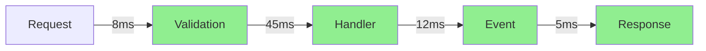

# Catga.Debugger - 全方位实时调试诊断系统

**版本**: v1.0
**创建日期**: 2025-10-15
**目标**: 打造业界最强大的 CQRS/Event Sourcing 调试诊断平台

---

## 🎯 核心目标

### 1. 全流程追踪
- ✅ 消息流完整链路追踪
- ✅ 跨服务分布式追踪
- ✅ 事件溯源回放
- ✅ 聚合状态演进历史

### 2. 全特性支持
- ✅ Command/Query 执行详情
- ✅ Event 发布和订阅跟踪
- ✅ Saga/Catga 事务状态机
- ✅ Read Model 投影构建过程
- ✅ Pipeline Behavior 执行链

### 3. 全方位诊断
- ✅ 性能分析（耗时、吞吐量）
- ✅ 内存分析（GC、分配）
- ✅ 并发分析（死锁检测）
- ✅ 错误分析（异常聚合）
- ✅ 健康检查（实时监控）

### 4. ASP.NET Core UI
- ✅ 实时 Web Dashboard
- ✅ 交互式调试控制台
- ✅ 可视化流程图
- ✅ 性能火焰图

---

## 📦 项目结构

```
src/Catga.Debugger/
├── Core/
│   ├── DebugSession.cs                   # 调试会话管理
│   ├── MessageFlowTracker.cs             # 消息流追踪（增强版）
│   ├── PerformanceRecorder.cs            # 性能记录器
│   ├── StateSnapshotManager.cs           # 状态快照管理
│   ├── DebugEventStore.cs                # 调试事件存储
│   ├── DebugEventAggregator.cs           # 事件聚合器
│   └── FlowCorrelationManager.cs         # 流程关联管理
│
├── Pipeline/
│   ├── DebugPipelineBehavior.cs          # 调试管道行为（增强版）
│   ├── PerformanceBehavior.cs            # 性能分析行为
│   ├── TracingBehavior.cs                # 追踪行为
│   ├── DiagnosticBehavior.cs             # 诊断行为
│   └── SnapshotBehavior.cs               # 快照捕获行为
│
├── Analyzers/
│   ├── PerformanceAnalyzer.cs            # 性能分析器
│   ├── ConcurrencyAnalyzer.cs            # 并发分析器
│   ├── MemoryAnalyzer.cs                 # 内存分析器
│   ├── ErrorAnalyzer.cs                  # 错误分析器
│   ├── AnomalyDetector.cs                # 异常检测器
│   └── PatternRecognizer.cs              # 模式识别器
│
├── Visualizers/
│   ├── FlowVisualizer.cs                 # 流程可视化
│   ├── StateVisualizer.cs                # 状态可视化
│   ├── GraphBuilder.cs                   # 图形构建器
│   ├── TimelineBuilder.cs                # 时间线构建器
│   ├── DependencyGraphBuilder.cs         # 依赖图构建器
│   └── HeatmapBuilder.cs                 # 热力图构建器
│
├── Storage/
│   ├── IDebugStorage.cs                  # 调试数据存储接口
│   ├── InMemoryDebugStorage.cs           # 内存存储
│   ├── RedisDebugStorage.cs              # Redis 存储
│   ├── FileDebugStorage.cs               # 文件存储
│   └── DebugStorageOptions.cs            # 存储配置
│
├── Export/
│   ├── IExporter.cs                      # 导出接口
│   ├── JsonExporter.cs                   # JSON 导出
│   ├── CsvExporter.cs                    # CSV 导出
│   ├── MermaidExporter.cs                # Mermaid 导出
│   └── ReportGenerator.cs                # 报告生成器
│
├── AspNetCore/
│   ├── Middleware/
│   │   ├── DebugDashboardMiddleware.cs   # Dashboard 中间件
│   │   └── DebugCorsMiddleware.cs        # CORS 中间件
│   ├── Controllers/
│   │   ├── DebugApiController.cs         # REST API 控制器
│   │   ├── FlowController.cs             # 流程 API
│   │   ├── PerformanceController.cs      # 性能 API
│   │   ├── SnapshotController.cs         # 快照 API
│   │   └── ExportController.cs           # 导出 API
│   ├── Hubs/
│   │   ├── DebugHub.cs                   # SignalR Hub
│   │   └── MetricsHub.cs                 # 指标推送 Hub
│   ├── Spa/                              # Vue 3 前端应用
│   │   ├── package.json
│   │   ├── vite.config.ts
│   │   ├── tsconfig.json
│   │   ├── index.html
│   │   └── src/
│   │       ├── main.ts                   # 入口文件
│   │       ├── App.vue                   # 根组件
│   │       ├── router/
│   │       │   └── index.ts              # 路由配置
│   │       ├── stores/
│   │       │   ├── debug.ts              # Debug 状态
│   │       │   ├── flow.ts               # 流程状态
│   │       │   └── performance.ts        # 性能状态
│   │       ├── api/
│   │       │   ├── client.ts             # API 客户端
│   │       │   ├── flows.ts              # 流程 API
│   │       │   ├── performance.ts        # 性能 API
│   │       │   └── snapshots.ts          # 快照 API
│   │       ├── composables/
│   │       │   ├── useSignalR.ts         # SignalR 组合式函数
│   │       │   ├── useRealtime.ts        # 实时数据
│   │       │   └── useDebugger.ts        # 调试器功能
│   │       ├── components/
│   │       │   ├── Dashboard/
│   │       │   │   ├── Overview.vue      # 概览面板
│   │       │   │   ├── MetricsPanel.vue  # 指标面板
│   │       │   │   └── AlertsPanel.vue   # 告警面板
│   │       │   ├── Flows/
│   │       │   │   ├── FlowList.vue      # 流程列表
│   │       │   │   ├── FlowDetail.vue    # 流程详情
│   │       │   │   ├── FlowDiagram.vue   # 流程图
│   │       │   │   └── FlowTimeline.vue  # 时间线
│   │       │   ├── Performance/
│   │       │   │   ├── PerformanceChart.vue  # 性能图表
│   │       │   │   ├── HotspotsTable.vue     # 热点表格
│   │       │   │   └── LatencyDistribution.vue # 延迟分布
│   │       │   ├── Snapshots/
│   │       │   │   ├── SnapshotList.vue      # 快照列表
│   │       │   │   ├── SnapshotViewer.vue    # 快照查看器
│   │       │   │   └── SnapshotDiff.vue      # 快照对比
│   │       │   ├── Visualizations/
│   │       │   │   ├── MermaidDiagram.vue    # Mermaid 图表
│   │       │   │   ├── D3Graph.vue           # D3 图形
│   │       │   │   ├── Heatmap.vue           # 热力图
│   │       │   │   └── FlameGraph.vue        # 火焰图
│   │       │   └── Common/
│   │       │       ├── StatusBadge.vue       # 状态徽章
│   │       │       ├── DurationLabel.vue     # 时长标签
│   │       │       └── CodeViewer.vue        # 代码查看器
│   │       ├── views/
│   │       │   ├── DashboardView.vue         # 仪表盘视图
│   │       │   ├── FlowsView.vue             # 流程视图
│   │       │   ├── PerformanceView.vue       # 性能视图
│   │       │   ├── SnapshotsView.vue         # 快照视图
│   │       │   └── SettingsView.vue          # 设置视图
│   │       ├── types/
│   │       │   ├── flow.ts                   # 流程类型
│   │       │   ├── performance.ts            # 性能类型
│   │       │   └── snapshot.ts               # 快照类型
│   │       └── utils/
│   │           ├── formatters.ts             # 格式化工具
│   │           ├── colors.ts                 # 颜色工具
│   │           └── charts.ts                 # 图表工具
│   └── wwwroot/                              # 静态资源输出
│
└── DependencyInjection/
    └── DebuggerServiceExtensions.cs          # DI 注册

tests/Catga.Debugger.Tests/
├── Core/
├── Analyzers/
├── Visualizers/
└── Integration/

examples/DebuggerDemo/
├── DebuggerDemo.csproj
├── Program.cs
└── Scenarios/                                # 各种调试场景
```

---

## 🔧 核心功能设计

### 1. 调试会话管理

```csharp
/// <summary>Debug session - isolate debugging data by session</summary>
public sealed class DebugSession : IDisposable
{
    public string SessionId { get; }
    public DateTime StartTime { get; }
    public DebugSessionOptions Options { get; }

    // 会话级别的追踪器
    public IMessageFlowTracker FlowTracker { get; }
    public IPerformanceRecorder PerformanceRecorder { get; }
    public IStateSnapshotManager SnapshotManager { get; }

    // 实时数据流
    public IObservable<DebugEvent> EventStream { get; }

    // 控制方法
    public Task PauseAsync();
    public Task ResumeAsync();
    public Task StepAsync();
    public Task<Snapshot> CaptureSnapshotAsync();
}
```

### 2. 增强的消息流追踪

```csharp
/// <summary>Enhanced message flow tracker with deep insights</summary>
public sealed class MessageFlowTracker : IMessageFlowTracker
{
    // 流程跟踪
    public FlowContext BeginFlow(string correlationId, FlowType type);
    public void RecordStep(string correlationId, StepInfo step);
    public void RecordState(string correlationId, object state);
    public void RecordPerformance(string correlationId, PerformanceMetrics metrics);
    public FlowSummary EndFlow(string correlationId);

    // 查询和分析
    public FlowContext? GetFlow(string correlationId);
    public IEnumerable<FlowContext> GetActiveFlows();
    public IEnumerable<FlowContext> QueryFlows(FlowQuery query);
    public FlowStatistics GetStatistics(TimeRange? range = null);

    // 实时推送
    public IObservable<FlowEvent> FlowEvents { get; }
}

public class FlowContext
{
    public string CorrelationId { get; set; }
    public FlowType Type { get; set; }
    public DateTime StartTime { get; set; }
    public DateTime? EndTime { get; set; }
    public TimeSpan? Duration { get; set; }

    // 步骤链
    public List<StepInfo> Steps { get; } = new();

    // 状态快照
    public List<StateSnapshot> Snapshots { get; } = new();

    // 性能数据
    public PerformanceMetrics Performance { get; set; }

    // 错误信息
    public ExceptionInfo? Exception { get; set; }

    // 元数据
    public Dictionary<string, object> Metadata { get; } = new();
}

public class StepInfo
{
    public int Sequence { get; set; }
    public string Name { get; set; }
    public string Type { get; set; }
    public DateTime Timestamp { get; set; }
    public TimeSpan Duration { get; set; }
    public StepStatus Status { get; set; }
    public object? Input { get; set; }
    public object? Output { get; set; }
    public Dictionary<string, object> Metadata { get; } = new();
}
```

### 3. 性能分析器

```csharp
/// <summary>Performance analyzer with zero-allocation tracking</summary>
public sealed class PerformanceRecorder
{
    // 记录性能指标
    public void RecordExecution(string operation, TimeSpan duration, long allocatedBytes);
    public void RecordThroughput(string operation, int count, TimeSpan window);
    public void RecordConcurrency(string operation, int concurrentCount);

    // 性能报告
    public PerformanceReport GetReport(TimeRange? range = null);
    public IEnumerable<PerformanceHotspot> GetHotspots(int topN = 10);
    public IEnumerable<PerformanceAnomaly> DetectAnomalies();

    // 实时监控
    public IObservable<PerformanceMetrics> MetricsStream { get; }
}

public class PerformanceMetrics
{
    // 耗时
    public TimeSpan Duration { get; set; }
    public TimeSpan AverageDuration { get; set; }
    public TimeSpan P95Duration { get; set; }
    public TimeSpan P99Duration { get; set; }

    // 吞吐量
    public double RequestsPerSecond { get; set; }
    public double EventsPerSecond { get; set; }

    // 内存
    public long AllocatedBytes { get; set; }
    public int Gen0Collections { get; set; }
    public int Gen1Collections { get; set; }
    public int Gen2Collections { get; set; }

    // 并发
    public int ConcurrentOperations { get; set; }
    public int PeakConcurrency { get; set; }

    // 错误率
    public double ErrorRate { get; set; }
    public int TotalErrors { get; set; }
}
```

### 4. 状态快照管理

```csharp
/// <summary>State snapshot manager for time-travel debugging</summary>
public sealed class StateSnapshotManager
{
    // 捕获快照
    public Task<Snapshot> CaptureAsync<TAggregate>(string aggregateId) where TAggregate : IAggregateRoot;
    public Task<Snapshot> CaptureAtVersionAsync<TAggregate>(string aggregateId, long version);

    // 快照查询
    public Task<Snapshot?> GetSnapshotAsync(string snapshotId);
    public Task<IEnumerable<Snapshot>> GetSnapshotsAsync(string aggregateId);
    public Task<Snapshot?> GetSnapshotAtTimeAsync(string aggregateId, DateTime timestamp);

    // 快照对比
    public SnapshotDiff CompareSnapshots(Snapshot before, Snapshot after);

    // 时间旅行
    public Task<TAggregate> RehydrateAtVersionAsync<TAggregate>(string aggregateId, long version);
    public Task<TAggregate> RehydrateAtTimeAsync<TAggregate>(string aggregateId, DateTime timestamp);
}

public class Snapshot
{
    public string SnapshotId { get; set; }
    public string AggregateId { get; set; }
    public string AggregateType { get; set; }
    public long Version { get; set; }
    public DateTime Timestamp { get; set; }
    public object State { get; set; }
    public Dictionary<string, object> Metadata { get; } = new();
}
```

### 5. 可视化引擎

```csharp
/// <summary>Flow visualizer - generate visual representations</summary>
public sealed class FlowVisualizer
{
    // 生成流程图
    public FlowGraph GenerateFlowGraph(FlowContext flow);
    public FlowGraph GenerateCatgaGraph(CatgaTransaction transaction);

    // 生成时间线
    public Timeline GenerateTimeline(FlowContext flow);
    public Timeline GenerateEventTimeline(string aggregateId);

    // 生成依赖图
    public DependencyGraph GenerateDependencyGraph(IEnumerable<FlowContext> flows);

    // 导出格式
    public string ExportAsMermaid(FlowGraph graph);
    public string ExportAsGraphViz(FlowGraph graph);
    public string ExportAsJson(FlowGraph graph);
}

public class FlowGraph
{
    public List<FlowNode> Nodes { get; } = new();
    public List<FlowEdge> Edges { get; } = new();
    public GraphMetadata Metadata { get; set; }
}

public class FlowNode
{
    public string Id { get; set; }
    public string Label { get; set; }
    public NodeType Type { get; set; }
    public NodeStatus Status { get; set; }
    public TimeSpan? Duration { get; set; }
    public Dictionary<string, object> Data { get; } = new();
}
```

---

## 🌐 ASP.NET Core UI Dashboard

### 主要功能

#### 1. 实时监控面板
```
┌─────────────────────────────────────────────────────────────┐
│  Catga Debugger Dashboard                   🔴 LIVE          │
├─────────────────────────────────────────────────────────────┤
│                                                              │
│  Active Flows: 12        Throughput: 1,234/s   Errors: 0    │
│  Avg Latency: 12ms      P95: 45ms             P99: 89ms     │
│                                                              │
│  ┌────────────────────────────────────────────────────────┐ │
│  │ 📊 Throughput (last 5 min)                             │ │
│  │                                                         │ │
│  │  2000 │           ╱╲                                    │ │
│  │  1500 │        ╱ ╱  ╲  ╱╲                              │ │
│  │  1000 │    ╱╲ ╱      ╲╱  ╲                             │ │
│  │   500 │ ╱ ╱  ╲╱                                        │ │
│  │     0 └────────────────────────────────────────        │ │
│  └────────────────────────────────────────────────────────┘ │
│                                                              │
│  Recent Flows                                                │
│  ┌────────────────────────────────────────────────────────┐ │
│  │ ID          Type      Status    Duration   Started      │ │
│  ├────────────────────────────────────────────────────────┤ │
│  │ abc123      Command   ✅ Done    12ms      10:23:45     │ │
│  │ def456      Event     🔄 Active  -         10:23:46     │ │
│  │ ghi789      Query     ✅ Done    8ms       10:23:44     │ │
│  │ jkl012      Catga     🔄 Active  1.2s      10:23:40     │ │
│  └────────────────────────────────────────────────────────┘ │
└─────────────────────────────────────────────────────────────┘
```

#### 2. 流程详情视图
```
┌─────────────────────────────────────────────────────────────┐
│  Flow Details: abc123                                        │
├─────────────────────────────────────────────────────────────┤
│                                                              │
│  📋 Overview                                                 │
│    Type: Command (CreateOrder)                              │
│    Status: ✅ Completed                                     │
│    Duration: 124ms                                          │
│    Started: 2025-10-15 10:23:45.123                         │
│                                                              │
│  🔄 Flow Diagram                                            │
│    ┌─────────┐   ┌──────────┐   ┌──────────┐              │
│    │ Request │──>│ Handler  │──>│ Event    │              │
│    │ (8ms)   │   │ (45ms)   │   │ (12ms)   │              │
│    └─────────┘   └──────────┘   └──────────┘              │
│         │              │               │                    │
│         ↓              ↓               ↓                    │
│    Validation     DB Write        Publish                  │
│                                                              │
│  📊 Steps (3 total)                                         │
│    ✅ Validation         (8ms)    - OK                      │
│    ✅ Handler Execution  (45ms)   - Order created           │
│    ✅ Event Publishing   (12ms)   - OrderCreated published  │
│                                                              │
│  💾 State Snapshots (2)                                     │
│    📷 Before: Version 0                                     │
│    📷 After:  Version 1                                     │
│                                                              │
│  📈 Performance                                             │
│    Allocated: 2.4 KB                                        │
│    GC Collections: 0                                        │
│                                                              │
└─────────────────────────────────────────────────────────────┘
```

#### 3. 性能分析视图
```
┌─────────────────────────────────────────────────────────────┐
│  Performance Analysis                                        │
├─────────────────────────────────────────────────────────────┤
│                                                              │
│  🔥 Hotspots (Top 10)                                       │
│  ┌────────────────────────────────────────────────────────┐ │
│  │ Operation          Calls   Avg Time   Total   Alloc    │ │
│  ├────────────────────────────────────────────────────────┤ │
│  │ CreateOrder        1,234   45ms       55.5s   2.4KB    │ │
│  │ ValidateOrder      1,234   8ms        9.9s    120B     │ │
│  │ SaveToDatabase     1,234   32ms       39.5s   1.2KB    │ │
│  └────────────────────────────────────────────────────────┘ │
│                                                              │
│  📊 Latency Distribution                                    │
│    ████████████████████ 0-10ms:   45%                      │
│    ██████████          10-50ms:   35%                      │
│    ████                50-100ms:  15%                      │
│    █                   100ms+:     5%                      │
│                                                              │
│  🧠 Memory Profile                                          │
│    Gen0: 12 collections                                     │
│    Gen1: 3 collections                                      │
│    Gen2: 0 collections                                      │
│    Total Allocated: 2.4 MB                                  │
│                                                              │
└─────────────────────────────────────────────────────────────┘
```

### UI 技术栈

```typescript
// 前端技术
- Vue 3 + TypeScript (响应式框架)
- Vite (构建工具)
- Pinia (状态管理)
- Vue Router (路由)
- ECharts / Chart.js (图表)
- Mermaid.js (流程图)
- D3.js (复杂可视化)
- @microsoft/signalr (实时通信)
- TailwindCSS (样式)
- Element Plus (UI 组件库)

// 后端 API
- ASP.NET Core Minimal APIs
- SignalR Hubs
- WebSockets
- Swagger/OpenAPI (API 文档)
```

---

## 🎨 Vue 3 前端架构

### 组件层次结构

```
App.vue
├── Layout
│   ├── Header.vue (顶部导航栏)
│   ├── Sidebar.vue (侧边栏菜单)
│   └── Footer.vue (底部状态栏)
│
└── Views (路由视图)
    ├── DashboardView.vue
    │   ├── Overview.vue (总览卡片)
    │   ├── MetricsPanel.vue (实时指标)
    │   ├── ActiveFlowsList.vue (活跃流程)
    │   └── RecentAlerts.vue (最近告警)
    │
    ├── FlowsView.vue
    │   ├── FlowList.vue (流程列表 + 过滤器)
    │   ├── FlowDetail.vue
    │   │   ├── FlowInfo.vue (基本信息)
    │   │   ├── StepsList.vue (步骤列表)
    │   │   ├── FlowDiagram.vue (可视化图)
    │   │   ├── FlowTimeline.vue (时间线)
    │   │   ├── StateSnapshots.vue (状态快照)
    │   │   └── PerformanceMetrics.vue (性能指标)
    │   └── FlowComparison.vue (流程对比)
    │
    ├── PerformanceView.vue
    │   ├── PerformanceOverview.vue (性能总览)
    │   ├── PerformanceChart.vue (性能曲线图)
    │   ├── HotspotsTable.vue (热点分析表)
    │   ├── LatencyDistribution.vue (延迟分布图)
    │   ├── ThroughputChart.vue (吞吐量图)
    │   └── MemoryProfile.vue (内存分析)
    │
    ├── SnapshotsView.vue
    │   ├── SnapshotList.vue (快照列表)
    │   ├── SnapshotViewer.vue (快照查看器)
    │   ├── SnapshotDiff.vue (快照对比)
    │   └── TimeTravel.vue (时间旅行)
    │
    └── SettingsView.vue
        ├── GeneralSettings.vue (通用设置)
        ├── FilterSettings.vue (过滤器设置)
        ├── StorageSettings.vue (存储设置)
        └── ExportSettings.vue (导出设置)
```

### 核心 Composables

```typescript
// composables/useSignalR.ts
export function useSignalR() {
  const connection = ref<HubConnection | null>(null);
  const isConnected = ref(false);
  
  const connect = async (url: string) => {
    connection.value = new HubConnectionBuilder()
      .withUrl(url)
      .withAutomaticReconnect()
      .build();
      
    await connection.value.start();
    isConnected.value = true;
  };
  
  const on = <T>(event: string, handler: (data: T) => void) => {
    connection.value?.on(event, handler);
  };
  
  return { connection, isConnected, connect, on };
}

// composables/useRealtime.ts
export function useRealtime() {
  const { connection, connect, on } = useSignalR();
  const flowStore = useFlowStore();
  const metricsStore = useMetricsStore();
  
  const startRealtimeUpdates = async () => {
    await connect('/hubs/debug');
    
    on<FlowEvent>('FlowStarted', (flow) => {
      flowStore.addFlow(flow);
    });
    
    on<FlowEvent>('FlowCompleted', (flow) => {
      flowStore.updateFlow(flow);
    });
    
    on<MetricsUpdate>('MetricsUpdated', (metrics) => {
      metricsStore.updateMetrics(metrics);
    });
  };
  
  return { startRealtimeUpdates };
}

// composables/useDebugger.ts
export function useDebugger() {
  const api = useApi();
  const flowStore = useFlowStore();
  
  const pauseFlow = async (correlationId: string) => {
    await api.flows.pause(correlationId);
  };
  
  const captureSnapshot = async (aggregateId: string) => {
    return await api.snapshots.capture(aggregateId);
  };
  
  const compareFlows = async (flowId1: string, flowId2: string) => {
    return await api.flows.compare(flowId1, flowId2);
  };
  
  return { pauseFlow, captureSnapshot, compareFlows };
}
```

### Pinia Stores

```typescript
// stores/flow.ts
export const useFlowStore = defineStore('flow', () => {
  const flows = ref<Map<string, FlowContext>>(new Map());
  const activeFlows = computed(() => 
    Array.from(flows.value.values()).filter(f => !f.endTime)
  );
  
  const addFlow = (flow: FlowContext) => {
    flows.value.set(flow.correlationId, flow);
  };
  
  const updateFlow = (flow: FlowContext) => {
    flows.value.set(flow.correlationId, flow);
  };
  
  const getFlow = (correlationId: string) => {
    return flows.value.get(correlationId);
  };
  
  return { flows, activeFlows, addFlow, updateFlow, getFlow };
});

// stores/performance.ts
export const usePerformanceStore = defineStore('performance', () => {
  const metrics = ref<PerformanceMetrics>({
    throughput: 0,
    averageLatency: 0,
    p95Latency: 0,
    errorRate: 0
  });
  
  const hotspots = ref<PerformanceHotspot[]>([]);
  const history = ref<MetricsHistory[]>([]);
  
  const updateMetrics = (newMetrics: PerformanceMetrics) => {
    metrics.value = newMetrics;
    history.value.push({
      timestamp: Date.now(),
      ...newMetrics
    });
  };
  
  return { metrics, hotspots, history, updateMetrics };
});
```

### TypeScript 类型定义

```typescript
// types/flow.ts
export interface FlowContext {
  correlationId: string;
  type: FlowType;
  startTime: Date;
  endTime?: Date;
  duration?: number;
  steps: StepInfo[];
  snapshots: StateSnapshot[];
  performance: PerformanceMetrics;
  exception?: ExceptionInfo;
  metadata: Record<string, any>;
}

export interface StepInfo {
  sequence: number;
  name: string;
  type: string;
  timestamp: Date;
  duration: number;
  status: StepStatus;
  input?: any;
  output?: any;
  metadata: Record<string, any>;
}

export enum FlowType {
  Command = 'Command',
  Query = 'Query',
  Event = 'Event',
  Catga = 'Catga'
}

export enum StepStatus {
  Pending = 'Pending',
  Running = 'Running',
  Completed = 'Completed',
  Failed = 'Failed'
}

// types/performance.ts
export interface PerformanceMetrics {
  duration?: number;
  averageDuration?: number;
  p95Duration?: number;
  p99Duration?: number;
  requestsPerSecond?: number;
  eventsPerSecond?: number;
  allocatedBytes?: number;
  gen0Collections?: number;
  concurrentOperations?: number;
  errorRate?: number;
}

export interface PerformanceHotspot {
  operation: string;
  calls: number;
  averageTime: number;
  totalTime: number;
  allocatedBytes: number;
}
```

### API 客户端

```typescript
// api/client.ts
import axios from 'axios';

export const apiClient = axios.create({
  baseURL: '/debug-api',
  timeout: 30000
});

// api/flows.ts
export const flowsApi = {
  getAll: () => apiClient.get<FlowContext[]>('/flows'),
  getById: (id: string) => apiClient.get<FlowContext>(`/flows/${id}`),
  getActive: () => apiClient.get<FlowContext[]>('/flows/active'),
  query: (query: FlowQuery) => apiClient.post<FlowContext[]>('/flows/query', query),
  pause: (id: string) => apiClient.post(`/flows/${id}/pause`),
  resume: (id: string) => apiClient.post(`/flows/${id}/resume`),
  compare: (id1: string, id2: string) => 
    apiClient.get(`/flows/compare?id1=${id1}&id2=${id2}`)
};

// api/performance.ts
export const performanceApi = {
  getReport: () => apiClient.get('/performance/report'),
  getHotspots: (topN = 10) => apiClient.get(`/performance/hotspots?top=${topN}`),
  getAnomalies: () => apiClient.get('/performance/anomalies')
};

// api/snapshots.ts
export const snapshotsApi = {
  getAll: (aggregateId: string) => 
    apiClient.get(`/snapshots/${aggregateId}`),
  getById: (id: string) => 
    apiClient.get(`/snapshots/${id}`),
  capture: (aggregateId: string) => 
    apiClient.post(`/snapshots/${aggregateId}/capture`),
  compare: (id1: string, id2: string) => 
    apiClient.post('/snapshots/compare', { id1, id2 })
};
```

### 路由配置

```typescript
// router/index.ts
import { createRouter, createWebHistory } from 'vue-router';

const routes = [
  {
    path: '/',
    redirect: '/dashboard'
  },
  {
    path: '/dashboard',
    name: 'Dashboard',
    component: () => import('@/views/DashboardView.vue'),
    meta: { title: '仪表盘' }
  },
  {
    path: '/flows',
    name: 'Flows',
    component: () => import('@/views/FlowsView.vue'),
    meta: { title: '流程追踪' },
    children: [
      {
        path: ':id',
        name: 'FlowDetail',
        component: () => import('@/components/Flows/FlowDetail.vue')
      }
    ]
  },
  {
    path: '/performance',
    name: 'Performance',
    component: () => import('@/views/PerformanceView.vue'),
    meta: { title: '性能分析' }
  },
  {
    path: '/snapshots',
    name: 'Snapshots',
    component: () => import('@/views/SnapshotsView.vue'),
    meta: { title: '状态快照' }
  },
  {
    path: '/settings',
    name: 'Settings',
    component: () => import('@/views/SettingsView.vue'),
    meta: { title: '设置' }
  }
];

export const router = createRouter({
  history: createWebHistory('/debug'),
  routes
});
```

### 构建配置

```typescript
// vite.config.ts
import { defineConfig } from 'vite';
import vue from '@vitejs/plugin-vue';
import path from 'path';

export default defineConfig({
  plugins: [vue()],
  resolve: {
    alias: {
      '@': path.resolve(__dirname, './src')
    }
  },
  build: {
    outDir: '../wwwroot',
    emptyOutDir: true,
    rollupOptions: {
      output: {
        manualChunks: {
          'vendor': ['vue', 'vue-router', 'pinia'],
          'charts': ['echarts', 'd3'],
          'signalr': ['@microsoft/signalr']
        }
      }
    }
  },
  server: {
    proxy: {
      '/debug-api': {
        target: 'http://localhost:5000',
        changeOrigin: true
      },
      '/hubs': {
        target: 'http://localhost:5000',
        changeOrigin: true,
        ws: true
      }
    }
  }
});
```

---

## 🔌 集成方式

### 1. 基础集成

```csharp
// Program.cs
var builder = WebApplication.CreateBuilder(args);

// 添加 Catga Debugger
builder.Services.AddCatgaDebugger(options =>
{
    // 基础配置
    options.Enabled = builder.Environment.IsDevelopment();
    options.SessionTimeout = TimeSpan.FromHours(1);

    // 追踪配置
    options.TrackMessageFlows = true;
    options.TrackPerformance = true;
    options.TrackStateSnapshots = true;
    options.TrackExceptions = true;

    // 性能配置
    options.MaxActiveFlows = 1000;
    options.FlowRetentionTime = TimeSpan.FromMinutes(30);

    // 存储配置
    options.UseInMemoryStorage(); // 或 UseRedisStorage() / UseFileStorage()

    // 采样配置
    options.SamplingRate = 1.0; // 100% in dev, 0.1 (10%) in prod
});

var app = builder.Build();

// 启用 Debugger Dashboard
app.MapCatgaDebugger("/debug"); // UI 界面在 /debug

// 启用 Debugger API
app.MapCatgaDebuggerApi("/debug-api");

app.Run();
```

### 2. 高级配置

```csharp
builder.Services.AddCatgaDebugger(options =>
{
    // 自定义过滤器
    options.AddFlowFilter(flow => flow.Duration > TimeSpan.FromMilliseconds(100));

    // 自定义分析器
    options.AddAnalyzer<CustomPerformanceAnalyzer>();

    // 自定义可视化器
    options.AddVisualizer<CustomFlowVisualizer>();

    // 事件订阅
    options.OnFlowStarted += (sender, e) => Console.WriteLine($"Flow started: {e.CorrelationId}");
    options.OnFlowCompleted += (sender, e) => Console.WriteLine($"Flow completed: {e.CorrelationId}");
    options.OnPerformanceAnomaly += (sender, e) => Console.WriteLine($"Performance anomaly: {e.Message}");
});
```

### 3. 编程式使用

```csharp
public class OrderService
{
    private readonly IDebugSession _debugSession;
    private readonly IMessageFlowTracker _flowTracker;

    public async Task<Order> CreateOrderAsync(CreateOrderCommand command)
    {
        // 开始追踪
        var flow = _flowTracker.BeginFlow(command.CorrelationId, FlowType.Command);

        try
        {
            // 记录步骤
            flow.RecordStep("Validation", () => ValidateOrder(command));

            // 捕获快照
            var snapshot = await _debugSession.SnapshotManager.CaptureAsync<Order>(command.OrderId);

            // 执行业务逻辑
            var order = await CreateOrder(command);

            // 记录性能
            flow.RecordPerformance(new PerformanceMetrics { ... });

            return order;
        }
        finally
        {
            // 结束追踪
            _flowTracker.EndFlow(command.CorrelationId);
        }
    }
}
```

---

## 📊 数据模型

### 调试事件

```csharp
public abstract class DebugEvent
{
    public string EventId { get; set; }
    public DateTime Timestamp { get; set; }
    public string CorrelationId { get; set; }
}

public class FlowStartedEvent : DebugEvent
{
    public FlowType Type { get; set; }
    public string MessageType { get; set; }
}

public class StepRecordedEvent : DebugEvent
{
    public StepInfo Step { get; set; }
}

public class PerformanceRecordedEvent : DebugEvent
{
    public PerformanceMetrics Metrics { get; set; }
}

public class FlowCompletedEvent : DebugEvent
{
    public FlowSummary Summary { get; set; }
}
```

---

## 🎨 可视化示例

### 1. Mermaid 流程图



### 2. 时间线视图

```
CreateOrder Flow (124ms total)
│
├─ 0ms     Request received
├─ 8ms     ✅ Validation completed
├─ 53ms    ✅ Handler executed
├─ 65ms    ✅ Event published
└─ 124ms   ✅ Response sent

Events:
  ├─ 65ms  OrderCreated published
  └─ 68ms  InventoryReserved received
```

---

## 🚀 实施计划

### Phase 1: 核心基础 (Week 1-2)
- [x] 项目结构搭建
- [ ] DebugSession 实现
- [ ] MessageFlowTracker 增强
- [ ] PerformanceRecorder 实现
- [ ] 基础存储实现 (InMemory)

### Phase 2: 分析器 (Week 3)
- [ ] PerformanceAnalyzer
- [ ] ConcurrencyAnalyzer
- [ ] MemoryAnalyzer
- [ ] ErrorAnalyzer

### Phase 3: 可视化 (Week 4)
- [ ] FlowVisualizer
- [ ] StateVisualizer
- [ ] GraphBuilder
- [ ] TimelineBuilder

### Phase 4: ASP.NET Core UI (Week 5-6)
- [ ] Dashboard 中间件
- [ ] REST API
- [ ] WebSocket 实时推送
- [ ] 前端 UI (HTML/JS/CSS)

### Phase 5: 高级功能 (Week 7)
- [ ] StateSnapshotManager
- [ ] 时间旅行调试
- [ ] 回放功能
- [ ] 导出/导入

### Phase 6: 优化和测试 (Week 8)
- [ ] 性能优化
- [ ] 内存优化
- [ ] 完整测试套件
- [ ] 文档和示例

---

## 📝 API 设计

### REST API Endpoints

```
GET    /debug-api/sessions                    # 获取所有会话
POST   /debug-api/sessions                    # 创建新会话
GET    /debug-api/sessions/{id}               # 获取会话详情
DELETE /debug-api/sessions/{id}               # 删除会话

GET    /debug-api/flows                       # 获取所有流程
GET    /debug-api/flows/{correlationId}       # 获取流程详情
GET    /debug-api/flows/active                # 获取活跃流程
POST   /debug-api/flows/query                 # 查询流程

GET    /debug-api/performance/report          # 性能报告
GET    /debug-api/performance/hotspots        # 性能热点
GET    /debug-api/performance/anomalies       # 性能异常

GET    /debug-api/snapshots/{aggregateId}     # 获取快照列表
GET    /debug-api/snapshots/{id}              # 获取快照详情
POST   /debug-api/snapshots/compare           # 对比快照

GET    /debug-api/visualize/flow/{id}         # 可视化流程
GET    /debug-api/visualize/timeline/{id}     # 可视化时间线
```

### SignalR Hubs

```csharp
public class DebugHub : Hub
{
    // 订阅实时流程事件
    public async Task SubscribeToFlows();

    // 订阅性能指标
    public async Task SubscribeToMetrics();

    // 控制会话
    public async Task PauseSession(string sessionId);
    public async Task ResumeSession(string sessionId);
}

// 客户端接收
connection.on("FlowStarted", (flow) => { ... });
connection.on("FlowCompleted", (flow) => { ... });
connection.on("MetricsUpdated", (metrics) => { ... });
```

---

## 🎯 性能目标

### 零侵入
- ✅ 开发环境 100% 采样
- ✅ 生产环境可配置采样率 (1-10%)
- ✅ 可完全禁用（零开销）

### 高性能
- ✅ 单个追踪 < 1μs 开销
- ✅ 内存占用 < 10MB (1000 活跃流程)
- ✅ 零 GC 压力（对象池）

### 可扩展
- ✅ 支持 10,000+ 并发流程
- ✅ 实时推送延迟 < 100ms
- ✅ Dashboard 支持 1000+ 并发用户

---

## 📚 文档计划

1. **快速开始** - 5分钟上手
2. **配置指南** - 详细配置说明
3. **UI 使用指南** - Dashboard 使用教程
4. **API 参考** - 完整 API 文档
5. **最佳实践** - 调试技巧和模式
6. **性能调优** - 生产环境优化
7. **扩展开发** - 自定义分析器和可视化器

---

## 🎉 高级特性

### 1. 智能分析引擎
```csharp
// 模式识别和异常检测
var patterns = await patternRecognizer.AnalyzeAsync(flows);
var anomalies = await anomalyDetector.DetectAsync(metrics);

// 基于规则的建议（非 AI）
// - 检测 N+1 查询模式
// - 识别重复计算
// - 发现并发瓶颈
// - 检测内存泄漏模式
```

### 2. 对比调试
```csharp
// 对比两次执行
var diff = debugger.Compare(flowId1, flowId2);
// => 显示性能差异、状态变化
```

### 3. 压力测试模式
```csharp
// 回放流程进行压测
await debugger.ReplayAsync(flowId, concurrency: 100);
```

### 4. 实时协作调试
```csharp
// 多人协作调试会话
var session = await debugger.CreateSharedSessionAsync();
await session.InviteUserAsync("user@example.com");
// 实时同步视图、断点、标注
```

### 5. 时间旅行回放
```csharp
// 精确重现历史状态
var replay = await debugger.ReplayFromSnapshotAsync(snapshotId);
await replay.StepForward();  // 单步前进
await replay.StepBackward(); // 单步后退
```

### 6. 自动化诊断规则
```csharp
// 自定义诊断规则
builder.Services.AddDebuggerRule<SlowQueryRule>(rule =>
{
    rule.Threshold = TimeSpan.FromMilliseconds(100);
    rule.OnDetected = alert => SendNotification(alert);
});
```

---

**状态**: 📝 计划阶段
**下一步**: 开始 Phase 1 实施

