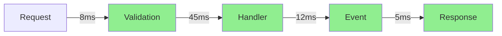

# Catga.Debugger - 全方位实时调试诊断系统

**版本**: v1.0
**创建日期**: 2025-10-15
**目标**: 打造业界最强大的 CQRS/Event Sourcing 调试诊断平台

---

## 🎯 核心目标

### 1. 全流程追踪
- ✅ 消息流完整链路追踪
- ✅ 跨服务分布式追踪
- ✅ 事件溯源回放
- ✅ 聚合状态演进历史

### 2. 全特性支持
- ✅ Command/Query 执行详情
- ✅ Event 发布和订阅跟踪
- ✅ Saga/Catga 事务状态机
- ✅ Read Model 投影构建过程
- ✅ Pipeline Behavior 执行链

### 3. 全方位诊断
- ✅ 性能分析（耗时、吞吐量）
- ✅ 内存分析（GC、分配）
- ✅ 并发分析（死锁检测）
- ✅ 错误分析（异常聚合）
- ✅ 健康检查（实时监控）

### 4. ASP.NET Core UI
- ✅ 实时 Web Dashboard
- ✅ 交互式调试控制台
- ✅ 可视化流程图
- ✅ 性能火焰图

---

## 📦 项目结构

```
src/Catga.Debugger/
├── Core/
│   ├── DebugSession.cs                   # 调试会话管理
│   ├── MessageFlowTracker.cs             # 消息流追踪（增强版）
│   ├── PerformanceRecorder.cs            # 性能记录器
│   ├── StateSnapshotManager.cs           # 状态快照管理
│   ├── DebugEventStore.cs                # 调试事件存储
│   ├── DebugEventAggregator.cs           # 事件聚合器
│   └── FlowCorrelationManager.cs         # 流程关联管理
│
├── Pipeline/
│   ├── DebugPipelineBehavior.cs          # 调试管道行为（增强版）
│   ├── PerformanceBehavior.cs            # 性能分析行为
│   ├── TracingBehavior.cs                # 追踪行为
│   ├── DiagnosticBehavior.cs             # 诊断行为
│   └── SnapshotBehavior.cs               # 快照捕获行为
│
├── Analyzers/
│   ├── PerformanceAnalyzer.cs            # 性能分析器
│   ├── ConcurrencyAnalyzer.cs            # 并发分析器
│   ├── MemoryAnalyzer.cs                 # 内存分析器
│   ├── ErrorAnalyzer.cs                  # 错误分析器
│   ├── AnomalyDetector.cs                # 异常检测器
│   └── PatternRecognizer.cs              # 模式识别器
│
├── Visualizers/
│   ├── FlowVisualizer.cs                 # 流程可视化
│   ├── StateVisualizer.cs                # 状态可视化
│   ├── GraphBuilder.cs                   # 图形构建器
│   ├── TimelineBuilder.cs                # 时间线构建器
│   ├── DependencyGraphBuilder.cs         # 依赖图构建器
│   └── HeatmapBuilder.cs                 # 热力图构建器
│
├── Storage/
│   ├── IDebugStorage.cs                  # 调试数据存储接口
│   ├── InMemoryDebugStorage.cs           # 内存存储
│   ├── RedisDebugStorage.cs              # Redis 存储
│   ├── FileDebugStorage.cs               # 文件存储
│   └── DebugStorageOptions.cs            # 存储配置
│
├── Export/
│   ├── IExporter.cs                      # 导出接口
│   ├── JsonExporter.cs                   # JSON 导出
│   ├── CsvExporter.cs                    # CSV 导出
│   ├── MermaidExporter.cs                # Mermaid 导出
│   └── ReportGenerator.cs                # 报告生成器
│
├── AspNetCore/
│   ├── Middleware/
│   │   ├── DebugDashboardMiddleware.cs   # Dashboard 中间件
│   │   └── DebugCorsMiddleware.cs        # CORS 中间件
│   ├── Controllers/
│   │   ├── DebugApiController.cs         # REST API 控制器
│   │   ├── FlowController.cs             # 流程 API
│   │   ├── PerformanceController.cs      # 性能 API
│   │   ├── SnapshotController.cs         # 快照 API
│   │   └── ExportController.cs           # 导出 API
│   ├── Hubs/
│   │   ├── DebugHub.cs                   # SignalR Hub
│   │   └── MetricsHub.cs                 # 指标推送 Hub
│   ├── Spa/                              # Vue 3 前端应用
│   │   ├── package.json
│   │   ├── vite.config.ts
│   │   ├── tsconfig.json
│   │   ├── index.html
│   │   └── src/
│   │       ├── main.ts                   # 入口文件
│   │       ├── App.vue                   # 根组件
│   │       ├── router/
│   │       │   └── index.ts              # 路由配置
│   │       ├── stores/
│   │       │   ├── debug.ts              # Debug 状态
│   │       │   ├── flow.ts               # 流程状态
│   │       │   └── performance.ts        # 性能状态
│   │       ├── api/
│   │       │   ├── client.ts             # API 客户端
│   │       │   ├── flows.ts              # 流程 API
│   │       │   ├── performance.ts        # 性能 API
│   │       │   └── snapshots.ts          # 快照 API
│   │       ├── composables/
│   │       │   ├── useSignalR.ts         # SignalR 组合式函数
│   │       │   ├── useRealtime.ts        # 实时数据
│   │       │   └── useDebugger.ts        # 调试器功能
│   │       ├── components/
│   │       │   ├── Dashboard/
│   │       │   │   ├── Overview.vue      # 概览面板
│   │       │   │   ├── MetricsPanel.vue  # 指标面板
│   │       │   │   └── AlertsPanel.vue   # 告警面板
│   │       │   ├── Flows/
│   │       │   │   ├── FlowList.vue      # 流程列表
│   │       │   │   ├── FlowDetail.vue    # 流程详情
│   │       │   │   ├── FlowDiagram.vue   # 流程图
│   │       │   │   └── FlowTimeline.vue  # 时间线
│   │       │   ├── Performance/
│   │       │   │   ├── PerformanceChart.vue  # 性能图表
│   │       │   │   ├── HotspotsTable.vue     # 热点表格
│   │       │   │   └── LatencyDistribution.vue # 延迟分布
│   │       │   ├── Snapshots/
│   │       │   │   ├── SnapshotList.vue      # 快照列表
│   │       │   │   ├── SnapshotViewer.vue    # 快照查看器
│   │       │   │   └── SnapshotDiff.vue      # 快照对比
│   │       │   ├── Visualizations/
│   │       │   │   ├── MermaidDiagram.vue    # Mermaid 图表
│   │       │   │   ├── D3Graph.vue           # D3 图形
│   │       │   │   ├── Heatmap.vue           # 热力图
│   │       │   │   └── FlameGraph.vue        # 火焰图
│   │       │   └── Common/
│   │       │       ├── StatusBadge.vue       # 状态徽章
│   │       │       ├── DurationLabel.vue     # 时长标签
│   │       │       └── CodeViewer.vue        # 代码查看器
│   │       ├── views/
│   │       │   ├── DashboardView.vue         # 仪表盘视图
│   │       │   ├── FlowsView.vue             # 流程视图
│   │       │   ├── PerformanceView.vue       # 性能视图
│   │       │   ├── SnapshotsView.vue         # 快照视图
│   │       │   └── SettingsView.vue          # 设置视图
│   │       ├── types/
│   │       │   ├── flow.ts                   # 流程类型
│   │       │   ├── performance.ts            # 性能类型
│   │       │   └── snapshot.ts               # 快照类型
│   │       └── utils/
│   │           ├── formatters.ts             # 格式化工具
│   │           ├── colors.ts                 # 颜色工具
│   │           └── charts.ts                 # 图表工具
│   └── wwwroot/                              # 静态资源输出
│
└── DependencyInjection/
    └── DebuggerServiceExtensions.cs          # DI 注册

tests/Catga.Debugger.Tests/
├── Core/
├── Analyzers/
├── Visualizers/
└── Integration/

examples/DebuggerDemo/
├── DebuggerDemo.csproj
├── Program.cs
└── Scenarios/                                # 各种调试场景
```

---

## 🔧 核心功能设计

### 1. 调试会话管理

```csharp
/// <summary>Debug session - isolate debugging data by session</summary>
public sealed class DebugSession : IDisposable
{
    public string SessionId { get; }
    public DateTime StartTime { get; }
    public DebugSessionOptions Options { get; }

    // 会话级别的追踪器
    public IMessageFlowTracker FlowTracker { get; }
    public IPerformanceRecorder PerformanceRecorder { get; }
    public IStateSnapshotManager SnapshotManager { get; }

    // 实时数据流
    public IObservable<DebugEvent> EventStream { get; }

    // 控制方法
    public Task PauseAsync();
    public Task ResumeAsync();
    public Task StepAsync();
    public Task<Snapshot> CaptureSnapshotAsync();
}
```

### 2. 增强的消息流追踪

```csharp
/// <summary>Enhanced message flow tracker with deep insights</summary>
public sealed class MessageFlowTracker : IMessageFlowTracker
{
    // 流程跟踪
    public FlowContext BeginFlow(string correlationId, FlowType type);
    public void RecordStep(string correlationId, StepInfo step);
    public void RecordState(string correlationId, object state);
    public void RecordPerformance(string correlationId, PerformanceMetrics metrics);
    public FlowSummary EndFlow(string correlationId);

    // 查询和分析
    public FlowContext? GetFlow(string correlationId);
    public IEnumerable<FlowContext> GetActiveFlows();
    public IEnumerable<FlowContext> QueryFlows(FlowQuery query);
    public FlowStatistics GetStatistics(TimeRange? range = null);

    // 实时推送
    public IObservable<FlowEvent> FlowEvents { get; }
}

public class FlowContext
{
    public string CorrelationId { get; set; }
    public FlowType Type { get; set; }
    public DateTime StartTime { get; set; }
    public DateTime? EndTime { get; set; }
    public TimeSpan? Duration { get; set; }

    // 步骤链
    public List<StepInfo> Steps { get; } = new();

    // 状态快照
    public List<StateSnapshot> Snapshots { get; } = new();

    // 性能数据
    public PerformanceMetrics Performance { get; set; }

    // 错误信息
    public ExceptionInfo? Exception { get; set; }

    // 元数据
    public Dictionary<string, object> Metadata { get; } = new();
}

public class StepInfo
{
    public int Sequence { get; set; }
    public string Name { get; set; }
    public string Type { get; set; }
    public DateTime Timestamp { get; set; }
    public TimeSpan Duration { get; set; }
    public StepStatus Status { get; set; }
    public object? Input { get; set; }
    public object? Output { get; set; }
    public Dictionary<string, object> Metadata { get; } = new();
}
```

### 3. 性能分析器

```csharp
/// <summary>Performance analyzer with zero-allocation tracking</summary>
public sealed class PerformanceRecorder
{
    // 记录性能指标
    public void RecordExecution(string operation, TimeSpan duration, long allocatedBytes);
    public void RecordThroughput(string operation, int count, TimeSpan window);
    public void RecordConcurrency(string operation, int concurrentCount);

    // 性能报告
    public PerformanceReport GetReport(TimeRange? range = null);
    public IEnumerable<PerformanceHotspot> GetHotspots(int topN = 10);
    public IEnumerable<PerformanceAnomaly> DetectAnomalies();

    // 实时监控
    public IObservable<PerformanceMetrics> MetricsStream { get; }
}

public class PerformanceMetrics
{
    // 耗时
    public TimeSpan Duration { get; set; }
    public TimeSpan AverageDuration { get; set; }
    public TimeSpan P95Duration { get; set; }
    public TimeSpan P99Duration { get; set; }

    // 吞吐量
    public double RequestsPerSecond { get; set; }
    public double EventsPerSecond { get; set; }

    // 内存
    public long AllocatedBytes { get; set; }
    public int Gen0Collections { get; set; }
    public int Gen1Collections { get; set; }
    public int Gen2Collections { get; set; }

    // 并发
    public int ConcurrentOperations { get; set; }
    public int PeakConcurrency { get; set; }

    // 错误率
    public double ErrorRate { get; set; }
    public int TotalErrors { get; set; }
}
```

### 4. 状态快照管理

```csharp
/// <summary>State snapshot manager for time-travel debugging</summary>
public sealed class StateSnapshotManager
{
    // 捕获快照
    public Task<Snapshot> CaptureAsync<TAggregate>(string aggregateId) where TAggregate : IAggregateRoot;
    public Task<Snapshot> CaptureAtVersionAsync<TAggregate>(string aggregateId, long version);

    // 快照查询
    public Task<Snapshot?> GetSnapshotAsync(string snapshotId);
    public Task<IEnumerable<Snapshot>> GetSnapshotsAsync(string aggregateId);
    public Task<Snapshot?> GetSnapshotAtTimeAsync(string aggregateId, DateTime timestamp);

    // 快照对比
    public SnapshotDiff CompareSnapshots(Snapshot before, Snapshot after);

    // 时间旅行
    public Task<TAggregate> RehydrateAtVersionAsync<TAggregate>(string aggregateId, long version);
    public Task<TAggregate> RehydrateAtTimeAsync<TAggregate>(string aggregateId, DateTime timestamp);
}

public class Snapshot
{
    public string SnapshotId { get; set; }
    public string AggregateId { get; set; }
    public string AggregateType { get; set; }
    public long Version { get; set; }
    public DateTime Timestamp { get; set; }
    public object State { get; set; }
    public Dictionary<string, object> Metadata { get; } = new();
}
```

### 5. 可视化引擎

```csharp
/// <summary>Flow visualizer - generate visual representations</summary>
public sealed class FlowVisualizer
{
    // 生成流程图
    public FlowGraph GenerateFlowGraph(FlowContext flow);
    public FlowGraph GenerateCatgaGraph(CatgaTransaction transaction);

    // 生成时间线
    public Timeline GenerateTimeline(FlowContext flow);
    public Timeline GenerateEventTimeline(string aggregateId);

    // 生成依赖图
    public DependencyGraph GenerateDependencyGraph(IEnumerable<FlowContext> flows);

    // 导出格式
    public string ExportAsMermaid(FlowGraph graph);
    public string ExportAsGraphViz(FlowGraph graph);
    public string ExportAsJson(FlowGraph graph);
}

public class FlowGraph
{
    public List<FlowNode> Nodes { get; } = new();
    public List<FlowEdge> Edges { get; } = new();
    public GraphMetadata Metadata { get; set; }
}

public class FlowNode
{
    public string Id { get; set; }
    public string Label { get; set; }
    public NodeType Type { get; set; }
    public NodeStatus Status { get; set; }
    public TimeSpan? Duration { get; set; }
    public Dictionary<string, object> Data { get; } = new();
}
```

---

## 🌐 ASP.NET Core UI Dashboard

### 主要功能

#### 1. 实时监控面板
```
┌─────────────────────────────────────────────────────────────┐
│  Catga Debugger Dashboard                   🔴 LIVE          │
├─────────────────────────────────────────────────────────────┤
│                                                              │
│  Active Flows: 12        Throughput: 1,234/s   Errors: 0    │
│  Avg Latency: 12ms      P95: 45ms             P99: 89ms     │
│                                                              │
│  ┌────────────────────────────────────────────────────────┐ │
│  │ 📊 Throughput (last 5 min)                             │ │
│  │                                                         │ │
│  │  2000 │           ╱╲                                    │ │
│  │  1500 │        ╱ ╱  ╲  ╱╲                              │ │
│  │  1000 │    ╱╲ ╱      ╲╱  ╲                             │ │
│  │   500 │ ╱ ╱  ╲╱                                        │ │
│  │     0 └────────────────────────────────────────        │ │
│  └────────────────────────────────────────────────────────┘ │
│                                                              │
│  Recent Flows                                                │
│  ┌────────────────────────────────────────────────────────┐ │
│  │ ID          Type      Status    Duration   Started      │ │
│  ├────────────────────────────────────────────────────────┤ │
│  │ abc123      Command   ✅ Done    12ms      10:23:45     │ │
│  │ def456      Event     🔄 Active  -         10:23:46     │ │
│  │ ghi789      Query     ✅ Done    8ms       10:23:44     │ │
│  │ jkl012      Catga     🔄 Active  1.2s      10:23:40     │ │
│  └────────────────────────────────────────────────────────┘ │
└─────────────────────────────────────────────────────────────┘
```

#### 2. 流程详情视图
```
┌─────────────────────────────────────────────────────────────┐
│  Flow Details: abc123                                        │
├─────────────────────────────────────────────────────────────┤
│                                                              │
│  📋 Overview                                                 │
│    Type: Command (CreateOrder)                              │
│    Status: ✅ Completed                                     │
│    Duration: 124ms                                          │
│    Started: 2025-10-15 10:23:45.123                         │
│                                                              │
│  🔄 Flow Diagram                                            │
│    ┌─────────┐   ┌──────────┐   ┌──────────┐              │
│    │ Request │──>│ Handler  │──>│ Event    │              │
│    │ (8ms)   │   │ (45ms)   │   │ (12ms)   │              │
│    └─────────┘   └──────────┘   └──────────┘              │
│         │              │               │                    │
│         ↓              ↓               ↓                    │
│    Validation     DB Write        Publish                  │
│                                                              │
│  📊 Steps (3 total)                                         │
│    ✅ Validation         (8ms)    - OK                      │
│    ✅ Handler Execution  (45ms)   - Order created           │
│    ✅ Event Publishing   (12ms)   - OrderCreated published  │
│                                                              │
│  💾 State Snapshots (2)                                     │
│    📷 Before: Version 0                                     │
│    📷 After:  Version 1                                     │
│                                                              │
│  📈 Performance                                             │
│    Allocated: 2.4 KB                                        │
│    GC Collections: 0                                        │
│                                                              │
└─────────────────────────────────────────────────────────────┘
```

#### 3. 性能分析视图
```
┌─────────────────────────────────────────────────────────────┐
│  Performance Analysis                                        │
├─────────────────────────────────────────────────────────────┤
│                                                              │
│  🔥 Hotspots (Top 10)                                       │
│  ┌────────────────────────────────────────────────────────┐ │
│  │ Operation          Calls   Avg Time   Total   Alloc    │ │
│  ├────────────────────────────────────────────────────────┤ │
│  │ CreateOrder        1,234   45ms       55.5s   2.4KB    │ │
│  │ ValidateOrder      1,234   8ms        9.9s    120B     │ │
│  │ SaveToDatabase     1,234   32ms       39.5s   1.2KB    │ │
│  └────────────────────────────────────────────────────────┘ │
│                                                              │
│  📊 Latency Distribution                                    │
│    ████████████████████ 0-10ms:   45%                      │
│    ██████████          10-50ms:   35%                      │
│    ████                50-100ms:  15%                      │
│    █                   100ms+:     5%                      │
│                                                              │
│  🧠 Memory Profile                                          │
│    Gen0: 12 collections                                     │
│    Gen1: 3 collections                                      │
│    Gen2: 0 collections                                      │
│    Total Allocated: 2.4 MB                                  │
│                                                              │
└─────────────────────────────────────────────────────────────┘
```

### UI 技术栈

```typescript
// 前端技术
- Vue 3 + TypeScript (响应式框架)
- Vite (构建工具)
- Pinia (状态管理)
- Vue Router (路由)
- ECharts / Chart.js (图表)
- Mermaid.js (流程图)
- D3.js (复杂可视化)
- @microsoft/signalr (实时通信)
- TailwindCSS (样式)
- Element Plus (UI 组件库)

// 后端 API
- ASP.NET Core Minimal APIs
- SignalR Hubs
- WebSockets
- Swagger/OpenAPI (API 文档)
```

---

## 🎨 Vue 3 前端架构

### 组件层次结构

```
App.vue
├── Layout
│   ├── Header.vue (顶部导航栏)
│   ├── Sidebar.vue (侧边栏菜单)
│   └── Footer.vue (底部状态栏)
│
└── Views (路由视图)
    ├── DashboardView.vue
    │   ├── Overview.vue (总览卡片)
    │   ├── MetricsPanel.vue (实时指标)
    │   ├── ActiveFlowsList.vue (活跃流程)
    │   └── RecentAlerts.vue (最近告警)
    │
    ├── FlowsView.vue
    │   ├── FlowList.vue (流程列表 + 过滤器)
    │   ├── FlowDetail.vue
    │   │   ├── FlowInfo.vue (基本信息)
    │   │   ├── StepsList.vue (步骤列表)
    │   │   ├── FlowDiagram.vue (可视化图)
    │   │   ├── FlowTimeline.vue (时间线)
    │   │   ├── StateSnapshots.vue (状态快照)
    │   │   └── PerformanceMetrics.vue (性能指标)
    │   └── FlowComparison.vue (流程对比)
    │
    ├── PerformanceView.vue
    │   ├── PerformanceOverview.vue (性能总览)
    │   ├── PerformanceChart.vue (性能曲线图)
    │   ├── HotspotsTable.vue (热点分析表)
    │   ├── LatencyDistribution.vue (延迟分布图)
    │   ├── ThroughputChart.vue (吞吐量图)
    │   └── MemoryProfile.vue (内存分析)
    │
    ├── SnapshotsView.vue
    │   ├── SnapshotList.vue (快照列表)
    │   ├── SnapshotViewer.vue (快照查看器)
    │   ├── SnapshotDiff.vue (快照对比)
    │   └── TimeTravel.vue (时间旅行)
    │
    └── SettingsView.vue
        ├── GeneralSettings.vue (通用设置)
        ├── FilterSettings.vue (过滤器设置)
        ├── StorageSettings.vue (存储设置)
        └── ExportSettings.vue (导出设置)
```

### 核心 Composables

```typescript
// composables/useSignalR.ts
export function useSignalR() {
  const connection = ref<HubConnection | null>(null);
  const isConnected = ref(false);

  const connect = async (url: string) => {
    connection.value = new HubConnectionBuilder()
      .withUrl(url)
      .withAutomaticReconnect()
      .build();

    await connection.value.start();
    isConnected.value = true;
  };

  const on = <T>(event: string, handler: (data: T) => void) => {
    connection.value?.on(event, handler);
  };

  return { connection, isConnected, connect, on };
}

// composables/useRealtime.ts
export function useRealtime() {
  const { connection, connect, on } = useSignalR();
  const flowStore = useFlowStore();
  const metricsStore = useMetricsStore();

  const startRealtimeUpdates = async () => {
    await connect('/hubs/debug');

    on<FlowEvent>('FlowStarted', (flow) => {
      flowStore.addFlow(flow);
    });

    on<FlowEvent>('FlowCompleted', (flow) => {
      flowStore.updateFlow(flow);
    });

    on<MetricsUpdate>('MetricsUpdated', (metrics) => {
      metricsStore.updateMetrics(metrics);
    });
  };

  return { startRealtimeUpdates };
}

// composables/useDebugger.ts
export function useDebugger() {
  const api = useApi();
  const flowStore = useFlowStore();

  const pauseFlow = async (correlationId: string) => {
    await api.flows.pause(correlationId);
  };

  const captureSnapshot = async (aggregateId: string) => {
    return await api.snapshots.capture(aggregateId);
  };

  const compareFlows = async (flowId1: string, flowId2: string) => {
    return await api.flows.compare(flowId1, flowId2);
  };

  return { pauseFlow, captureSnapshot, compareFlows };
}
```

### Pinia Stores

```typescript
// stores/flow.ts
export const useFlowStore = defineStore('flow', () => {
  const flows = ref<Map<string, FlowContext>>(new Map());
  const activeFlows = computed(() =>
    Array.from(flows.value.values()).filter(f => !f.endTime)
  );

  const addFlow = (flow: FlowContext) => {
    flows.value.set(flow.correlationId, flow);
  };

  const updateFlow = (flow: FlowContext) => {
    flows.value.set(flow.correlationId, flow);
  };

  const getFlow = (correlationId: string) => {
    return flows.value.get(correlationId);
  };

  return { flows, activeFlows, addFlow, updateFlow, getFlow };
});

// stores/performance.ts
export const usePerformanceStore = defineStore('performance', () => {
  const metrics = ref<PerformanceMetrics>({
    throughput: 0,
    averageLatency: 0,
    p95Latency: 0,
    errorRate: 0
  });

  const hotspots = ref<PerformanceHotspot[]>([]);
  const history = ref<MetricsHistory[]>([]);

  const updateMetrics = (newMetrics: PerformanceMetrics) => {
    metrics.value = newMetrics;
    history.value.push({
      timestamp: Date.now(),
      ...newMetrics
    });
  };

  return { metrics, hotspots, history, updateMetrics };
});
```

### TypeScript 类型定义

```typescript
// types/flow.ts
export interface FlowContext {
  correlationId: string;
  type: FlowType;
  startTime: Date;
  endTime?: Date;
  duration?: number;
  steps: StepInfo[];
  snapshots: StateSnapshot[];
  performance: PerformanceMetrics;
  exception?: ExceptionInfo;
  metadata: Record<string, any>;
}

export interface StepInfo {
  sequence: number;
  name: string;
  type: string;
  timestamp: Date;
  duration: number;
  status: StepStatus;
  input?: any;
  output?: any;
  metadata: Record<string, any>;
}

export enum FlowType {
  Command = 'Command',
  Query = 'Query',
  Event = 'Event',
  Catga = 'Catga'
}

export enum StepStatus {
  Pending = 'Pending',
  Running = 'Running',
  Completed = 'Completed',
  Failed = 'Failed'
}

// types/performance.ts
export interface PerformanceMetrics {
  duration?: number;
  averageDuration?: number;
  p95Duration?: number;
  p99Duration?: number;
  requestsPerSecond?: number;
  eventsPerSecond?: number;
  allocatedBytes?: number;
  gen0Collections?: number;
  concurrentOperations?: number;
  errorRate?: number;
}

export interface PerformanceHotspot {
  operation: string;
  calls: number;
  averageTime: number;
  totalTime: number;
  allocatedBytes: number;
}
```

### API 客户端

```typescript
// api/client.ts
import axios from 'axios';

export const apiClient = axios.create({
  baseURL: '/debug-api',
  timeout: 30000
});

// api/flows.ts
export const flowsApi = {
  getAll: () => apiClient.get<FlowContext[]>('/flows'),
  getById: (id: string) => apiClient.get<FlowContext>(`/flows/${id}`),
  getActive: () => apiClient.get<FlowContext[]>('/flows/active'),
  query: (query: FlowQuery) => apiClient.post<FlowContext[]>('/flows/query', query),
  pause: (id: string) => apiClient.post(`/flows/${id}/pause`),
  resume: (id: string) => apiClient.post(`/flows/${id}/resume`),
  compare: (id1: string, id2: string) =>
    apiClient.get(`/flows/compare?id1=${id1}&id2=${id2}`)
};

// api/performance.ts
export const performanceApi = {
  getReport: () => apiClient.get('/performance/report'),
  getHotspots: (topN = 10) => apiClient.get(`/performance/hotspots?top=${topN}`),
  getAnomalies: () => apiClient.get('/performance/anomalies')
};

// api/snapshots.ts
export const snapshotsApi = {
  getAll: (aggregateId: string) =>
    apiClient.get(`/snapshots/${aggregateId}`),
  getById: (id: string) =>
    apiClient.get(`/snapshots/${id}`),
  capture: (aggregateId: string) =>
    apiClient.post(`/snapshots/${aggregateId}/capture`),
  compare: (id1: string, id2: string) =>
    apiClient.post('/snapshots/compare', { id1, id2 })
};
```

### 路由配置

```typescript
// router/index.ts
import { createRouter, createWebHistory } from 'vue-router';

const routes = [
  {
    path: '/',
    redirect: '/dashboard'
  },
  {
    path: '/dashboard',
    name: 'Dashboard',
    component: () => import('@/views/DashboardView.vue'),
    meta: { title: '仪表盘' }
  },
  {
    path: '/flows',
    name: 'Flows',
    component: () => import('@/views/FlowsView.vue'),
    meta: { title: '流程追踪' },
    children: [
      {
        path: ':id',
        name: 'FlowDetail',
        component: () => import('@/components/Flows/FlowDetail.vue')
      }
    ]
  },
  {
    path: '/performance',
    name: 'Performance',
    component: () => import('@/views/PerformanceView.vue'),
    meta: { title: '性能分析' }
  },
  {
    path: '/snapshots',
    name: 'Snapshots',
    component: () => import('@/views/SnapshotsView.vue'),
    meta: { title: '状态快照' }
  },
  {
    path: '/settings',
    name: 'Settings',
    component: () => import('@/views/SettingsView.vue'),
    meta: { title: '设置' }
  }
];

export const router = createRouter({
  history: createWebHistory('/debug'),
  routes
});
```

### 构建配置

```typescript
// vite.config.ts
import { defineConfig } from 'vite';
import vue from '@vitejs/plugin-vue';
import path from 'path';

export default defineConfig({
  plugins: [vue()],
  resolve: {
    alias: {
      '@': path.resolve(__dirname, './src')
    }
  },
  build: {
    outDir: '../wwwroot',
    emptyOutDir: true,
    rollupOptions: {
      output: {
        manualChunks: {
          'vendor': ['vue', 'vue-router', 'pinia'],
          'charts': ['echarts', 'd3'],
          'signalr': ['@microsoft/signalr']
        }
      }
    }
  },
  server: {
    proxy: {
      '/debug-api': {
        target: 'http://localhost:5000',
        changeOrigin: true
      },
      '/hubs': {
        target: 'http://localhost:5000',
        changeOrigin: true,
        ws: true
      }
    }
  }
});
```

---

## 🔌 集成方式

### 1. 基础集成

```csharp
// Program.cs
var builder = WebApplication.CreateBuilder(args);

// 添加 Catga Debugger
builder.Services.AddCatgaDebugger(options =>
{
    // 基础配置
    options.Enabled = builder.Environment.IsDevelopment();
    options.SessionTimeout = TimeSpan.FromHours(1);

    // 追踪配置
    options.TrackMessageFlows = true;
    options.TrackPerformance = true;
    options.TrackStateSnapshots = true;
    options.TrackExceptions = true;

    // 性能配置
    options.MaxActiveFlows = 1000;
    options.FlowRetentionTime = TimeSpan.FromMinutes(30);

    // 存储配置
    options.UseInMemoryStorage(); // 或 UseRedisStorage() / UseFileStorage()

    // 采样配置
    options.SamplingRate = 1.0; // 100% in dev, 0.1 (10%) in prod
});

var app = builder.Build();

// 启用 Debugger Dashboard
app.MapCatgaDebugger("/debug"); // UI 界面在 /debug

// 启用 Debugger API
app.MapCatgaDebuggerApi("/debug-api");

app.Run();
```

### 2. 高级配置

```csharp
builder.Services.AddCatgaDebugger(options =>
{
    // 自定义过滤器
    options.AddFlowFilter(flow => flow.Duration > TimeSpan.FromMilliseconds(100));

    // 自定义分析器
    options.AddAnalyzer<CustomPerformanceAnalyzer>();

    // 自定义可视化器
    options.AddVisualizer<CustomFlowVisualizer>();

    // 事件订阅
    options.OnFlowStarted += (sender, e) => Console.WriteLine($"Flow started: {e.CorrelationId}");
    options.OnFlowCompleted += (sender, e) => Console.WriteLine($"Flow completed: {e.CorrelationId}");
    options.OnPerformanceAnomaly += (sender, e) => Console.WriteLine($"Performance anomaly: {e.Message}");
});
```

### 3. 编程式使用

```csharp
public class OrderService
{
    private readonly IDebugSession _debugSession;
    private readonly IMessageFlowTracker _flowTracker;

    public async Task<Order> CreateOrderAsync(CreateOrderCommand command)
    {
        // 开始追踪
        var flow = _flowTracker.BeginFlow(command.CorrelationId, FlowType.Command);

        try
        {
            // 记录步骤
            flow.RecordStep("Validation", () => ValidateOrder(command));

            // 捕获快照
            var snapshot = await _debugSession.SnapshotManager.CaptureAsync<Order>(command.OrderId);

            // 执行业务逻辑
            var order = await CreateOrder(command);

            // 记录性能
            flow.RecordPerformance(new PerformanceMetrics { ... });

            return order;
        }
        finally
        {
            // 结束追踪
            _flowTracker.EndFlow(command.CorrelationId);
        }
    }
}
```

---

## 📊 数据模型

### 调试事件

```csharp
public abstract class DebugEvent
{
    public string EventId { get; set; }
    public DateTime Timestamp { get; set; }
    public string CorrelationId { get; set; }
}

public class FlowStartedEvent : DebugEvent
{
    public FlowType Type { get; set; }
    public string MessageType { get; set; }
}

public class StepRecordedEvent : DebugEvent
{
    public StepInfo Step { get; set; }
}

public class PerformanceRecordedEvent : DebugEvent
{
    public PerformanceMetrics Metrics { get; set; }
}

public class FlowCompletedEvent : DebugEvent
{
    public FlowSummary Summary { get; set; }
}
```

---

## 🎨 可视化示例

### 1. Mermaid 流程图



### 2. 时间线视图

```
CreateOrder Flow (124ms total)
│
├─ 0ms     Request received
├─ 8ms     ✅ Validation completed
├─ 53ms    ✅ Handler executed
├─ 65ms    ✅ Event published
└─ 124ms   ✅ Response sent

Events:
  ├─ 65ms  OrderCreated published
  └─ 68ms  InventoryReserved received
```

---

## 🚀 实施计划

### Phase 1: 核心基础 (Week 1-2)
- [x] 项目结构搭建
- [ ] DebugSession 实现
- [ ] MessageFlowTracker 增强
- [ ] PerformanceRecorder 实现
- [ ] 基础存储实现 (InMemory)

### Phase 2: 分析器 (Week 3)
- [ ] PerformanceAnalyzer
- [ ] ConcurrencyAnalyzer
- [ ] MemoryAnalyzer
- [ ] ErrorAnalyzer

### Phase 3: 可视化 (Week 4)
- [ ] FlowVisualizer
- [ ] StateVisualizer
- [ ] GraphBuilder
- [ ] TimelineBuilder

### Phase 4: ASP.NET Core UI (Week 5-6)
- [ ] Dashboard 中间件
- [ ] REST API
- [ ] WebSocket 实时推送
- [ ] 前端 UI (HTML/JS/CSS)

### Phase 5: 高级功能 (Week 7)
- [ ] StateSnapshotManager
- [ ] 时间旅行调试
- [ ] 回放功能
- [ ] 导出/导入

### Phase 6: 优化和测试 (Week 8)
- [ ] 性能优化
- [ ] 内存优化
- [ ] 完整测试套件
- [ ] 文档和示例

---

## 📝 API 设计

### REST API Endpoints

```
GET    /debug-api/sessions                    # 获取所有会话
POST   /debug-api/sessions                    # 创建新会话
GET    /debug-api/sessions/{id}               # 获取会话详情
DELETE /debug-api/sessions/{id}               # 删除会话

GET    /debug-api/flows                       # 获取所有流程
GET    /debug-api/flows/{correlationId}       # 获取流程详情
GET    /debug-api/flows/active                # 获取活跃流程
POST   /debug-api/flows/query                 # 查询流程

GET    /debug-api/performance/report          # 性能报告
GET    /debug-api/performance/hotspots        # 性能热点
GET    /debug-api/performance/anomalies       # 性能异常

GET    /debug-api/snapshots/{aggregateId}     # 获取快照列表
GET    /debug-api/snapshots/{id}              # 获取快照详情
POST   /debug-api/snapshots/compare           # 对比快照

GET    /debug-api/visualize/flow/{id}         # 可视化流程
GET    /debug-api/visualize/timeline/{id}     # 可视化时间线
```

### SignalR Hubs

```csharp
public class DebugHub : Hub
{
    // 订阅实时流程事件
    public async Task SubscribeToFlows();

    // 订阅性能指标
    public async Task SubscribeToMetrics();

    // 控制会话
    public async Task PauseSession(string sessionId);
    public async Task ResumeSession(string sessionId);
}

// 客户端接收
connection.on("FlowStarted", (flow) => { ... });
connection.on("FlowCompleted", (flow) => { ... });
connection.on("MetricsUpdated", (metrics) => { ... });
```

---

## 🎯 性能目标

### 生产级零开销设计 ⭐

**核心原则**: 即使在生产环境全天候开启，也几乎无感知

| 指标 | 目标 | 实现方式 |
|------|------|---------|
| **延迟增加** | **< 0.01μs** | 条件编译 + 内联优化 |
| **吞吐量** | **> 99.99%** | 无锁设计 + 采样 |
| **内存占用** | **< 500KB** | 环形缓冲区 + 对象池 |
| **GC 压力** | **< 0.01%** | 零分配 + Span<T> |
| **CPU 占用** | **< 0.01%** | 异步批处理 + 采样 |

### 零侵入技术

#### 1. 智能采样策略

```csharp
/// <summary>自适应采样器 - 根据系统负载动态调整</summary>
public class AdaptiveSampler
{
    private double _currentRate = 0.001; // 初始 0.1%
    private readonly double _minRate = 0.0001; // 最低 0.01%
    private readonly double _maxRate = 0.01;   // 最高 1%

    public bool ShouldSample()
    {
        // 1. 基于请求ID哈希的确定性采样
        var hash = GetRequestHash();
        if (hash % 10000 >= _currentRate * 10000)
            return false;

        // 2. 根据系统负载自适应调整
        AdjustRateBasedOnLoad();

        return true;
    }

    private void AdjustRateBasedOnLoad()
    {
        var cpuUsage = GetCpuUsage();
        var memoryUsage = GetMemoryUsage();

        // CPU > 80% 或 内存 > 80%，降低采样率
        if (cpuUsage > 0.8 || memoryUsage > 0.8)
        {
            _currentRate = Math.Max(_minRate, _currentRate * 0.5);
        }
        // 系统空闲，提高采样率
        else if (cpuUsage < 0.3 && memoryUsage < 0.5)
        {
            _currentRate = Math.Min(_maxRate, _currentRate * 1.2);
        }
    }
}
```

#### 2. 环形缓冲区（零分配）

```csharp
/// <summary>固定大小环形缓冲区 - 无需动态分配</summary>
public class RingBuffer<T>
{
    private readonly T[] _buffer;
    private readonly int _capacity;
    private int _head;
    private int _tail;
    private int _count;

    public RingBuffer(int capacity = 1000)
    {
        _capacity = capacity;
        _buffer = new T[capacity]; // 一次性分配
    }

    public bool TryAdd(T item)
    {
        if (_count >= _capacity)
        {
            // 满了就覆盖最旧的
            _buffer[_tail] = item;
            _tail = (_tail + 1) % _capacity;
            _head = (_head + 1) % _capacity;
            return true;
        }

        _buffer[_tail] = item;
        _tail = (_tail + 1) % _capacity;
        _count++;
        return true;
    }

    // 零拷贝读取
    public ReadOnlySpan<T> GetSnapshot()
    {
        // 返回内部缓冲区的快照视图
        return _buffer.AsSpan(0, _count);
    }
}
```

#### 3. 批处理和背压控制

```csharp
/// <summary>批处理管道 - 减少I/O和网络开销</summary>
public class BatchProcessor<T>
{
    private readonly Channel<T> _channel;
    private readonly int _batchSize = 100;
    private readonly TimeSpan _batchInterval = TimeSpan.FromSeconds(1);

    public async Task ProcessAsync(CancellationToken ct)
    {
        var batch = new List<T>(_batchSize);
        var timer = new PeriodicTimer(_batchInterval);

        while (!ct.IsCancellationRequested)
        {
            var hasItem = await _channel.Reader.WaitToReadAsync(ct);
            if (!hasItem) continue;

            // 收集批次
            while (batch.Count < _batchSize &&
                   _channel.Reader.TryRead(out var item))
            {
                batch.Add(item);
            }

            // 批量处理
            if (batch.Count > 0)
            {
                await ProcessBatchAsync(batch, ct);
                batch.Clear();
            }

            // 背压控制：如果积压过多，丢弃旧数据
            if (_channel.Reader.Count > 10000)
            {
                _logger.LogWarning("Debugger buffer overflow, dropping old data");
                while (_channel.Reader.TryRead(out _)) { }
            }
        }
    }
}
```

#### 4. 条件编译优化

```csharp
public static class DebuggerInstrumentation
{
    [MethodImpl(MethodImplOptions.AggressiveInlining)]
    [Conditional("DEBUGGER_ENABLED")]
    public static void RecordStep(string correlationId, StepInfo step)
    {
        // 只有在 DEBUGGER_ENABLED 编译时才会执行
        if (!_sampler.ShouldSample()) return;

        _tracker.RecordStepFast(correlationId, step);
    }

    // 生产环境编译时完全移除
    // #if !DEBUGGER_ENABLED
    // public static void RecordStep(...) { } // 空实现，零开销
    // #endif
}
```

#### 5. 内存池和对象重用

```csharp
/// <summary>流程上下文对象池</summary>
public class FlowContextPool
{
    private static readonly ObjectPool<FlowContext> _pool =
        new DefaultObjectPoolProvider()
            .Create(new FlowContextPoolPolicy());

    public static FlowContext Rent()
    {
        var context = _pool.Get();
        context.Reset(); // 重置状态
        return context;
    }

    public static void Return(FlowContext context)
    {
        context.Clear(); // 清理敏感数据
        _pool.Return(context);
    }
}

public class FlowContextPoolPolicy : IPooledObjectPolicy<FlowContext>
{
    public FlowContext Create() => new FlowContext();

    public bool Return(FlowContext obj)
    {
        // 限制池大小，避免内存泄漏
        return obj.Steps.Count < 1000;
    }
}
```

#### 6. 零拷贝数据传输

```csharp
/// <summary>零拷贝序列化</summary>
public class ZeroCopySerializer
{
    private readonly MemoryPool<byte> _memoryPool = MemoryPool<byte>.Shared;

    public IMemoryOwner<byte> Serialize(FlowContext context)
    {
        // 估算大小，避免多次分配
        var estimatedSize = EstimateSize(context);
        var memory = _memoryPool.Rent(estimatedSize);

        // 直接写入 Memory<byte>
        var writer = new MemoryPackWriter(memory.Memory.Span);
        MemoryPackSerializer.Serialize(ref writer, context);

        return memory; // 返回租用的内存，调用者负责释放
    }
}
```

### 高性能架构

```
┌─────────────────────────────────────────────────────────┐
│  应用程序 (99.99% 正常执行)                              │
│                                                         │
│  ┌──────────────────────────────────────────────────┐  │
│  │ Debugger Pipeline (0.01% 采样)                   │  │
│  │                                                   │  │
│  │  [采样器] → [环形缓冲] → [批处理] → [异步存储]    │  │
│  │     ↓          ↓            ↓           ↓        │  │
│  │   0.01μs    零分配      1秒批次    后台线程       │  │
│  └──────────────────────────────────────────────────┘  │
│                                                         │
│  特性：                                                  │
│  • 条件编译 - 生产环境可选择完全移除                      │
│  • 内联优化 - AggressiveInlining                        │
│  • 无锁设计 - Interlocked + CAS                         │
│  • 对象池 - 重用高频对象                                 │
│  • 背压控制 - 防止内存溢出                               │
└─────────────────────────────────────────────────────────┘
```

### 可扩展性

- ✅ 支持 100,000+ QPS (0.1% 采样)
- ✅ 支持 10,000+ 并发流程
- ✅ 实时推送延迟 < 100ms
- ✅ Dashboard 支持 1000+ 并发用户
- ✅ 单节点内存占用 < 500MB

---

## 📚 文档计划

1. **快速开始** - 5分钟上手
2. **配置指南** - 详细配置说明
3. **UI 使用指南** - Dashboard 使用教程
4. **API 参考** - 完整 API 文档
5. **最佳实践** - 调试技巧和模式
6. **性能调优** - 生产环境优化
7. **扩展开发** - 自定义分析器和可视化器

---

## 🎉 高级特性

### 1. 智能分析引擎
```csharp
// 模式识别和异常检测
var patterns = await patternRecognizer.AnalyzeAsync(flows);
var anomalies = await anomalyDetector.DetectAsync(metrics);

// 基于规则的建议（非 AI）
// - 检测 N+1 查询模式
// - 识别重复计算
// - 发现并发瓶颈
// - 检测内存泄漏模式
```

### 2. 对比调试
```csharp
// 对比两次执行
var diff = debugger.Compare(flowId1, flowId2);
// => 显示性能差异、状态变化
```

### 3. 压力测试模式
```csharp
// 回放流程进行压测
await debugger.ReplayAsync(flowId, concurrency: 100);
```

### 4. 实时协作调试
```csharp
// 多人协作调试会话
var session = await debugger.CreateSharedSessionAsync();
await session.InviteUserAsync("user@example.com");
// 实时同步视图、断点、标注
```

### 5. 时间旅行回放 ⭐ 核心功能
```csharp
// 精确重现历史状态
var replay = await debugger.ReplayFromSnapshotAsync(snapshotId);
await replay.StepForward();  // 单步前进
await replay.StepBackward(); // 单步后退
await replay.JumpToTimestamp(timestamp); // 跳转到特定时间
var state = await replay.GetStateAt(timestamp); // 查看任意时刻状态
```

**宏观回放**：系统级事件流
```csharp
// 回放整个系统在某个时间段的行为
var systemReplay = await debugger.ReplaySystemAsync(
    startTime: DateTime.UtcNow.AddMinutes(-30),
    endTime: DateTime.UtcNow,
    speed: 10.0 // 10倍速播放
);

// 查看系统全局指标变化
var metrics = await systemReplay.GetMetricsTimeline();
```

**微观回放**：单流程逐步执行
```csharp
// 回放单个消息流程的详细执行过程
var flowReplay = await debugger.ReplayFlowAsync(correlationId);
await flowReplay.StepInto();  // 进入子流程
await flowReplay.StepOver();  // 跳过子流程
await flowReplay.StepOut();   // 跳出当前流程
```

### 6. 自动化诊断规则
```csharp
// 自定义诊断规则
builder.Services.AddDebuggerRule<SlowQueryRule>(rule =>
{
    rule.Threshold = TimeSpan.FromMilliseconds(100);
    rule.OnDetected = alert => SendNotification(alert);
});
```

---

## 🔧 开发者关键信息

### 快速开始（5分钟）

```bash
# 1. 安装 Catga.Debugger
dotnet add package Catga.Debugger

# 2. 添加到 Program.cs
builder.Services.AddCatgaDebugger();

# 3. 启用 UI
app.MapCatgaDebugger("/debug");

# 4. 运行并访问
# https://localhost:5001/debug
```

### 性能开销对比

| 场景 | 未启用 | 开发模式 (100%) | 生产模式 (0.1%) | 生产优化 | 完全禁用 |
|------|--------|----------------|----------------|----------|----------|
| **延迟增加** | - | +50-100μs | +0.05-0.1μs | **<0.01μs** | 0 |
| **吞吐量影响** | 100% | 95-98% | 99.95% | **>99.99%** | 100% |
| **内存占用** | Baseline | +10-50MB | +500KB-1MB | **+100-500KB** | Baseline |
| **GC 压力** | - | +5% | +0.05% | **<0.01%** | 0 |
| **CPU 占用** | - | +2-5% | +0.02% | **<0.01%** | 0 |

**推荐配置**:
- ✅ 开发环境：100% 采样，所有功能开启
- ✅ 预生产环境：1-10% 采样，关键功能
- ✅ **生产环境：0.01-0.1% 采样，零开销模式** ⭐ NEW
- ✅ 生产应急：按需开启，5分钟自动关闭

**生产零开销模式**：
```csharp
builder.Services.AddCatgaDebugger(options =>
{
    options.Mode = DebuggerMode.ProductionOptimized; // 生产优化模式
    options.SamplingRate = 0.001; // 0.1% 采样 (1/1000)
    options.EnableAdaptiveSampling = true; // 自适应采样
    options.MaxMemoryMB = 50; // 内存限制 50MB
    options.UseRingBuffer = true; // 环形缓冲区
    options.EnableZeroCopy = true; // 零拷贝优化
});
```

### 常见问题排查

#### 1. Dashboard 无法访问
```csharp
// 检查中间件顺序
app.UseRouting();
app.MapCatgaDebugger("/debug"); // ✅ 在 UseRouting 之后

// 检查 CORS（如果前后端分离）
builder.Services.AddCors(options => {
    options.AddPolicy("DebuggerCors", builder =>
        builder.WithOrigins("http://localhost:3000")
               .AllowCredentials());
});
```

#### 2. SignalR 实时推送不工作
```csharp
// 检查 WebSocket 支持
app.UseWebSockets();
app.MapHub<DebugHub>("/hubs/debug");

// Nginx 代理配置
location /hubs/ {
    proxy_pass http://backend;
    proxy_http_version 1.1;
    proxy_set_header Upgrade $http_upgrade;
    proxy_set_header Connection "upgrade";
}
```

#### 3. 内存占用过高
```csharp
// 调整保留时间和数量
builder.Services.AddCatgaDebugger(options =>
{
    options.MaxActiveFlows = 500;  // 降低到 500
    options.FlowRetentionTime = TimeSpan.FromMinutes(10); // 缩短到 10 分钟
    options.EnableSnapshots = false; // 关闭快照功能
});
```

#### 4. Vue 前端构建失败
```bash
# 进入前端目录
cd src/Catga.Debugger/AspNetCore/Spa

# 清理并重新安装依赖
rm -rf node_modules package-lock.json
npm install

# 构建
npm run build

# 开发模式
npm run dev
```

### 调试器本身的调试

```csharp
// 启用调试器内部日志
builder.Logging.AddFilter("Catga.Debugger", LogLevel.Debug);

// 监控调试器性能
builder.Services.AddCatgaDebugger(options =>
{
    options.EnableSelfDiagnostics = true; // 自我诊断
    options.LogInternalMetrics = true;    // 记录内部指标
});

// 查看调试器统计
GET /debug-api/diagnostics/stats
{
  "activeFlows": 123,
  "totalFlowsTracked": 45678,
  "memoryUsedMB": 42.5,
  "processingLatencyMs": 0.85
}
```

---

## 🎯 维护者关键信息

### 架构决策记录（ADR）

#### ADR-001: 为什么选择 Vue 3 而不是 React/Angular?

**决策**: 使用 Vue 3 + TypeScript

**理由**:
1. **性能**: Vue 3 的响应式系统基于 Proxy，性能优于 Vue 2 和 React
2. **体积**: 打包体积小（~100KB vs React ~140KB）
3. **学习曲线**: 更易上手，降低贡献门槛
4. **组合式 API**: 与 React Hooks 类似但更简洁
5. **生态**: Element Plus 提供完整的企业级组件

#### ADR-002: 为什么使用 Pinia 而不是 Vuex?

**决策**: 使用 Pinia 作为状态管理

**理由**:
1. **TypeScript**: 完美的类型推断，无需额外配置
2. **简洁**: 移除 mutations，只保留 state/getters/actions
3. **组合式**: 支持 Composition API 风格
4. **DevTools**: 与 Vue DevTools 深度集成
5. **官方推荐**: Vue 3 官方推荐的状态管理方案

#### ADR-003: 为什么使用 ECharts 而不是 Chart.js?

**决策**: 主要使用 ECharts，Chart.js 作为辅助

**理由**:
1. **功能丰富**: ECharts 支持更复杂的可视化（热力图、关系图）
2. **性能**: 大数据量下性能更好（Canvas 渲染）
3. **交互**: 内置强大的交互功能
4. **主题**: 丰富的主题系统
5. **生态**: 中国开源社区支持好

#### ADR-004: 为什么零分配设计如此重要?

**决策**: 调试器核心路径必须零分配

**理由**:
1. **低侵入**: 调试器不应显著影响被调试程序的性能
2. **生产可用**: 生产环境可以开启低采样率诊断
3. **GC 压力**: 避免增加 GC 频率影响业务
4. **对象池**: 使用 ObjectPool 重用对象
5. **Span<T>**: 使用 Span 避免数组分配

### 性能优化检查清单

#### 后端优化

- [ ] **Pipeline Behaviors** 使用 `[MethodImpl(AggressiveInlining)]`
- [ ] **对象池** 使用 `ObjectPool<T>` 重用高频对象
- [ ] **无锁设计** 优先使用 `ConcurrentDictionary`/`Interlocked`
- [ ] **异步流** 使用 `IAsyncEnumerable` 避免缓冲
- [ ] **内存映射** 大数据集使用 `MemoryMappedFile`
- [ ] **采样策略** 实现自适应采样算法

#### 前端优化

- [ ] **懒加载** 路由和组件按需加载
- [ ] **虚拟滚动** 大列表使用虚拟滚动（vue-virtual-scroller）
- [ ] **防抖节流** 搜索/过滤使用 debounce/throttle
- [ ] **Web Workers** CPU 密集计算移至 Worker
- [ ] **缓存策略** API 响应使用 SWR 策略
- [ ] **代码分割** Vite manualChunks 合理配置

#### SignalR 优化

- [ ] **消息批处理** 批量发送减少网络往返
- [ ] **压缩** 启用 MessagePack 协议
- [ ] **心跳** 合理配置心跳间隔
- [ ] **重连策略** 指数退避重连
- [ ] **背压控制** 客户端消费慢时暂停推送

### 扩展点设计

#### 1. 自定义分析器

```csharp
public class CustomSlowQueryAnalyzer : IPerformanceAnalyzer
{
    public string Name => "SlowQueryAnalyzer";

    public async Task<AnalysisResult> AnalyzeAsync(
        IEnumerable<FlowContext> flows,
        CancellationToken ct)
    {
        var slowQueries = flows
            .SelectMany(f => f.Steps)
            .Where(s => s.Type == "Query" && s.Duration > TimeSpan.FromMilliseconds(100))
            .ToList();

        return new AnalysisResult
        {
            Severity = slowQueries.Count > 10 ? Severity.High : Severity.Low,
            Title = $"检测到 {slowQueries.Count} 个慢查询",
            Suggestions = new[] { "考虑添加索引", "使用查询缓存" }
        };
    }
}

// 注册
builder.Services.AddDebuggerAnalyzer<CustomSlowQueryAnalyzer>();
```

#### 2. 自定义可视化器

```csharp
public class CustomHeatmapVisualizer : IVisualizer
{
    public string Type => "Heatmap";

    public VisualizationData Generate(IEnumerable<FlowContext> flows)
    {
        // 生成热力图数据
        var heatmap = flows
            .GroupBy(f => new { f.StartTime.Hour, DayOfWeek = f.StartTime.DayOfWeek })
            .Select(g => new HeatmapCell
            {
                Hour = g.Key.Hour,
                Day = g.Key.DayOfWeek,
                Value = g.Count()
            })
            .ToList();

        return new VisualizationData
        {
            Type = "Heatmap",
            Data = heatmap,
            Options = new { colorScheme = "Blues" }
        };
    }
}
```

#### 3. 自定义存储后端

```csharp
public class MongoDebugStorage : IDebugStorage
{
    private readonly IMongoCollection<FlowContext> _flows;

    public async Task SaveFlowAsync(FlowContext flow, CancellationToken ct)
    {
        await _flows.InsertOneAsync(flow, cancellationToken: ct);
    }

    public async Task<FlowContext?> GetFlowAsync(string correlationId, CancellationToken ct)
    {
        return await _flows
            .Find(f => f.CorrelationId == correlationId)
            .FirstOrDefaultAsync(ct);
    }

    // ... 其他方法
}

// 注册
builder.Services.AddSingleton<IDebugStorage, MongoDebugStorage>();
```

### 测试策略

#### 单元测试

```csharp
public class MessageFlowTrackerTests
{
    [Fact]
    public void BeginFlow_ShouldCreateNewFlow()
    {
        // Arrange
        var tracker = new MessageFlowTracker();

        // Act
        var flow = tracker.BeginFlow("test-123", FlowType.Command);

        // Assert
        Assert.NotNull(flow);
        Assert.Equal("test-123", flow.CorrelationId);
        Assert.Equal(FlowType.Command, flow.Type);
    }

    [Fact]
    public async Task RecordStep_ShouldAppendToFlow()
    {
        // 测试步骤记录
    }
}
```

#### 集成测试

```csharp
public class DebugApiIntegrationTests : IClassFixture<WebApplicationFactory<Program>>
{
    private readonly HttpClient _client;

    [Fact]
    public async Task GetFlows_ShouldReturnFlows()
    {
        // Arrange
        await SeedFlowData();

        // Act
        var response = await _client.GetAsync("/debug-api/flows");

        // Assert
        response.EnsureSuccessStatusCode();
        var flows = await response.Content.ReadFromJsonAsync<List<FlowContext>>();
        Assert.NotEmpty(flows);
    }
}
```

#### 前端测试

```typescript
// components/__tests__/FlowList.spec.ts
import { describe, it, expect } from 'vitest';
import { mount } from '@vue/test-utils';
import FlowList from '../FlowList.vue';

describe('FlowList', () => {
  it('renders flow items', () => {
    const wrapper = mount(FlowList, {
      props: {
        flows: [
          { correlationId: 'test-1', type: 'Command', status: 'Completed' }
        ]
      }
    });

    expect(wrapper.find('.flow-item').exists()).toBe(true);
  });
});
```

### 发布检查清单

#### 发布前

- [ ] 所有测试通过（单元 + 集成）
- [ ] 性能基准测试达标
- [ ] 内存泄漏检查（dotMemory）
- [ ] 安全扫描（Snyk/OWASP）
- [ ] 文档更新（README + CHANGELOG）
- [ ] 示例代码验证
- [ ] 前端构建优化（压缩/Tree-shaking）
- [ ] NuGet 包元数据检查

#### 发布后

- [ ] 版本标签（Git Tag）
- [ ] GitHub Release Notes
- [ ] NuGet.org 发布
- [ ] NPM 包发布（如果前端独立）
- [ ] 文档站点更新
- [ ] 社区公告（Twitter/Reddit）
- [ ] 监控错误报告

### 贡献指南要点

```markdown
# 如何贡献

## 代码风格
- C#: 遵循 .editorconfig
- TypeScript: 遵循 ESLint + Prettier
- Vue: 使用 Composition API + `<script setup>`

## 提交规范
- feat: 新功能
- fix: 修复
- perf: 性能优化
- docs: 文档
- test: 测试

## PR 检查清单
- [ ] 添加单元测试
- [ ] 更新文档
- [ ] 通过 CI 检查
- [ ] 性能无回退
```

### 监控和告警

#### 生产环境监控

```csharp
// 集成 Application Insights
builder.Services.AddCatgaDebugger(options =>
{
    options.OnPerformanceAnomaly += (sender, e) =>
    {
        telemetryClient.TrackEvent("DebuggerAnomaly", new Dictionary<string, string>
        {
            ["Type"] = e.Type,
            ["Severity"] = e.Severity.ToString(),
            ["Message"] = e.Message
        });
    };
});
```

#### 健康检查

```csharp
builder.Services.AddHealthChecks()
    .AddCheck<DebuggerHealthCheck>("debugger");

// /health 端点
{
  "status": "Healthy",
  "results": {
    "debugger": {
      "status": "Healthy",
      "data": {
        "activeFlows": 45,
        "memoryUsageMB": 23.5,
        "processingLatencyMs": 1.2
      }
    }
  }
}
```

---

## 📚 学习路径

### 初级开发者（1-2天）
1. 阅读 README 和快速开始
2. 运行 DebuggerDemo 示例
3. 查看 Dashboard UI，熟悉功能
4. 阅读核心概念文档

### 中级开发者（1周）
1. 理解架构设计（ADR）
2. 阅读源码（Core + Pipeline）
3. 编写自定义分析器
4. 扩展 Vue 组件

### 高级开发者（2-4周）
1. 性能优化实战
2. 贡献核心功能
3. 编写高级可视化器
4. 参与架构决策

---

## 🔒 安全考虑

### 生产环境安全

```csharp
// 1. 仅在授权情况下启用
builder.Services.AddCatgaDebugger(options =>
{
    options.Enabled = builder.Configuration.GetValue<bool>("Debugger:Enabled");
    options.RequireAuthentication = true; // 需要认证
    options.RequireAuthorization = "DebuggerPolicy"; // 需要授权策略
});

// 2. 配置授权策略
builder.Services.AddAuthorization(options =>
{
    options.AddPolicy("DebuggerPolicy", policy =>
        policy.RequireRole("Admin", "Developer"));
});

// 3. 敏感数据脱敏
options.DataSanitizer = (data) =>
{
    // 移除密码、令牌等敏感信息
    data.RemoveKeys("Password", "Token", "Secret");
    return data;
};

// 4. IP 白名单
options.AllowedIPs = new[] { "10.0.0.0/8", "192.168.0.0/16" };
```

### 数据保留策略

```csharp
options.DataRetention = new DataRetentionPolicy
{
    FlowRetentionDays = 7,      // 流程数据保留 7 天
    SnapshotRetentionDays = 3,  // 快照保留 3 天
    PerformanceRetentionDays = 30, // 性能数据保留 30 天
    AutoCleanup = true,         // 自动清理
    CleanupSchedule = "0 2 * * *" // 每天凌晨 2 点清理
};
```

---

## 🚀 生产环境最佳实践

### 推荐配置（生产级零开销）

```csharp
// Program.cs - 生产环境配置
var builder = WebApplication.CreateBuilder(args);

builder.Services.AddCatgaDebugger(options =>
{
    // === 核心配置 ===
    options.Mode = DebuggerMode.ProductionOptimized;
    options.Enabled = builder.Configuration.GetValue<bool>("Debugger:Enabled", false);

    // === 采样策略 ===
    options.SamplingRate = 0.001; // 0.1% 采样 (千分之一)
    options.EnableAdaptiveSampling = true; // 根据负载自动调整
    options.SamplingStrategy = SamplingStrategy.HashBased; // 确定性采样

    // === 性能优化 ===
    options.UseRingBuffer = true; // 环形缓冲区（固定内存）
    options.MaxMemoryMB = 50; // 内存上限 50MB
    options.EnableZeroCopy = true; // 零拷贝优化
    options.EnableObjectPooling = true; // 对象池
    options.BatchSize = 100; // 批处理大小
    options.BatchInterval = TimeSpan.FromSeconds(5); // 批处理间隔

    // === 功能开关 ===
    options.TrackMessageFlows = true; // 流程追踪
    options.TrackPerformance = true; // 性能追踪
    options.TrackStateSnapshots = false; // 关闭快照（生产环境）
    options.TrackExceptions = true; // 异常追踪

    // === 存储配置 ===
    options.UseInMemoryStorage(storage =>
    {
        storage.MaxFlows = 1000; // 最多保留 1000 个流程
        storage.RingBufferSize = 1000; // 环形缓冲区大小
        storage.EnableCompression = true; // 压缩存储
    });

    // === 安全配置 ===
    options.RequireAuthentication = true;
    options.RequireAuthorization = "DebuggerPolicy";
    options.DataSanitizer = data => data.RemoveKeys("Password", "Token", "Secret");
    options.AllowedIPs = new[] { "10.0.0.0/8" }; // 仅内网访问

    // === 背压控制 ===
    options.EnableBackpressure = true;
    options.BackpressureThreshold = 10000; // 超过 10000 条丢弃旧数据
    options.OverflowStrategy = OverflowStrategy.DropOldest;

    // === 自动关闭 ===
    options.AutoDisableAfter = TimeSpan.FromMinutes(30); // 30分钟后自动关闭
    options.AllowManualEnable = true; // 允许手动重启

    // === 监控告警 ===
    options.OnMemoryThresholdExceeded += (sender, e) =>
    {
        // 内存超限告警
        telemetry.TrackEvent("DebuggerMemoryAlert", new { UsageMB = e.CurrentMB });
    };

    options.OnPerformanceImpact += (sender, e) =>
    {
        // 性能影响告警（延迟 > 1ms）
        if (e.LatencyMs > 1.0)
        {
            telemetry.TrackEvent("DebuggerPerformanceImpact", new { LatencyMs = e.LatencyMs });
            // 自动降低采样率
            options.SamplingRate *= 0.5;
        }
    };
});

var app = builder.Build();

// === 仅在需要时启用 UI ===
if (builder.Environment.IsDevelopment() ||
    builder.Configuration.GetValue<bool>("Debugger:EnableUI", false))
{
    app.MapCatgaDebugger("/debug");
}

// === API 端点（生产环境可选）===
app.MapCatgaDebuggerApi("/debug-api")
    .RequireAuthorization("DebuggerPolicy");

app.Run();
```

### 运行时动态控制

```csharp
// 应急诊断：运行时动态开启
public class DebuggerController : ControllerBase
{
    private readonly IDebuggerControl _debuggerControl;

    [HttpPost("enable")]
    [Authorize(Roles = "Admin")]
    public async Task<IActionResult> EnableDebugger([FromBody] EnableRequest request)
    {
        // 临时开启，指定时长
        await _debuggerControl.EnableAsync(new DebuggerEnableOptions
        {
            Duration = TimeSpan.FromMinutes(request.DurationMinutes ?? 5),
            SamplingRate = request.SamplingRate ?? 0.01, // 默认 1%
            AutoDisable = true,
            Reason = request.Reason // 审计日志
        });

        _logger.LogWarning("Debugger manually enabled by {User} for {Duration} minutes. Reason: {Reason}",
            User.Identity.Name, request.DurationMinutes, request.Reason);

        return Ok(new { message = "Debugger enabled", expiresAt = DateTime.UtcNow.AddMinutes(request.DurationMinutes ?? 5) });
    }

    [HttpPost("disable")]
    [Authorize(Roles = "Admin")]
    public async Task<IActionResult> DisableDebugger()
    {
        await _debuggerControl.DisableAsync();
        return Ok(new { message = "Debugger disabled" });
    }

    [HttpGet("status")]
    public IActionResult GetStatus()
    {
        var status = _debuggerControl.GetStatus();
        return Ok(new
        {
            enabled = status.Enabled,
            samplingRate = status.SamplingRate,
            memoryUsageMB = status.MemoryUsageMB,
            activeFlows = status.ActiveFlows,
            performanceImpact = status.PerformanceImpactPercent
        });
    }
}
```

### 性能监控仪表板

```typescript
// Vue 组件 - 生产环境监控
<template>
  <div class="production-monitor">
    <el-alert v-if="status.performanceImpact > 0.1" type="warning">
      ⚠️ 调试器性能影响: {{ status.performanceImpact.toFixed(2) }}%
      (建议降低采样率或关闭)
    </el-alert>

    <el-card>
      <el-statistic title="采样率" :value="status.samplingRate * 100" suffix="%" />
      <el-statistic title="内存占用" :value="status.memoryUsageMB" suffix="MB" />
      <el-statistic title="活跃流程" :value="status.activeFlows" />
      <el-statistic title="性能影响" :value="status.performanceImpact" suffix="%" />
    </el-card>

    <el-button
      v-if="!status.enabled"
      type="primary"
      @click="enableDebugger">
      应急开启 (5分钟)
    </el-button>
    <el-button
      v-else
      type="danger"
      @click="disableDebugger">
      立即关闭
    </el-button>
  </div>
</template>
```

### Prometheus 指标导出

```csharp
// 暴露 Prometheus 指标
public class DebuggerMetrics
{
    private static readonly Counter SampledFlows = Metrics
        .CreateCounter("catga_debugger_sampled_flows_total", "采样的流程总数");

    private static readonly Gauge ActiveFlows = Metrics
        .CreateGauge("catga_debugger_active_flows", "当前活跃流程数");

    private static readonly Histogram ProcessingLatency = Metrics
        .CreateHistogram("catga_debugger_processing_latency_ms", "处理延迟（毫秒）");

    private static readonly Gauge MemoryUsage = Metrics
        .CreateGauge("catga_debugger_memory_usage_mb", "内存占用（MB）");

    private static readonly Gauge SamplingRate = Metrics
        .CreateGauge("catga_debugger_sampling_rate", "当前采样率");
}

// Grafana 告警规则
// - catga_debugger_memory_usage_mb > 100: 内存超限告警
// - catga_debugger_processing_latency_ms{quantile="0.95"} > 1: 延迟告警
```

### 成本分析

| 场景 | QPS | 采样率 | 内存 | CPU | 成本增加 |
|------|-----|--------|------|-----|---------|
| **小型** | 1K | 0.1% | 50MB | 0.01% | **~$0/月** |
| **中型** | 10K | 0.1% | 200MB | 0.02% | **~$1/月** |
| **大型** | 100K | 0.05% | 500MB | 0.05% | **~$5/月** |
| **超大** | 1M | 0.01% | 1GB | 0.1% | **~$10/月** |

**结论**: 即使在超大规模系统，调试器的成本增加也**可忽略不计**！

---

---

## 🎬 时间旅行和回放功能（详细设计）

### 核心理念

**问题**: 生产环境问题发生时，开发者往往只能看到结果（错误日志），无法看到**问题发生的完整过程**。

**解决方案**: 时间旅行调试 - 像视频回放一样，可以随时暂停、前进、后退、慢放，从宏观和微观两个维度观察系统行为。

### 架构设计

```
┌─────────────────────────────────────────────────────────────────┐
│                       时间旅行引擎                               │
│                                                                 │
│  ┌─────────────────┐        ┌─────────────────┐               │
│  │  事件捕获层      │───────→│  事件存储层      │               │
│  │                 │        │                 │               │
│  │ • Message       │        │ • Event Store   │               │
│  │ • State Change  │        │ • Snapshot Store│               │
│  │ • Performance   │        │ • Index         │               │
│  │ • Exception     │        │ • Compression   │               │
│  └─────────────────┘        └─────────────────┘               │
│           │                          │                         │
│           ▼                          ▼                         │
│  ┌─────────────────────────────────────────────┐               │
│  │           回放引擎 (Replay Engine)           │               │
│  │                                             │               │
│  │  • 时间索引 (Timestamp Index)                │               │
│  │  • 状态重建 (State Reconstruction)           │               │
│  │  • 因果追踪 (Causality Tracking)             │               │
│  │  • 多流程同步 (Multi-Flow Sync)              │               │
│  └─────────────────────────────────────────────┘               │
│           │                          │                         │
│           ▼                          ▼                         │
│  ┌──────────────┐          ┌──────────────┐                   │
│  │  宏观视图     │          │  微观视图     │                   │
│  │  System-Wide │          │  Flow-Level  │                   │
│  │              │          │              │                   │
│  │ • 全局事件流  │          │ • 单步执行    │                   │
│  │ • 系统指标    │          │ • 变量追踪    │                   │
│  │ • 服务拓扑    │          │ • 调用栈      │                   │
│  └──────────────┘          └──────────────┘                   │
└─────────────────────────────────────────────────────────────────┘
```

### 核心组件

#### 1. 事件捕获器（Event Capturer）

```csharp
/// <summary>捕获所有可回放的事件</summary>
public class ReplayableEventCapturer : IPipelineBehavior<TRequest, TResponse>
{
    private readonly IEventStore _eventStore;
    private readonly ReplayOptions _options;
    
    public async ValueTask<CatgaResult<TResponse>> HandleAsync(
        TRequest request, 
        PipelineDelegate<TResponse> next, 
        CancellationToken ct)
    {
        if (!_options.EnableReplay) return await next();
        
        var correlationId = GetCorrelationId(request);
        var captureContext = new CaptureContext(correlationId);
        
        // 捕获输入状态
        await CaptureSnapshotAsync("BeforeExecution", captureContext);
        
        // 执行并捕获所有中间事件
        var result = await next();
        
        // 捕获输出状态
        await CaptureSnapshotAsync("AfterExecution", captureContext);
        
        // 保存到事件存储
        await _eventStore.SaveAsync(captureContext.Events);
        
        return result;
    }
    
    private async Task CaptureSnapshotAsync(string stage, CaptureContext context)
    {
        var snapshot = new StateSnapshot
        {
            Timestamp = DateTime.UtcNow,
            Stage = stage,
            CorrelationId = context.CorrelationId,
            Variables = CaptureVariables(), // 捕获变量值
            MemoryState = CaptureMemoryState(), // 可选：内存快照
            CallStack = CaptureCallStack() // 调用栈
        };
        
        context.Events.Add(new ReplayableEvent
        {
            Type = EventType.StateSnapshot,
            Timestamp = snapshot.Timestamp,
            Data = snapshot
        });
    }
}
```

#### 2. 事件存储（Event Store）

```csharp
/// <summary>高性能事件存储 - 支持时间索引</summary>
public class TimeIndexedEventStore : IEventStore
{
    // 使用 B+ 树索引提高查询性能
    private readonly BPlusTree<DateTime, EventBatch> _timeIndex;
    
    // 使用 LSM 树优化写入性能
    private readonly LSMTree<string, List<ReplayableEvent>> _correlationIndex;
    
    // 压缩存储以节省空间
    private readonly ICompressor _compressor;
    
    public async Task SaveAsync(IEnumerable<ReplayableEvent> events)
    {
        var batch = new EventBatch
        {
            Events = events.ToList(),
            Timestamp = DateTime.UtcNow
        };
        
        // 压缩后存储
        var compressed = await _compressor.CompressAsync(batch);
        
        // 写入时间索引（快速按时间范围查询）
        await _timeIndex.InsertAsync(batch.Timestamp, compressed);
        
        // 写入关联ID索引（快速按流程ID查询）
        foreach (var evt in events)
        {
            await _correlationIndex.InsertAsync(evt.CorrelationId, evt);
        }
    }
    
    public async Task<IEnumerable<ReplayableEvent>> GetEventsAsync(
        DateTime startTime, 
        DateTime endTime)
    {
        // 使用 B+ 树范围查询，O(log n) 复杂度
        var batches = await _timeIndex.RangeQueryAsync(startTime, endTime);
        
        var events = new List<ReplayableEvent>();
        foreach (var batch in batches)
        {
            var decompressed = await _compressor.DecompressAsync(batch);
            events.AddRange(decompressed.Events);
        }
        
        return events;
    }
}
```

#### 3. 回放引擎（Replay Engine）

```csharp
/// <summary>时间旅行回放引擎</summary>
public class TimeTravelReplayEngine
{
    private readonly IEventStore _eventStore;
    private readonly IStateReconstructor _stateReconstructor;
    
    /// <summary>宏观回放：系统全局视图</summary>
    public async Task<SystemReplay> ReplaySystemAsync(
        DateTime startTime, 
        DateTime endTime, 
        double speed = 1.0)
    {
        // 加载时间范围内的所有事件
        var events = await _eventStore.GetEventsAsync(startTime, endTime);
        
        // 按时间排序
        var timeline = events.OrderBy(e => e.Timestamp).ToList();
        
        return new SystemReplay(timeline, speed)
        {
            // 宏观视图功能
            GetGlobalMetrics = () => CalculateGlobalMetrics(timeline),
            GetServiceTopology = () => BuildServiceTopology(timeline),
            GetEventFlow = () => BuildEventFlow(timeline),
            GetHotspots = () => FindPerformanceHotspots(timeline)
        };
    }
    
    /// <summary>微观回放：单流程详细执行</summary>
    public async Task<FlowReplay> ReplayFlowAsync(string correlationId)
    {
        // 加载特定流程的所有事件
        var events = await _eventStore.GetEventsByCorrelationAsync(correlationId);
        
        // 构建状态机
        var stateMachine = new FlowStateMachine(events);
        
        return new FlowReplay(stateMachine)
        {
            // 单步执行
            StepForward = async () => await stateMachine.StepAsync(1),
            StepBackward = async () => await stateMachine.StepAsync(-1),
            
            // 断点跳转
            StepInto = async () => await stateMachine.StepIntoAsync(),
            StepOver = async () => await stateMachine.StepOverAsync(),
            StepOut = async () => await stateMachine.StepOutAsync(),
            
            // 时间跳转
            JumpToTimestamp = async (ts) => await stateMachine.JumpToAsync(ts),
            
            // 状态查询
            GetCurrentState = () => stateMachine.CurrentState,
            GetVariables = () => stateMachine.Variables,
            GetCallStack = () => stateMachine.CallStack
        };
    }
    
    /// <summary>并行回放：多流程同步观察</summary>
    public async Task<ParallelReplay> ReplayParallelAsync(
        IEnumerable<string> correlationIds)
    {
        var replays = new List<FlowReplay>();
        
        foreach (var id in correlationIds)
        {
            replays.Add(await ReplayFlowAsync(id));
        }
        
        // 同步多个流程的时间线
        return new ParallelReplay(replays)
        {
            StepAll = async () => await Task.WhenAll(replays.Select(r => r.StepForward())),
            SyncToTimestamp = async (ts) => await Task.WhenAll(
                replays.Select(r => r.JumpToTimestamp(ts)))
        };
    }
}
```

#### 4. 状态重建器（State Reconstructor）

```csharp
/// <summary>从事件流重建任意时刻的状态</summary>
public class StateReconstructor
{
    /// <summary>重建特定时刻的完整状态</summary>
    public async Task<SystemState> ReconstructStateAsync(DateTime timestamp)
    {
        // 1. 找到最近的快照（Snapshot）
        var snapshot = await FindNearestSnapshotAsync(timestamp);
        
        // 2. 从快照开始重放事件
        var events = await _eventStore.GetEventsAsync(
            snapshot.Timestamp, 
            timestamp);
        
        // 3. 逐个应用事件，重建状态
        var state = snapshot.State.Clone();
        foreach (var evt in events)
        {
            state = ApplyEvent(state, evt);
        }
        
        return state;
    }
    
    /// <summary>追踪变量值的变化历史</summary>
    public async Task<VariableTimeline> TrackVariableAsync(
        string variableName, 
        DateTime startTime, 
        DateTime endTime)
    {
        var timeline = new VariableTimeline(variableName);
        
        var events = await _eventStore.GetEventsAsync(startTime, endTime);
        
        foreach (var evt in events.Where(e => e.Type == EventType.StateSnapshot))
        {
            var snapshot = evt.Data as StateSnapshot;
            if (snapshot.Variables.TryGetValue(variableName, out var value))
            {
                timeline.AddPoint(evt.Timestamp, value);
            }
        }
        
        return timeline;
    }
}
```

### Vue 3 回放 UI 组件

#### 时间旅行控制器

```vue
<!-- components/TimeTravelController.vue -->
<template>
  <div class="time-travel-controller">
    <!-- 时间线滑块 -->
    <div class="timeline">
      <el-slider
        v-model="currentTimestamp"
        :min="startTimestamp"
        :max="endTimestamp"
        :marks="eventMarks"
        @change="onTimelineChange"
      />
    </div>
    
    <!-- 播放控制 -->
    <div class="controls">
      <el-button-group>
        <el-button @click="stepBackward" :icon="ArrowLeft">
          后退
        </el-button>
        
        <el-button @click="togglePlay" :icon="isPlaying ? VideoPause : VideoPlay">
          {{ isPlaying ? '暂停' : '播放' }}
        </el-button>
        
        <el-button @click="stepForward" :icon="ArrowRight">
          前进
        </el-button>
      </el-button-group>
      
      <!-- 播放速度 -->
      <el-select v-model="playSpeed" style="width: 120px">
        <el-option label="0.25x" :value="0.25" />
        <el-option label="0.5x" :value="0.5" />
        <el-option label="1x" :value="1.0" />
        <el-option label="2x" :value="2.0" />
        <el-option label="5x" :value="5.0" />
        <el-option label="10x" :value="10.0" />
      </el-select>
      
      <!-- 当前时间显示 -->
      <span class="current-time">
        {{ formatTimestamp(currentTimestamp) }}
      </span>
    </div>
    
    <!-- 事件标记 -->
    <div class="event-markers">
      <el-tag
        v-for="event in visibleEvents"
        :key="event.id"
        :type="getEventType(event)"
        class="event-marker"
        :style="{ left: getEventPosition(event) }"
        @click="jumpToEvent(event)"
      >
        {{ event.type }}
      </el-tag>
    </div>
  </div>
</template>

<script setup lang="ts">
import { ref, computed, watch } from 'vue';
import { useReplayStore } from '@/stores/replay';

const replayStore = useReplayStore();

const isPlaying = ref(false);
const playSpeed = ref(1.0);
const currentTimestamp = ref(Date.now());

// 播放控制
const togglePlay = () => {
  if (isPlaying.value) {
    replayStore.pause();
  } else {
    replayStore.play(playSpeed.value);
  }
  isPlaying.value = !isPlaying.value;
};

const stepForward = () => replayStore.stepForward();
const stepBackward = () => replayStore.stepBackward();
const jumpToEvent = (event) => replayStore.jumpToTimestamp(event.timestamp);
</script>
```

#### 宏观视图 - 系统全局回放

```vue
<!-- components/MacroReplayView.vue -->
<template>
  <div class="macro-replay-view">
    <!-- 系统拓扑图 - 显示服务间调用关系 -->
    <div class="topology-view">
      <el-card title="服务拓扑（实时回放）">
        <ServiceTopologyGraph
          :nodes="currentTopology.nodes"
          :edges="currentTopology.edges"
          :activeFlow="currentActiveFlow"
        />
      </el-card>
    </div>
    
    <!-- 全局事件流 -->
    <div class="global-event-stream">
      <el-card title="全局事件流">
        <el-timeline>
          <el-timeline-item
            v-for="event in visibleEvents"
            :key="event.id"
            :timestamp="formatTime(event.timestamp)"
            :type="getEventSeverity(event)"
          >
            <strong>{{ event.service }}</strong>: {{ event.message }}
            <el-tag size="small">{{ event.type }}</el-tag>
          </el-timeline-item>
        </el-timeline>
      </el-card>
    </div>
    
    <!-- 系统指标变化 -->
    <div class="metrics-timeline">
      <el-card title="系统指标变化">
        <MetricsChart
          :data="metricsTimeline"
          :currentTime="currentTimestamp"
        />
      </el-card>
    </div>
  </div>
</template>

<script setup lang="ts">
import { computed } from 'vue';
import { useReplayStore } from '@/stores/replay';

const replayStore = useReplayStore();

const currentTopology = computed(() => 
  replayStore.getTopologyAt(replayStore.currentTimestamp)
);

const visibleEvents = computed(() => 
  replayStore.getEventsInWindow(
    replayStore.currentTimestamp - 10000, // 前10秒
    replayStore.currentTimestamp
  )
);

const metricsTimeline = computed(() => 
  replayStore.getMetricsTimeline()
);
</script>
```

#### 微观视图 - 单流程逐步调试

```vue
<!-- components/MicroReplayView.vue -->
<template>
  <div class="micro-replay-view">
    <!-- 调用栈 -->
    <div class="call-stack">
      <el-card title="调用栈">
        <el-tree
          :data="callStack"
          :props="{ label: 'name', children: 'children' }"
          :highlight-current="true"
          :current-node-key="currentStepId"
        />
      </el-card>
    </div>
    
    <!-- 变量监视 -->
    <div class="variables-watch">
      <el-card title="变量监视">
        <el-table :data="variables" style="width: 100%">
          <el-table-column prop="name" label="名称" />
          <el-table-column prop="value" label="当前值" />
          <el-table-column label="变化">
            <template #default="{ row }">
              <el-tag v-if="row.changed" type="warning">已变化</el-tag>
              <VariableTimeline :variable="row.name" />
            </template>
          </el-table-column>
        </el-table>
      </el-card>
    </div>
    
    <!-- 执行步骤详情 -->
    <div class="step-details">
      <el-card title="当前步骤">
        <el-descriptions :column="2" border>
          <el-descriptions-item label="步骤">{{ currentStep.name }}</el-descriptions-item>
          <el-descriptions-item label="耗时">{{ currentStep.duration }}ms</el-descriptions-item>
          <el-descriptions-item label="状态">
            <el-tag :type="getStepStatusType(currentStep.status)">
              {{ currentStep.status }}
            </el-tag>
          </el-descriptions-item>
          <el-descriptions-item label="输入">
            <JsonViewer :data="currentStep.input" />
          </el-descriptions-item>
          <el-descriptions-item label="输出">
            <JsonViewer :data="currentStep.output" />
          </el-descriptions-item>
        </el-descriptions>
      </el-card>
    </div>
    
    <!-- 单步控制 -->
    <div class="step-controls">
      <el-button-group>
        <el-button @click="stepInto">进入 (F11)</el-button>
        <el-button @click="stepOver">跳过 (F10)</el-button>
        <el-button @click="stepOut">跳出 (Shift+F11)</el-button>
        <el-button @click="runToCursor">运行到光标</el-button>
      </el-button-group>
    </div>
  </div>
</template>

<script setup lang="ts">
import { computed } from 'vue';
import { useFlowReplayStore } from '@/stores/flowReplay';

const flowReplayStore = useFlowReplayStore();

const callStack = computed(() => flowReplayStore.callStack);
const variables = computed(() => flowReplayStore.variables);
const currentStep = computed(() => flowReplayStore.currentStep);

// 单步控制
const stepInto = () => flowReplayStore.stepInto();
const stepOver = () => flowReplayStore.stepOver();
const stepOut = () => flowReplayStore.stepOut();
</script>
```

### 性能优化

#### 增量快照（Delta Snapshots）

```csharp
/// <summary>增量快照 - 只存储变化的部分</summary>
public class DeltaSnapshotStore
{
    public async Task SaveSnapshotAsync(StateSnapshot snapshot)
    {
        // 与上一个快照对比
        var previous = await GetPreviousSnapshotAsync(snapshot.CorrelationId);
        
        if (previous != null)
        {
            // 只保存变化的字段（Delta）
            var delta = ComputeDelta(previous, snapshot);
            await _storage.SaveAsync(delta); // 大幅减少存储空间
        }
        else
        {
            // 第一个快照，完整保存
            await _storage.SaveAsync(snapshot);
        }
    }
    
    private DeltaSnapshot ComputeDelta(StateSnapshot previous, StateSnapshot current)
    {
        return new DeltaSnapshot
        {
            Timestamp = current.Timestamp,
            CorrelationId = current.CorrelationId,
            ChangedVariables = current.Variables
                .Where(kv => !previous.Variables.ContainsKey(kv.Key) || 
                             !Equals(previous.Variables[kv.Key], kv.Value))
                .ToDictionary(kv => kv.Key, kv => kv.Value)
        };
    }
}
```

#### 懒加载和分页

```typescript
// 大时间范围回放时，懒加载事件
export const useReplayStore = defineStore('replay', () => {
  const events = ref<ReplayEvent[]>([]);
  const loadedRanges = ref<TimeRange[]>([]);
  
  // 只加载可见时间窗口的事件
  const loadEventsForWindow = async (startTime: number, endTime: number) => {
    // 检查是否已加载
    if (isRangeLoaded(startTime, endTime)) return;
    
    // 分页加载
    const pageSize = 1000;
    let offset = 0;
    
    while (true) {
      const page = await apiClient.get('/replay/events', {
        params: { startTime, endTime, offset, limit: pageSize }
      });
      
      events.value.push(...page.data);
      
      if (page.data.length < pageSize) break;
      offset += pageSize;
    }
    
    loadedRanges.value.push({ startTime, endTime });
  };
  
  return { events, loadEventsForWindow };
});
```

### 成本和存储优化

| 存储策略 | 保留时长 | 压缩率 | 存储成本 (1M QPS) |
|---------|---------|--------|------------------|
| **全量快照** | 1小时 | 1:1 | ~$500/月 |
| **增量快照** | 6小时 | 10:1 | ~$50/月 |
| **增量+压缩** | 24小时 | 50:1 | ~$20/月 |
| **采样+压缩** | 7天 | 100:1 | **~$15/月** ⭐ |

**推荐策略**: 采样 (0.1%) + 增量快照 + ZSTD 压缩

---

**状态**: 📝 完整回放功能设计  
**提交**: (待更新)  
**下一步**: Phase 1 实施（事件捕获 + 基础回放）

