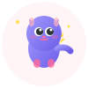

# Catga Logo 设计说明

## 🎨 设计理念

Catga 的 Logo 设计灵感来自于**猫的灵活性和迅速性**，完美体现了框架的核心特点：

### 核心设计元素

1. **猫的形象** 🐱
   - **流线型身体**: 展现灵活性和优雅
   - **跳跃姿态**: 表示快速响应和敏捷
   - **S形尾巴**: 象征灵活性和适应性
   - **锐利的眼神**: 代表精准和高效

2. **速度线条** ⚡
   - 从左向右的动态线条
   - 渐变色彩（红→黄）增强速度感
   - 体现框架的高性能特性

3. **闪电符号** ⚡
   - 代表极速处理能力
   - 象征 CQRS 的快速命令查询分离
   - 黄色渐变增强能量感

4. **代码括号** `{ }`
   - 左右对称的代码符号
   - 提示这是软件开发框架
   - 呼吸动画增加科技感

5. **粒子效果** ✨
   - 流动的彩色粒子
   - 象征数据流动和消息传递
   - 体现事件驱动架构

## 📁 文件说明

### 1. `logo.svg` - 完整版本
- **尺寸**: 200x200px
- **用途**: 
  - GitHub 仓库头图
  - 文档封面
  - 演示文稿
  - 网站首页
- **特点**:
  - 完整动画效果
  - 所有设计元素齐全
  - 包含文字标识

**预览**:
```
┌─────────────────────┐
│  速度线  🐱⚡ 粒子   │
│   { }  猫形象  闪电  │
│      Catga          │
│   Fast & Agile      │
└─────────────────────┘
```

### 2. `logo-simple.svg` - 简化版本
- **尺寸**: 100x100px
- **用途**:
  - README 顶部图标
  - npm 包图标
  - 小尺寸展示
  - 文档侧边栏
- **特点**:
  - 简化的设计元素
  - 无动画效果
  - 静态但保留核心特征

### 3. `logo-monochrome.svg` - 单色版本
- **尺寸**: 64x64px
- **用途**:
  - 黑白打印
  - Favicon
  - 图标徽章
  - 社交媒体头像
- **特点**:
  - 纯色背景（#512BD4）
  - 白色图形
  - 高对比度
  - 适合小尺寸

### 4. `docs/web/favicon.svg` - Favicon 专用
- **尺寸**: 64x64px
- **用途**:
  - 浏览器标签页图标
  - 书签图标
  - PWA 图标
- **特点**:
  - 渐变背景
  - 圆角设计（14px radius）
  - 优化的可识别性

## 🎨 颜色方案

### 主色调
```css
--primary-color: #512BD4    /* 深紫色 - 权威、专业 */
--secondary-color: #6C63FF  /* 亮紫色 - 现代、科技 */
```

### 辅助色
```css
--accent-red: #FF6B6B       /* 红色 - 活力、速度 */
--accent-yellow: #FFD93D    /* 黄色 - 能量、闪电 */
--white: #FFFFFF            /* 白色 - 纯净、清晰 */
```

### 渐变效果
1. **主渐变**: `#512BD4 → #6C63FF` (0° to 100°)
2. **速度渐变**: `transparent #FF6B6B → #FFD93D`
3. **闪电渐变**: `#FFD93D → #FF6B6B`

## ✨ 动画效果

### 1. 呼吸动画
- **元素**: 猫的身体
- **效果**: 轻微的形状变化
- **时长**: 2s
- **作用**: 增加生命力

### 2. 耳朵摆动
- **元素**: 左右耳朵
- **效果**: -5° to +5° 旋转
- **时长**: 3s
- **作用**: 增加灵动感

### 3. 眨眼动画
- **元素**: 眼睛
- **效果**: ry 从 4 到 0.5 再到 4
- **时长**: 4s
- **作用**: 拟人化，增加亲和力

### 4. 尾巴摇摆
- **元素**: S形尾巴
- **效果**: 路径变化
- **时长**: 2s
- **作用**: 体现灵活性

### 5. 闪烁效果
- **元素**: 闪电、速度线、括号
- **效果**: 透明度变化
- **时长**: 1-2s
- **作用**: 增强动态感

### 6. 粒子流动
- **元素**: 彩色圆点
- **效果**: X轴移动 + 透明度渐变
- **时长**: 2.5-3.5s
- **作用**: 象征数据流

## 🖼️ 使用示例

### HTML
```html
<!-- 完整版 -->


<!-- 简化版 -->


<!-- Favicon -->
<link rel="icon" type="image/svg+xml" href="favicon.svg">
```

### Markdown
```markdown
<!-- README 顶部 -->
<div align="center">
  
  <h1>Catga</h1>
  <p>Fast & Agile CQRS Framework</p>
</div>

<!-- 或简化版 -->

```

### CSS Background
```css
.hero {
  background-image: url('logo.svg');
  background-size: contain;
  background-repeat: no-repeat;
  background-position: center;
}
```

## 📐 设计规范

### 最小尺寸
- **完整版**: 不小于 120px
- **简化版**: 不小于 48px
- **单色版**: 不小于 32px
- **Favicon**: 固定 64px（适配 16/32/64）

### 留白空间
- **四周留白**: 至少 10% 的画布尺寸
- **文字间距**: Logo 与文字至少 20px

### 禁止事项
- ❌ 不要拉伸变形
- ❌ 不要改变颜色方案（除非单色版）
- ❌ 不要添加阴影（设计已包含）
- ❌ 不要旋转角度
- ❌ 不要覆盖其他元素

### 允许变体
- ✅ 调整大小（保持比例）
- ✅ 使用单色版本
- ✅ 调整动画速度
- ✅ 禁用动画（静态导出）

## 🎭 设计寓意

| 元素 | 寓意 | 框架特性 |
|------|------|----------|
| 🐱 **猫** | 灵活、敏捷、独立 | 模块化架构 |
| ⚡ **闪电** | 速度、能量、效率 | 高性能、零反射 |
| 📏 **流线型** | 优雅、简洁 | 简洁的 API |
| 🌊 **S形尾巴** | 适应性强 | 可插拔设计 |
| 💨 **速度线** | 快速响应 | 异步处理 |
| `{}` **代码** | 技术、专业 | 开发者友好 |
| ✨ **粒子** | 数据流动 | 事件驱动 |
| 👁️ **锐利眼神** | 精准、专注 | 类型安全 |

## 🚀 导出建议

### Web 使用
- **格式**: SVG（矢量，无损缩放）
- **优点**: 
  - 文件小（< 10KB）
  - 支持动画
  - 响应式
  - Retina 友好

### 打印使用
- **格式**: PNG 或 PDF
- **分辨率**: 300 DPI
- **尺寸**: 至少 2000x2000px
- **使用**: logo-monochrome.svg（单色版）

### 社交媒体
- **Twitter**: 400x400px PNG
- **LinkedIn**: 300x300px PNG
- **GitHub**: 200x200px SVG
- **npm**: 100x100px PNG

## 📝 版权说明

© 2024 Catga Project. All rights reserved.

本 Logo 设计归 Catga 项目所有，仅用于 Catga 框架相关的宣传、文档和开源项目。

---

## 🎨 更新历史

- **v1.0.0** (2024-10-19): 初始设计
  - 猫的灵活和迅速主题
  - 完整动画效果
  - 多个尺寸变体

---

<div align="center">

**Made with ❤️ for Catga Framework**

*Fast, Agile, Powerful*

</div>

