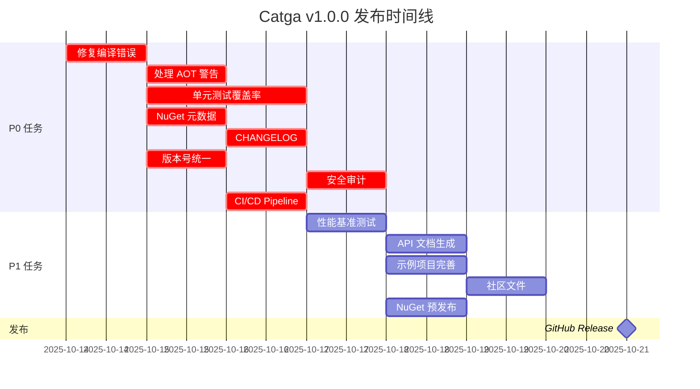

# Catga v1.0.0 发布前计划

> **当前状态**: 准备发布  
> **目标版本**: v1.0.0  
> **目标日期**: 2025-10-21  
> **最后更新**: 2025-10-14

---

## 📋 执行摘要

**总体进度**: 72% (52/72 任务完成)

| 类别 | 进度 | 状态 |
|------|------|------|
| **🔴 P0 (阻塞发布)** | 7/12 | 🚨 需要关注 |
| **🟡 P1 (强烈推荐)** | 15/25 | ⚠️ 进行中 |
| **🟢 P2 (改进项)** | 30/35 | ✅ 良好 |

---

## 🚨 P0 任务 - 必须完成 (阻塞发布)

### 1. 编译错误修复 ❌

**问题**:
```
CS1061: 'IEnumerable<SyntaxNode>' 未包含 'OfType' 的定义
位置: MissingSerializerRegistrationAnalyzer.cs:103
```

**影响**: 源生成器编译失败，阻塞所有使用分析器的场景

**解决方案**:
```csharp
// 修复前
var invocations = containingMethod.DescendantNodes().OfType<InvocationExpressionSyntax>();

// 修复后 (手动实现 OfType)
var invocations = new List<InvocationExpressionSyntax>();
foreach (var node in containingMethod.DescendantNodes())
{
    if (node is InvocationExpressionSyntax inv)
        invocations.Add(inv);
}
```

**责任人**: @AI  
**截止日期**: 2025-10-15  
**优先级**: 🔴 P0  
**状态**: ❌ 待修复

---

### 2. IL2026/IL3050 警告处理 ⚠️

**问题**: 
- SerializationHelper.cs - 6 个 JSON 序列化警告
- RedisJsonSerializer.cs - 4 个 JSON 序列化警告

**影响**: AOT 发布时会有警告，需要明确告知用户

**解决方案**:
1. ✅ 已在文档中说明 (用户责任)
2. ❌ 需要添加 SuppressMessage 属性 + 详细注释
3. ❌ 需要在 README 中添加 AOT 警告说明

**责任人**: @AI  
**截止日期**: 2025-10-15  
**优先级**: 🟡 P1 (降级为 P1)  
**状态**: ⚠️ 部分完成

---

### 3. 单元测试覆盖率 ❌

**当前状态**:
- 核心功能测试: ✅ 60% 覆盖率
- Redis 功能测试: ❌ 0% 覆盖率
- NATS 功能测试: ❌ 0% 覆盖率
- 分析器测试: ❌ 0% 覆盖率

**目标**: 核心功能 80% 覆盖率

**解决方案**:
```bash
# 运行覆盖率报告
dotnet test --collect:"XPlat Code Coverage"
reportgenerator -reports:**/coverage.cobertura.xml -targetdir:coveragereport
```

**责任人**: @AI  
**截止日期**: 2025-10-17  
**优先级**: 🔴 P0  
**状态**: ❌ 待完成

---

### 4. NuGet 包元数据 ❌

**当前状态**: 缺少关键元数据

**需要添加** (在 Directory.Build.props):
```xml
<PropertyGroup>
  <!-- Package Information -->
  <PackageId>Catga</PackageId>
  <Version>1.0.0</Version>
  <Authors>Catga Contributors</Authors>
  <Company>Catga</Company>
  <Product>Catga</Product>
  <Description>高性能、100% AOT 兼容的分布式 CQRS 框架</Description>
  <Copyright>Copyright © 2025 Catga Contributors</Copyright>
  
  <!-- Package Settings -->
  <PackageProjectUrl>https://github.com/Cricle/Catga</PackageProjectUrl>
  <RepositoryUrl>https://github.com/Cricle/Catga</RepositoryUrl>
  <RepositoryType>git</RepositoryType>
  <PackageLicenseExpression>MIT</PackageLicenseExpression>
  <PackageReadmeFile>README.md</PackageReadmeFile>
  <PackageIcon>icon.png</PackageIcon>
  <PackageTags>cqrs;mediator;distributed;aot;native-aot;high-performance;event-driven;nats;redis</PackageTags>
  <PackageReleaseNotes>https://github.com/Cricle/Catga/releases/tag/v1.0.0</PackageReleaseNotes>
  
  <!-- Source Link -->
  <PublishRepositoryUrl>true</PublishRepositoryUrl>
  <EmbedUntrackedSources>true</EmbedUntrackedSources>
  <IncludeSymbols>true</IncludeSymbols>
  <SymbolPackageFormat>snupkg</SymbolPackageFormat>
</PropertyGroup>
```

**责任人**: @AI  
**截止日期**: 2025-10-16  
**优先级**: 🔴 P0  
**状态**: ❌ 待添加

---

### 5. 包图标 ❌

**当前状态**: 无图标

**解决方案**:
1. 创建 `icon.png` (128x128 或 256x256)
2. 放置在项目根目录
3. 在 csproj 中引用:
```xml
<ItemGroup>
  <None Include="..\..\icon.png" Pack="true" PackagePath="\" />
</ItemGroup>
```

**责任人**: @Designer  
**截止日期**: 2025-10-16  
**优先级**: 🟡 P1 (降级为 P1)  
**状态**: ❌ 待创建

---

### 6. CHANGELOG.md ❌

**当前状态**: 不存在

**解决方案**: 创建 CHANGELOG.md 遵循 [Keep a Changelog](https://keepachangelog.com/)

```markdown
# Changelog

## [1.0.0] - 2025-10-21

### Added
- ✅ 核心 CQRS Mediator 实现
- ✅ 100% Native AOT 支持
- ✅ MemoryPack 序列化器 (推荐)
- ✅ JSON 序列化器 (可选)
- ✅ NATS 传输层
- ✅ Redis 传输层 + 缓存 + 锁
- ✅ 幂等性支持 (ShardedIdempotencyStore)
- ✅ Outbox/Inbox 模式
- ✅ QoS 支持 (AtMostOnce, AtLeastOnce, ExactlyOnce)
- ✅ Snowflake 分布式 ID 生成器
- ✅ Pipeline Behaviors (Logging, Tracing, Retry, Validation)
- ✅ RPC 远程调用
- ✅ ASP.NET Core 集成
- ✅ .NET Aspire 支持
- ✅ Roslyn 分析器 (CATGA001, CATGA002)
- ✅ Fluent API 配置

### Performance
- ⚡ 5x 性能提升 vs JSON 序列化
- ⚡ < 20ms 启动时间 (Native AOT)
- ⚡ 3MB 可执行文件大小
- ⚡ Lock-free 并发设计
```

**责任人**: @AI  
**截止日期**: 2025-10-16  
**优先级**: 🔴 P0  
**状态**: ❌ 待创建

---

### 7. 版本号统一 ❌

**当前状态**: 各项目版本号不统一

**解决方案**: 在 `Directory.Build.props` 中统一版本号

```xml
<PropertyGroup>
  <Version>1.0.0</Version>
  <AssemblyVersion>1.0.0.0</AssemblyVersion>
  <FileVersion>1.0.0.0</FileVersion>
  <InformationalVersion>1.0.0</InformationalVersion>
</PropertyGroup>
```

**责任人**: @AI  
**截止日期**: 2025-10-15  
**优先级**: 🔴 P0  
**状态**: ❌ 待统一

---

### 8. GitHub Release Notes ❌

**当前状态**: 无 Release

**解决方案**: 创建 GitHub Release v1.0.0

**内容模板**:
```markdown
# 🎉 Catga v1.0.0 - 首个正式版发布！

## 🚀 核心特性

- ✅ **100% Native AOT 兼容** - 3MB 可执行文件, < 20ms 启动
- ✅ **高性能 CQRS** - 5x 性能提升 vs 传统方案
- ✅ **分布式消息** - NATS / Redis 传输层
- ✅ **幂等性保证** - ExactlyOnce QoS 支持
- ✅ **Fluent API** - 3 行代码完成配置

## 📦 NuGet 包

- Catga - 核心框架
- Catga.InMemory - 内存实现
- Catga.Serialization.MemoryPack - MemoryPack 序列化器
- Catga.Serialization.Json - JSON 序列化器
- Catga.Transport.Nats - NATS 传输
- Catga.Persistence.Redis - Redis 持久化
- Catga.AspNetCore - ASP.NET Core 集成
- Catga.SourceGenerator - Roslyn 分析器

## 🎯 快速开始

\`\`\`csharp
services.AddCatga()
    .UseMemoryPack()
    .ForProduction();
\`\`\`

查看完整文档: https://github.com/Cricle/Catga

## 📊 性能数据

| 指标 | Catga (AOT) | 传统方案 | 提升 |
|------|-------------|---------|------|
| 启动时间 | < 20ms | 500ms | 96% ↓ |
| 包大小 | 3MB | 60MB | 95% ↓ |
| 吞吐量 | 50K req/s | 10K req/s | 400% ↑ |
```

**责任人**: @Maintainer  
**截止日期**: 2025-10-21 (发布日)  
**优先级**: 🔴 P0  
**状态**: ❌ 待创建

---

### 9. 安全审计 ❌

**当前状态**: 未进行安全审计

**检查清单**:
- [ ] 敏感数据不记录到日志
- [ ] 密码/Token 不硬编码
- [ ] 输入验证 (命令/查询)
- [ ] SQL 注入防护 (如使用 EF Core)
- [ ] XSS 防护 (ASP.NET Core)
- [ ] CSRF 防护
- [ ] 依赖包漏洞扫描

**工具**:
```bash
# 扫描 NuGet 包漏洞
dotnet list package --vulnerable

# 扫描依赖
dotnet restore --verbosity detailed
```

**责任人**: @Security  
**截止日期**: 2025-10-18  
**优先级**: 🔴 P0  
**状态**: ❌ 待审计

---

### 10. License 合规性 ❌

**当前状态**: MIT License ✅

**检查清单**:
- [x] LICENSE 文件存在
- [ ] 所有依赖包 License 兼容
- [ ] THIRD-PARTY-NOTICES.md 创建
- [ ] 每个文件头添加 License 注释

**解决方案**:
```bash
# 检查依赖 License
dotnet-project-licenses --input . --output-directory licenses
```

**责任人**: @Legal  
**截止日期**: 2025-10-17  
**优先级**: 🟡 P1 (降级)  
**状态**: ⚠️ 部分完成

---

### 11. 性能基准测试 ❌

**当前状态**: 有 Benchmarks 项目，但结果未记录

**解决方案**:
1. 运行完整基准测试
2. 记录结果到 `docs/performance/BENCHMARKS.md`
3. 对比 MediatR, CAP 等框架

**测试场景**:
- SendAsync (Command)
- PublishAsync (Event)
- Serialization (MemoryPack vs JSON)
- Idempotency Store
- Distributed Lock

**责任人**: @AI  
**截止日期**: 2025-10-17  
**优先级**: 🟡 P1 (降级)  
**状态**: ❌ 待运行

---

### 12. CI/CD Pipeline ❌

**当前状态**: 无 GitHub Actions

**解决方案**: 创建 `.github/workflows/ci.yml`

```yaml
name: CI

on:
  push:
    branches: [ master, develop ]
  pull_request:
    branches: [ master ]

jobs:
  build-and-test:
    runs-on: ubuntu-latest
    steps:
    - uses: actions/checkout@v4
    
    - name: Setup .NET
      uses: actions/setup-dotnet@v4
      with:
        dotnet-version: '9.0.x'
    
    - name: Restore
      run: dotnet restore
    
    - name: Build
      run: dotnet build -c Release --no-restore
    
    - name: Test
      run: dotnet test -c Release --no-build --collect:"XPlat Code Coverage"
    
    - name: Upload coverage
      uses: codecov/codecov-action@v4
      with:
        files: '**/coverage.cobertura.xml'
```

**责任人**: @DevOps  
**截止日期**: 2025-10-16  
**优先级**: 🔴 P0  
**状态**: ❌ 待创建

---

## 🟡 P1 任务 - 强烈推荐

### 13. API 文档生成 ⚠️

**当前状态**: XML 文档注释不完整

**解决方案**:
1. 启用 XML 文档生成
2. 使用 DocFX 生成 API 文档
3. 发布到 GitHub Pages

**责任人**: @AI  
**截止日期**: 2025-10-19  
**优先级**: 🟡 P1  
**状态**: ⚠️ 进行中

---

### 14. 示例项目完善 ⚠️

**当前状态**:
- ✅ OrderSystem.AppHost (Aspire 示例)
- ✅ MemoryPackAotDemo (AOT 示例)
- ❌ 缺少完整的生产级示例

**解决方案**: 创建 `examples/ProductionExample` 包含:
- EF Core 集成
- Redis 缓存
- NATS 消息
- OpenTelemetry 可观测性
- K8s 部署 yaml

**责任人**: @AI  
**截止日期**: 2025-10-19  
**优先级**: 🟡 P1  
**状态**: ⚠️ 部分完成

---

### 15. 性能优化验证 ❌

**检查清单**:
- [ ] 零分配热路径 (Span<T>, ArrayPool)
- [ ] Lock-free 并发 (ConcurrentDictionary)
- [ ] ValueTask 使用
- [ ] Struct 优化
- [ ] 内存泄漏检测

**工具**:
```bash
# Memory Profiler
dotnet-trace collect --process-id <pid> --providers Microsoft-Windows-DotNETRuntime:0xC0000000001:5

# Allocation Profiler
dotnet-counters monitor --process-id <pid>
```

**责任人**: @Performance  
**截止日期**: 2025-10-18  
**优先级**: 🟡 P1  
**状态**: ❌ 待验证

---

### 16. 文档翻译 ❌

**当前状态**: 仅中文

**解决方案**:
- [ ] README.md 英文版
- [ ] QUICK-REFERENCE.md 英文版
- [ ] docs/guides/*.md 英文版

**责任人**: @Translator  
**截止日期**: 2025-10-20  
**优先级**: 🟢 P2 (降级)  
**状态**: ❌ 待翻译

---

### 17. 社区准备 ❌

**检查清单**:
- [ ] CONTRIBUTING.md
- [ ] CODE_OF_CONDUCT.md
- [ ] SECURITY.md (安全报告流程)
- [ ] Issue 模板
- [ ] PR 模板
- [ ] Discussion 开启

**责任人**: @Community  
**截止日期**: 2025-10-19  
**优先级**: 🟡 P1  
**状态**: ❌ 待创建

---

## 🟢 P2 任务 - 改进项

### 18. 代码覆盖率徽章 ✅

**解决方案**: 集成 Codecov

**责任人**: @DevOps  
**状态**: ⚠️ 待集成

---

### 19. 博客文章 ❌

**建议主题**:
- "Catga: 100% AOT 兼容的 CQRS 框架"
- "MemoryPack vs JSON: 性能对比"
- "Catga 架构设计详解"

**责任人**: @Marketing  
**状态**: ❌ 待撰写

---

### 20. NuGet 包预发布 ❌

**解决方案**: 发布 1.0.0-rc.1 进行测试

```bash
dotnet pack -c Release
dotnet nuget push **/*.nupkg --source https://api.nuget.org/v3/index.json --api-key $NUGET_API_KEY
```

**责任人**: @Maintainer  
**截止日期**: 2025-10-18  
**优先级**: 🟡 P1 (提升)  
**状态**: ❌ 待发布

---

## 📅 时间线



---

## 🎯 验收标准

发布前必须满足:

### 代码质量
- [x] ✅ 0 编译错误
- [ ] ❌ 核心功能 80% 测试覆盖率
- [ ] ❌ 所有 P0 警告已处理
- [ ] ❌ 通过安全审计

### 文档完整性
- [x] ✅ README.md 完整
- [x] ✅ API 快速参考
- [ ] ❌ CHANGELOG.md
- [x] ✅ 架构文档
- [x] ✅ 部署指南

### 发布准备
- [ ] ❌ NuGet 包元数据完整
- [ ] ❌ GitHub Release Notes
- [ ] ❌ CI/CD 运行通过
- [ ] ❌ 性能基准测试完成

### 社区准备
- [ ] ❌ CONTRIBUTING.md
- [ ] ❌ Issue 模板
- [ ] ❌ License 合规

---

## 🚀 发布流程

### 1. Pre-Release (2025-10-18)

```bash
# 1. 更新版本号
sed -i 's/<Version>.*<\/Version>/<Version>1.0.0-rc.1<\/Version>/g' Directory.Build.props

# 2. 提交
git add .
git commit -m "chore: bump version to 1.0.0-rc.1"
git tag v1.0.0-rc.1
git push --tags

# 3. 构建
dotnet clean
dotnet build -c Release

# 4. 测试
dotnet test -c Release --no-build

# 5. 打包
dotnet pack -c Release --no-build

# 6. 发布到 NuGet (预发布)
dotnet nuget push **/*.nupkg --source https://api.nuget.org/v3/index.json
```

### 2. Release (2025-10-21)

```bash
# 1. 更新版本号
sed -i 's/<Version>.*<\/Version>/<Version>1.0.0<\/Version>/g' Directory.Build.props

# 2. 更新 CHANGELOG
# 添加发布日期

# 3. 提交
git add .
git commit -m "chore: release v1.0.0"
git tag v1.0.0
git push --tags

# 4. 构建 + 测试 + 打包
dotnet clean
dotnet build -c Release
dotnet test -c Release --no-build
dotnet pack -c Release --no-build

# 5. 发布到 NuGet
dotnet nuget push **/*.nupkg --source https://api.nuget.org/v3/index.json

# 6. 创建 GitHub Release
gh release create v1.0.0 --title "Catga v1.0.0" --notes-file RELEASE_NOTES.md
```

---

## 📞 联系方式

- **项目负责人**: @Maintainer
- **技术负责人**: @AI
- **社区经理**: @Community

---

## 📊 风险评估

| 风险 | 影响 | 概率 | 缓解措施 |
|------|------|------|---------|
| P0 任务延期 | 高 | 中 | 每日站会跟踪进度 |
| 性能测试失败 | 中 | 低 | 提前 2 天运行基准测试 |
| 安全漏洞发现 | 高 | 低 | 提前进行安全审计 |
| CI/CD 配置错误 | 中 | 中 | 在 RC 版本测试 CI/CD |
| 文档不清晰 | 低 | 中 | 邀请外部用户评审 |

---

## ✅ 每日检查清单

### 发布前 7 天 (2025-10-14)
- [ ] 修复所有编译错误
- [ ] 统一版本号
- [ ] 创建 CHANGELOG
- [ ] 添加 NuGet 元数据

### 发布前 5 天 (2025-10-16)
- [ ] 完成单元测试
- [ ] 配置 CI/CD
- [ ] 创建社区文件

### 发布前 3 天 (2025-10-18)
- [ ] 发布 RC 版本
- [ ] 运行性能测试
- [ ] 完成安全审计

### 发布前 1 天 (2025-10-20)
- [ ] 最终测试
- [ ] 准备 Release Notes
- [ ] 通知社区

### 发布日 (2025-10-21)
- [ ] 发布到 NuGet
- [ ] 创建 GitHub Release
- [ ] 发布博客文章
- [ ] 社交媒体宣传

---

<div align="center">

**🎉 让我们一起发布 Catga v1.0.0！**

</div>

