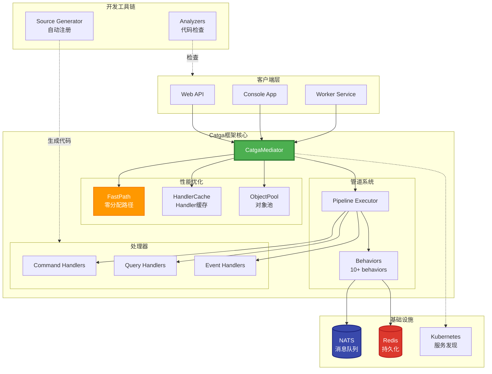
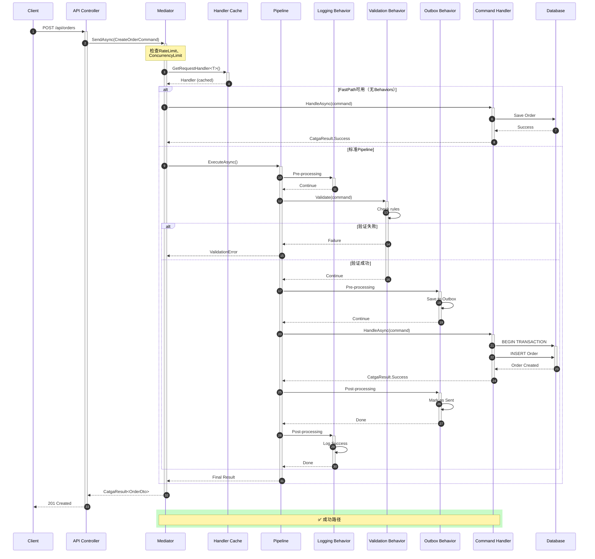
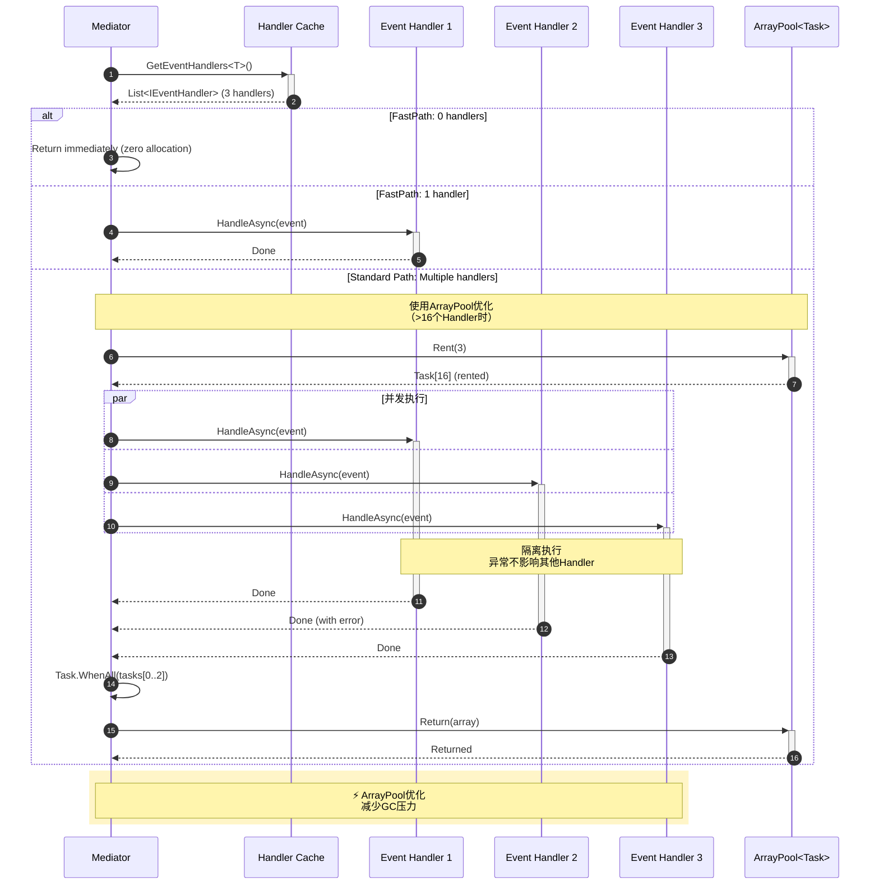
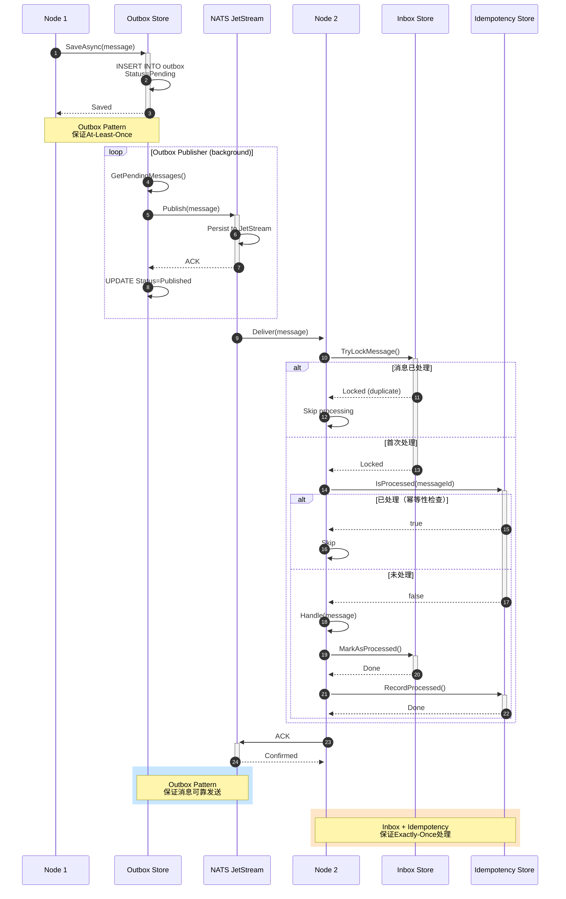
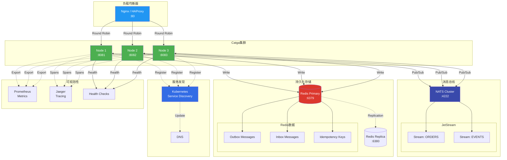
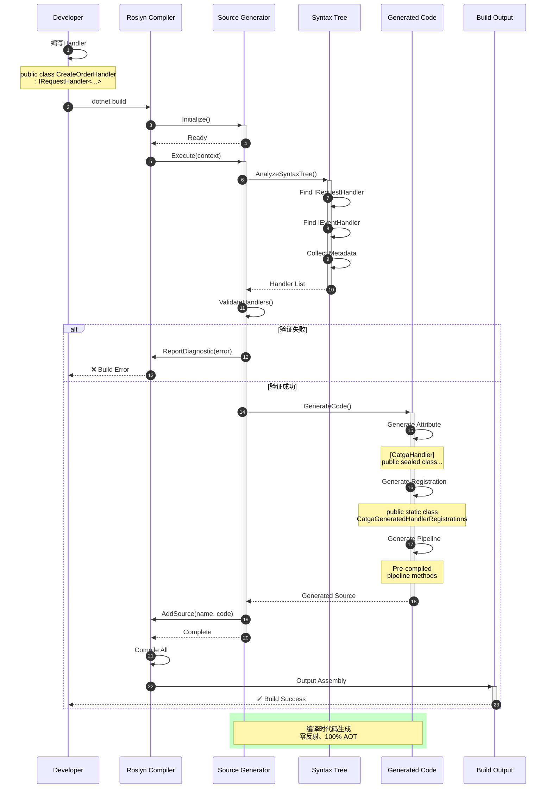
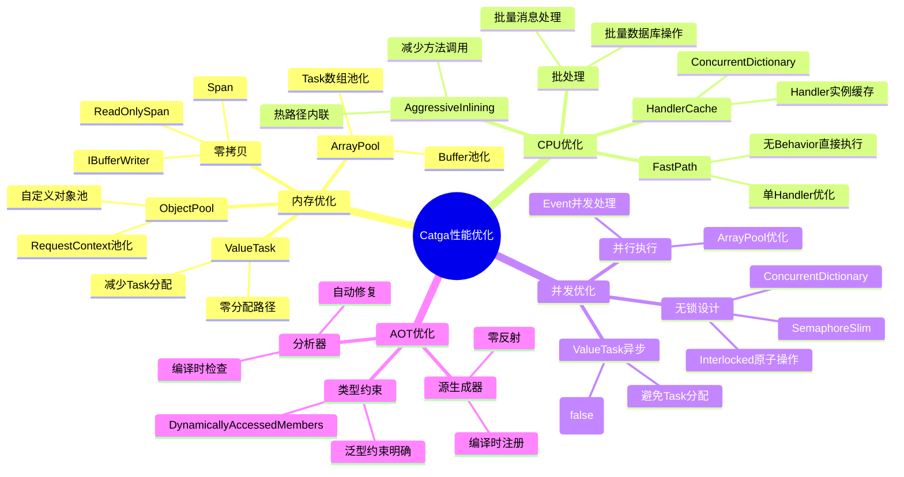
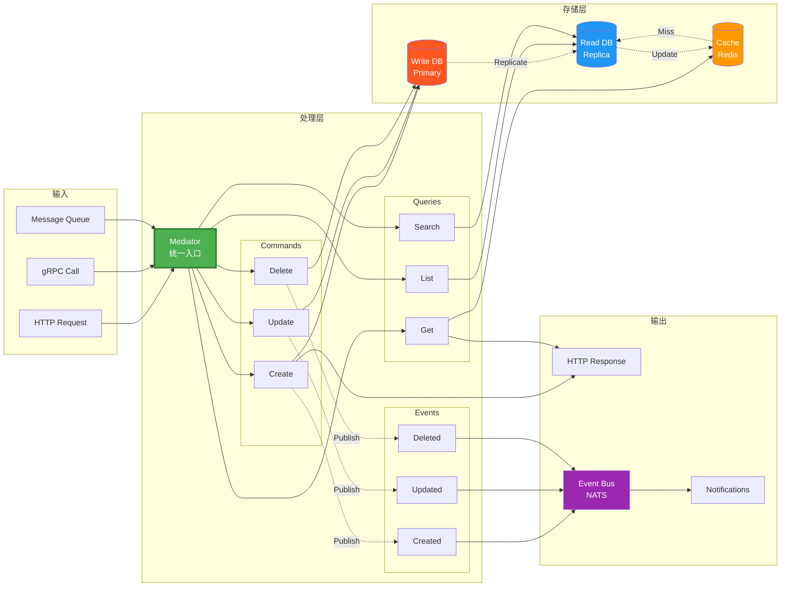

# 📐 Catga v2.0 架构图集

完整的架构图可视化文档

---

## 🎯 核心架构总览

---

## 🔄 Command处理流程（标准路径）

---

## 📢 Event发布流程（多Handler并发）

---

## 🌐 分布式消息流

---

## 🏗️ 集群拓扑

---

## 🔧 源生成器工作流

---

## 🎯 性能优化策略图

---

## 📊 数据流向图

---

**🎨 所有架构图使用Mermaid语法，可在GitHub、Markdown编辑器中直接渲染！**

