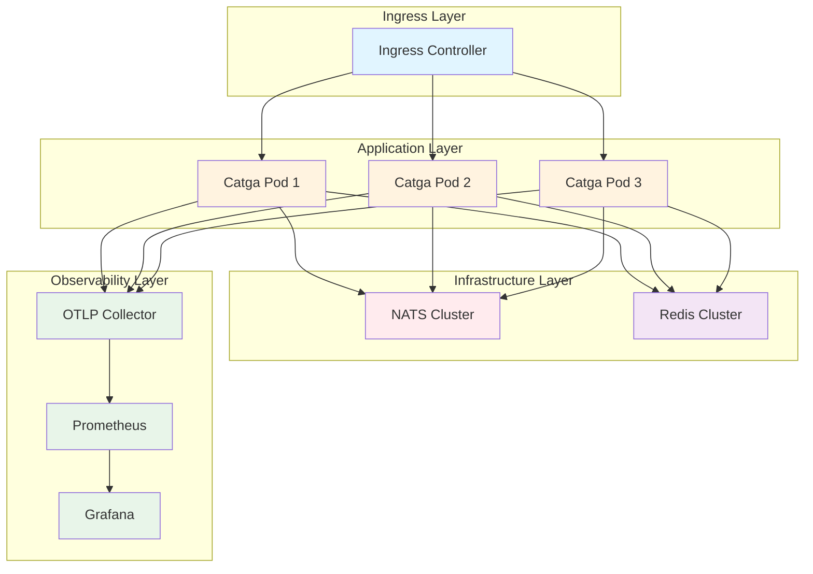

# Kubernetes 部署指南

> **生产级 K8s 部署** - Catga + NATS + Redis 完整部署方案
> 最后更新: 2025-10-14

[返回主文档](../README.md) · [文档索引](../INDEX.md) · [架构设计](../architecture/ARCHITECTURE.md)

---

## 本指南内容

本指南涵盖 Catga 应用在 Kubernetes 上的完整部署流程：

✅ **Helm Chart 部署** - 一键部署完整堆栈
✅ **NATS + Redis 集成** - 生产级消息队列和缓存
✅ **服务发现** - K8s 原生服务发现
✅ **可观测性** - OpenTelemetry + Prometheus + Grafana
✅ **高可用** - 多副本 + 滚动更新
✅ **Auto-scaling** - HPA + VPA 自动扩缩容

---

## 前置要求

### 本地开发

- ✅ **kubectl** - K8s 命令行工具
- ✅ **helm** - K8s 包管理器
- ✅ **Docker Desktop** (含 K8s) 或 **Minikube**

```bash
# 验证安装
kubectl version --client
helm version
docker version
```

### 生产环境

- ✅ **Kubernetes 集群** - v1.27+ (AKS / EKS / GKE)
- ✅ **Helm** - v3.12+
- ✅ **容器镜像仓库** - ACR / ECR / GCR / Docker Hub
- ✅ **域名和 SSL 证书** (可选)

---

## 快速开始

### 1. 使用 Helm 部署（推荐）

```bash
# 添加 Catga Helm 仓库
helm repo add catga https://catga.github.io/charts
helm repo update

# 部署完整堆栈 (Catga + NATS + Redis)
helm install my-catga catga/catga \
  --namespace catga \
  --create-namespace \
  --set image.tag=latest \
  --set replicaCount=3

# 查看部署状态
kubectl get pods -n catga
kubectl get svc -n catga
```

### 2. 访问应用

```bash
# 端口转发
kubectl port-forward svc/my-catga -n catga 8080:80

# 测试
curl http://localhost:8080/health
```

---

## 架构概览

### 组件关系图



### 核心组件

| 组件 | 用途 | 推荐副本数 | 资源需求 |
|------|------|-----------|---------|
| **Catga App** | 应用服务 | 3+ | 200m CPU / 256Mi RAM |
| **NATS** | 消息队列 | 3 | 500m CPU / 512Mi RAM |
| **Redis** | 缓存/存储 | 3 (Sentinel) | 500m CPU / 1Gi RAM |
| **OTLP Collector** | 遥测收集 | 2 | 100m CPU / 128Mi RAM |

---

## 方式 1: Helm Chart 部署（推荐）

### Helm Chart 结构

```
helm/catga/
├── Chart.yaml              # Chart 元数据
├── values.yaml             # 默认配置
├── values-prod.yaml        # 生产环境配置
├── templates/
│   ├── deployment.yaml     # Deployment
│   ├── service.yaml        # Service
│   ├── ingress.yaml        # Ingress
│   ├── configmap.yaml      # ConfigMap
│   ├── secret.yaml         # Secret
│   ├── hpa.yaml            # HorizontalPodAutoscaler
│   ├── servicemonitor.yaml # Prometheus ServiceMonitor
│   └── NOTES.txt           # 部署后提示
└── charts/
    ├── nats/               # NATS 依赖
    └── redis/              # Redis 依赖
```

### values.yaml 示例

```yaml
# Catga 应用配置
replicaCount: 3

image:
  repository: myregistry.azurecr.io/catga-app
  tag: "1.0.0"
  pullPolicy: IfNotPresent

service:
  type: ClusterIP
  port: 80
  targetPort: 8080

resources:
  requests:
    cpu: 200m
    memory: 256Mi
  limits:
    cpu: 1000m
    memory: 512Mi

# 自动扩缩容
autoscaling:
  enabled: true
  minReplicas: 3
  maxReplicas: 10
  targetCPUUtilizationPercentage: 70
  targetMemoryUtilizationPercentage: 80

# Catga 配置
catga:
  serializer: memorypack  # memorypack | json
  environment: production # development | production

  # NATS 配置
  nats:
    enabled: true
    url: nats://nats-cluster:4222

  # Redis 配置
  redis:
    enabled: true
    host: redis-master
    port: 6379

  # 可观测性
  observability:
    tracing: true
    metrics: true
    logging: true

# NATS 依赖
nats:
  enabled: true
  cluster:
    enabled: true
    replicas: 3
  jetstream:
    enabled: true
    fileStorage:
      size: 10Gi

# Redis 依赖
redis:
  enabled: true
  architecture: replication
  auth:
    enabled: true
    password: "change-me-in-production"
  master:
    persistence:
      size: 10Gi
  replica:
    replicaCount: 2
    persistence:
      size: 10Gi
```

### 部署命令

```bash
# 1. 开发环境
helm install catga-dev ./helm/catga \
  --namespace catga-dev \
  --create-namespace

# 2. 生产环境
helm install catga-prod ./helm/catga \
  --namespace catga-prod \
  --create-namespace \
  --values ./helm/catga/values-prod.yaml \
  --set image.tag=1.0.0

# 3. 升级
helm upgrade catga-prod ./helm/catga \
  --namespace catga-prod \
  --values ./helm/catga/values-prod.yaml \
  --set image.tag=1.0.1

# 4. 回滚
helm rollback catga-prod -n catga-prod

# 5. 卸载
helm uninstall catga-prod -n catga-prod
```

---

## 方式 2: 原始 Manifest 部署

### 1. Deployment

```yaml
# deployment.yaml
apiVersion: apps/v1
kind: Deployment
metadata:
  name: catga-app
  namespace: catga
spec:
  replicas: 3
  selector:
    matchLabels:
      app: catga
  template:
    metadata:
      labels:
        app: catga
    spec:
      containers:
      - name: catga
        image: myregistry.azurecr.io/catga-app:1.0.0
        ports:
        - containerPort: 8080
          name: http
        env:
        - name: ASPNETCORE_ENVIRONMENT
          value: "Production"
        - name: Catga__Serializer
          value: "memorypack"
        - name: Catga__Nats__Url
          value: "nats://nats-cluster:4222"
        - name: Catga__Redis__Host
          value: "redis-master"
        - name: Catga__Redis__Port
          value: "6379"
        resources:
          requests:
            cpu: 200m
            memory: 256Mi
          limits:
            cpu: 1000m
            memory: 512Mi
        livenessProbe:
          httpGet:
            path: /health
            port: 8080
          initialDelaySeconds: 10
          periodSeconds: 10
        readinessProbe:
          httpGet:
            path: /health
            port: 8080
          initialDelaySeconds: 5
          periodSeconds: 5
```

### 2. Service

```yaml
# service.yaml
apiVersion: v1
kind: Service
metadata:
  name: catga-service
  namespace: catga
spec:
  selector:
    app: catga
  ports:
  - name: http
    port: 80
    targetPort: 8080
  type: ClusterIP
```

### 3. Ingress

```yaml
# ingress.yaml
apiVersion: networking.k8s.io/v1
kind: Ingress
metadata:
  name: catga-ingress
  namespace: catga
  annotations:
    cert-manager.io/cluster-issuer: letsencrypt-prod
    nginx.ingress.kubernetes.io/ssl-redirect: "true"
spec:
  ingressClassName: nginx
  tls:
  - hosts:
    - api.example.com
    secretName: catga-tls
  rules:
  - host: api.example.com
    http:
      paths:
      - path: /
        pathType: Prefix
        backend:
          service:
            name: catga-service
            port:
              number: 80
```

### 4. ConfigMap

```yaml
# configmap.yaml
apiVersion: v1
kind: ConfigMap
metadata:
  name: catga-config
  namespace: catga
data:
  appsettings.Production.json: |
    {
      "Catga": {
        "Serializer": "memorypack",
        "Environment": "production",
        "Observability": {
          "EnableTracing": true,
          "EnableMetrics": true,
          "EnableLogging": true
        }
      }
    }
```

### 5. HorizontalPodAutoscaler

```yaml
# hpa.yaml
apiVersion: autoscaling/v2
kind: HorizontalPodAutoscaler
metadata:
  name: catga-hpa
  namespace: catga
spec:
  scaleTargetRef:
    apiVersion: apps/v1
    kind: Deployment
    name: catga-app
  minReplicas: 3
  maxReplicas: 10
  metrics:
  - type: Resource
    resource:
      name: cpu
      target:
        type: Utilization
        averageUtilization: 70
  - type: Resource
    resource:
      name: memory
      target:
        type: Utilization
        averageUtilization: 80
```

### 部署

```bash
# 应用所有 manifest
kubectl apply -f deployment.yaml
kubectl apply -f service.yaml
kubectl apply -f configmap.yaml
kubectl apply -f hpa.yaml
kubectl apply -f ingress.yaml

# 或一次性应用
kubectl apply -f k8s/
```

---

## NATS 集群部署

### 使用 Helm

```bash
# 添加 NATS Helm 仓库
helm repo add nats https://nats-io.github.io/k8s/helm/charts/
helm repo update

# 部署 NATS 集群 (3 节点 + JetStream)
helm install nats nats/nats \
  --namespace catga \
  --set cluster.enabled=true \
  --set cluster.replicas=3 \
  --set nats.jetstream.enabled=true \
  --set nats.jetstream.fileStorage.size=10Gi
```

### Catga 连接配置

```csharp
builder.Services.AddCatga()
    .UseMemoryPack()
    .ForProduction();

builder.Services.AddNatsTransport(options =>
{
    options.Servers = "nats://nats-cluster:4222"; // K8s Service DNS
    options.Name = "catga-app";
});
```

---

## Redis 集群部署

### 使用 Helm (Sentinel 模式)

```bash
# 添加 Bitnami Helm 仓库
helm repo add bitnami https://charts.bitnami.com/bitnami
helm repo update

# 部署 Redis (Sentinel 高可用)
helm install redis bitnami/redis \
  --namespace catga \
  --set architecture=replication \
  --set auth.password=your-secure-password \
  --set master.persistence.size=10Gi \
  --set replica.replicaCount=2 \
  --set replica.persistence.size=10Gi \
  --set sentinel.enabled=true
```

### Catga 连接配置

```csharp
builder.Services.AddRedisTransport(options =>
{
    options.ConnectionString = "redis-master:6379,password=your-secure-password";
});

builder.Services.AddRedisDistributedCache();
```

---

## 可观测性

### 1. OpenTelemetry Collector

```yaml
# otel-collector.yaml
apiVersion: v1
kind: ConfigMap
metadata:
  name: otel-collector-config
  namespace: catga
data:
  config.yaml: |
    receivers:
      otlp:
        protocols:
          grpc:
            endpoint: 0.0.0.0:4317
          http:
            endpoint: 0.0.0.0:4318

    exporters:
      prometheus:
        endpoint: "0.0.0.0:8889"

      jaeger:
        endpoint: jaeger-collector:14250
        tls:
          insecure: true

    service:
      pipelines:
        traces:
          receivers: [otlp]
          exporters: [jaeger]
        metrics:
          receivers: [otlp]
          exporters: [prometheus]

---
apiVersion: apps/v1
kind: Deployment
metadata:
  name: otel-collector
  namespace: catga
spec:
  replicas: 2
  selector:
    matchLabels:
      app: otel-collector
  template:
    metadata:
      labels:
        app: otel-collector
    spec:
      containers:
      - name: otel-collector
        image: otel/opentelemetry-collector:latest
        args: ["--config=/etc/otel/config.yaml"]
        ports:
        - containerPort: 4317 # OTLP gRPC
        - containerPort: 4318 # OTLP HTTP
        - containerPort: 8889 # Prometheus
        volumeMounts:
        - name: config
          mountPath: /etc/otel
      volumes:
      - name: config
        configMap:
          name: otel-collector-config
```

### 2. Prometheus + Grafana

```bash
# 使用 kube-prometheus-stack
helm repo add prometheus-community https://prometheus-community.github.io/helm-charts
helm repo update

helm install monitoring prometheus-community/kube-prometheus-stack \
  --namespace monitoring \
  --create-namespace \
  --set prometheus.prometheusSpec.serviceMonitorSelectorNilUsesHelmValues=false \
  --set grafana.adminPassword=admin
```

### 3. Catga 遥测配置

```csharp
builder.Services.AddOpenTelemetry()
    .WithTracing(tracing => tracing
        .AddSource("Catga")
        .AddAspNetCoreInstrumentation()
        .AddOtlpExporter(options =>
        {
            options.Endpoint = new Uri("http://otel-collector:4317");
        }))
    .WithMetrics(metrics => metrics
        .AddMeter("Catga")
        .AddAspNetCoreInstrumentation()
        .AddOtlpExporter(options =>
        {
            options.Endpoint = new Uri("http://otel-collector:4317");
        }));
```

---

## 安全最佳实践

### 1. Secret 管理

```yaml
# secret.yaml
apiVersion: v1
kind: Secret
metadata:
  name: catga-secrets
  namespace: catga
type: Opaque
stringData:
  redis-password: "your-redis-password"
  nats-auth-token: "your-nats-token"
```

```yaml
# 在 Deployment 中使用
env:
- name: Catga__Redis__Password
  valueFrom:
    secretKeyRef:
      name: catga-secrets
      key: redis-password
```

### 2. NetworkPolicy

```yaml
# network-policy.yaml
apiVersion: networking.k8s.io/v1
kind: NetworkPolicy
metadata:
  name: catga-network-policy
  namespace: catga
spec:
  podSelector:
    matchLabels:
      app: catga
  policyTypes:
  - Ingress
  - Egress
  ingress:
  - from:
    - namespaceSelector:
        matchLabels:
          name: ingress-nginx
    ports:
    - protocol: TCP
      port: 8080
  egress:
  - to:
    - podSelector:
        matchLabels:
          app: nats
    ports:
    - protocol: TCP
      port: 4222
  - to:
    - podSelector:
        matchLabels:
          app: redis
    ports:
    - protocol: TCP
      port: 6379
```

### 3. PodSecurityPolicy

```yaml
# psp.yaml
apiVersion: policy/v1beta1
kind: PodSecurityPolicy
metadata:
  name: catga-psp
spec:
  privileged: false
  allowPrivilegeEscalation: false
  requiredDropCapabilities:
    - ALL
  volumes:
    - 'configMap'
    - 'emptyDir'
    - 'projected'
    - 'secret'
  hostNetwork: false
  hostIPC: false
  hostPID: false
  runAsUser:
    rule: 'MustRunAsNonRoot'
  seLinux:
    rule: 'RunAsAny'
  fsGroup:
    rule: 'RunAsAny'
  readOnlyRootFilesystem: true
```

---

## CI/CD 集成

### GitHub Actions 示例

```yaml
# .github/workflows/deploy.yml
name: Deploy to K8s

on:
  push:
    branches: [main]

env:
  REGISTRY: myregistry.azurecr.io
  IMAGE_NAME: catga-app

jobs:
  build-and-deploy:
    runs-on: ubuntu-latest
    steps:
    - uses: actions/checkout@v3

    - name: Build and push Docker image
      run: |
        docker build -t ${{ env.REGISTRY }}/${{ env.IMAGE_NAME }}:${{ github.sha }} .
        docker push ${{ env.REGISTRY }}/${{ env.IMAGE_NAME }}:${{ github.sha }}

    - name: Set up kubectl
      uses: azure/setup-kubectl@v3

    - name: Deploy to K8s
      run: |
        helm upgrade catga-prod ./helm/catga \
          --namespace catga-prod \
          --set image.tag=${{ github.sha }} \
          --wait
```

---

## 性能调优

### 资源配置建议

**小型部署（< 1000 req/s）**:
```yaml
resources:
  requests:
    cpu: 100m
    memory: 128Mi
  limits:
    cpu: 500m
    memory: 256Mi
replicaCount: 2
```

**中型部署（1000-10000 req/s）**:
```yaml
resources:
  requests:
    cpu: 200m
    memory: 256Mi
  limits:
    cpu: 1000m
    memory: 512Mi
replicaCount: 3-5
```

**大型部署（> 10000 req/s）**:
```yaml
resources:
  requests:
    cpu: 500m
    memory: 512Mi
  limits:
    cpu: 2000m
    memory: 1Gi
replicaCount: 10+
```

---

## 故障排查

### 常见问题

**1. Pod 无法启动**
```bash
# 查看 Pod 日志
kubectl logs -f <pod-name> -n catga

# 查看 Pod 事件
kubectl describe pod <pod-name> -n catga
```

**2. NATS 连接失败**
```bash
# 测试 NATS 连接
kubectl run -it --rm nats-box --image=natsio/nats-box --restart=Never -- sh
nats-box:~# nats-pub test "Hello"
```

**3. Redis 连接失败**
```bash
# 测试 Redis 连接
kubectl run -it --rm redis-cli --image=redis:alpine --restart=Never -- sh
redis-cli -h redis-master -p 6379 PING
```

---

## 相关资源

- **[Helm Charts 仓库](https://github.com/catga/charts)**
- **[K8s 官方文档](https://kubernetes.io/docs/)**
- **[NATS K8s 部署](https://docs.nats.io/running-a-nats-service/nats-kubernetes)**
- **[Redis K8s 部署](https://redis.io/docs/getting-started/install-stack/kubernetes/)**

---

<div align="center">

**🚀 生产级 K8s 部署，让 Catga 飞起来！**

[返回主文档](../README.md) · [文档索引](../INDEX.md) · [架构设计](../architecture/ARCHITECTURE.md)

</div>
