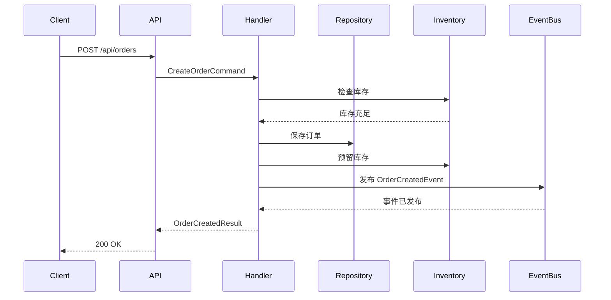
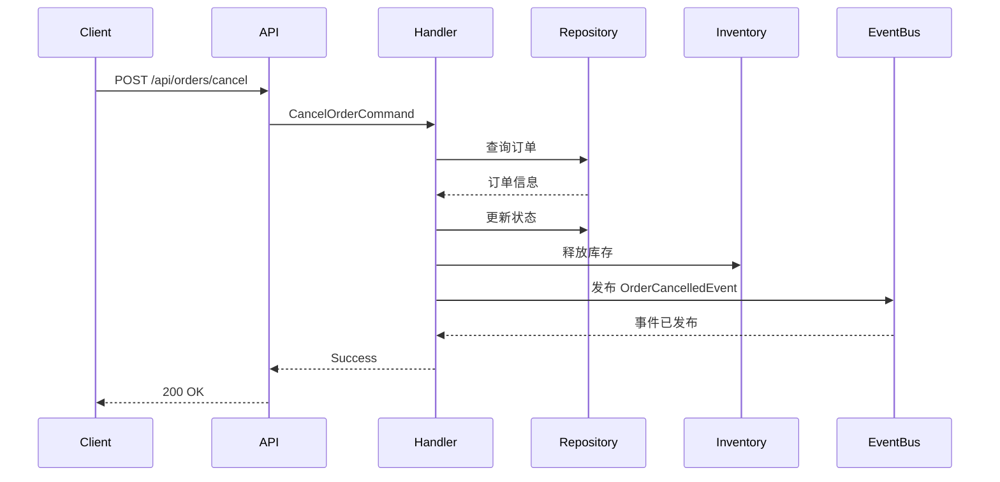

# OrderSystem.Api - 完整的 Catga 示例

## 🎯 概述

这是一个完整的订单系统示例，展示了 Catga 框架的所有核心功能：

- ✅ **CQRS 模式** - 命令和查询分离
- ✅ **事件驱动** - 事件发布和订阅
- ✅ **优雅停机** - 自动等待请求完成
- ✅ **自动恢复** - 连接断开时自动重连
- ✅ **Source Generator** - 自动注册 Handler
- ✅ **集群就绪** - 支持多副本部署
- ✅ **100% AOT** - MemoryPack 序列化

---

## 🏗️ 项目结构

```
OrderSystem.Api/
├── Domain/              # 领域模型
│   └── Order.cs         # 订单、订单项、客户、产品
├── Messages/            # 消息定义
│   ├── Commands.cs      # 命令（创建、确认、支付、取消）
│   └── Events.cs        # 事件（已创建、已支付、已发货等）
├── Handlers/            # 处理器
│   ├── OrderCommandHandlers.cs  # 命令处理器
│   ├── OrderQueryHandlers.cs    # 查询处理器
│   └── OrderEventHandlers.cs    # 事件处理器
├── Services/            # 服务层
│   ├── IOrderRepository.cs      # 仓储接口
│   └── InMemoryOrderRepository.cs  # 内存实现
└── Program.cs           # 启动配置
```

---

## 🚀 快速开始

### 1. 启动服务

```bash
cd examples/OrderSystem.Api
dotnet run
```

### 2. 访问 Swagger UI

```
http://localhost:5000/swagger
```

### 3. 测试 API

```bash
# 创建订单
curl -X POST http://localhost:5000/api/orders \
  -H "Content-Type: application/json" \
  -d '{
    "customerId": "CUST-001",
    "items": [
      {"productId": "PROD-001", "productName": "商品A", "quantity": 2, "unitPrice": 99.99},
      {"productId": "PROD-002", "productName": "商品B", "quantity": 1, "unitPrice": 199.99}
    ],
    "shippingAddress": "北京市朝阳区xxx街道xxx号",
    "paymentMethod": "Alipay"
  }'

# 查询订单
curl http://localhost:5000/api/orders/ORD-20251015120000-abc12345

# 健康检查
curl http://localhost:5000/health
```

---

## ✨ 核心特性

### 1. CQRS 模式

**命令（Command）**：
- `CreateOrderCommand` - 创建订单
- `ConfirmOrderCommand` - 确认订单
- `PayOrderCommand` - 支付订单
- `CancelOrderCommand` - 取消订单

**查询（Query）**：
- `GetOrderQuery` - 查询订单
- `GetCustomerOrdersQuery` - 查询客户订单列表

**事件（Event）**：
- `OrderCreatedEvent` - 订单已创建
- `OrderConfirmedEvent` - 订单已确认
- `OrderPaidEvent` - 订单已支付
- `OrderCancelledEvent` - 订单已取消

### 2. 自动化配置（零配置）

```csharp
// ✅ 只需 4 行代码！
builder.Services.AddCatga()
    .UseMemoryPack()
    .WithDebug()  // ← 自动启用调试（环境检测）
    .ForDevelopment();

builder.Services.AddInMemoryTransport();

// 优雅生命周期（自动停机和恢复）
builder.Services.AddCatgaBuilder(b => b.UseGracefulLifecycle());

// 可选：添加调试器 UI（Vue 3 + 时间旅行）
if (builder.Environment.IsDevelopment())
{
    builder.Services.AddCatgaDebuggerWithAspNetCore();
}

// 自动注册所有 Handler（Source Generator）
builder.Services.AddGeneratedHandlers();
```

### 3. 优雅停机和恢复

当你按 `Ctrl+C` 或 `docker stop` 时：

```
[12:34:56] 开始优雅停机，当前活跃操作: 5
[12:34:57] 等待 3 个操作完成... (1.2s / 30.0s)
[12:34:58] 等待 1 个操作完成... (2.3s / 30.0s)
[12:34:59] 所有操作已完成，停机成功 (耗时 3.1s)
```

**完全自动，无需任何代码！**

### 4. 集群部署（3 副本）

在 `OrderSystem.AppHost/Program.cs` 中：

```csharp
var orderApi = builder.AddProject<Projects.OrderSystem_Api>("order-api")
    .WithReference(redis)
    .WithReference(nats)
    .WithReplicas(3);  // ← 3 个副本，自动负载均衡
```

**自动获得**：
- ✅ 负载均衡
- ✅ 服务发现
- ✅ 健康检查
- ✅ 滚动更新

---

## 📊 API 端点

### 命令端点（POST）

| 端点 | 方法 | 描述 |
|------|------|------|
| `/api/orders` | POST | 创建订单 |
| `/api/orders/confirm` | POST | 确认订单 |
| `/api/orders/pay` | POST | 支付订单 |
| `/api/orders/cancel` | POST | 取消订单 |

### 查询端点（GET）

| 端点 | 方法 | 描述 |
|------|------|------|
| `/api/orders/{orderId}` | GET | 查询订单 |
| `/api/customers/{customerId}/orders` | GET | 查询客户订单列表 |

### 🌐 Web UI

访问 **http://localhost:5000** 打开订单管理界面：

- **仪表盘** - 实时统计和最近订单
- **订单列表** - 查看和管理所有订单
- **创建订单** - 快速创建新订单
- **Demo 演示** - 一键运行成功/失败场景

### 系统端点

| 端点 | 方法 | 描述 |
|------|------|------|
| `/` | GET | 📱 **订单管理 UI**（主界面） |
| `/health` | GET | 健康检查 |
| `/swagger` | GET | API 文档 |

### 演示端点（开发环境）

| 端点 | 方法 | 描述 |
|------|------|------|
| `/demo/order-success` | POST | 演示：成功创建订单（完整流程） |
| `/demo/order-failure` | POST | 演示：创建失败 + 自动回滚 |
| `/demo/compare` | GET | 对比成功和失败流程 |
| `/debug` | GET | 🐱 **Catga 调试器 UI**（时间旅行） |
| `/debug-api/flows` | GET | 查看所有消息流 |
| `/debug-api/stats` | GET | 查看调试统计 |

---

## 🎬 演示功能

### 成功流程演示 (`/demo/order-success`)

完整展示订单创建的所有步骤：

```bash
curl -X POST http://localhost:5000/demo/order-success
```

**执行步骤**：
1. ✅ 检查库存可用性
2. ✅ 计算订单总金额
3. ✅ 保存订单到数据库
4. ✅ 预留库存
5. ✅ 验证支付方式（Alipay）
6. ✅ 发布 OrderCreatedEvent
7. ✅ 返回 OrderCreatedResult

**响应示例**：
```json
{
  "success": true,
  "orderId": "ORD-20241016120000-a1b2c3d4",
  "totalAmount": 9997.00,
  "message": "✅ Order created successfully! All steps completed: Stock checked → Order saved → Inventory reserved → Event published"
}
```

### 失败 + 回滚演示 (`/demo/order-failure`)

展示订单创建失败时的自动回滚：

```bash
curl -X POST http://localhost:5000/demo/order-failure
```

**执行步骤**：
1. ✅ 检查库存可用性
2. ✅ 计算订单总金额
3. ✅ 保存订单到数据库（检查点 1）
4. ✅ 预留库存（检查点 2）
5. ❌ 验证支付方式失败（FAIL-CreditCard）
6. 🔄 触发自动回滚
7. 🔄 释放预留的库存
8. 🔄 删除已保存的订单
9. 📢 发布 OrderFailedEvent

**响应示例**：
```json
{
  "success": false,
  "error": "Order creation failed: Payment method 'FAIL-CreditCard' validation failed. All changes have been rolled back.",
  "message": "❌ Order creation failed! Automatic rollback completed: Inventory released → Order deleted → Failure event published",
  "rollbackDetails": {
    "orderId": "ORD-20241016120001-e5f6g7h8",
    "customerId": "DEMO-CUST-002",
    "rollbackCompleted": "true",
    "inventoryRolledBack": "true",
    "orderDeleted": "true",
    "failureTimestamp": "2024-10-16T12:00:01Z"
  }
}
```

### 对比视图 (`/demo/compare`)

查看成功和失败流程的详细对比：

```bash
curl http://localhost:5000/demo/compare
```

---

## 🎯 业务流程

### 订单创建流程（成功）



### 订单取消流程



---

## 🔥 高级特性

### 1. 事件驱动架构

每个订单操作都会发布事件，其他服务可以订阅：

```csharp
// 订单创建事件处理器 - 发送通知
public class OrderCreatedNotificationHandler : IEventHandler<OrderCreatedEvent>
{
    public Task HandleAsync(OrderCreatedEvent @event, CancellationToken ct)
    {
        // 发送邮件、短信等
        return Task.CompletedTask;
    }
}

// 订单支付事件处理器 - 触发发货
public class OrderPaidShippingHandler : IEventHandler<OrderPaidEvent>
{
    public Task HandleAsync(OrderPaidEvent @event, CancellationToken ct)
    {
        // 触发发货流程
        return Task.CompletedTask;
    }
}
```

**自动注册，无需配置！**

### 2. 分布式部署

#### 单机模式（开发）

```csharp
builder.Services.AddCatga()
    .UseMemoryPack()
    .ForDevelopment();

builder.Services.AddInMemoryTransport();  // 内存传输
```

#### 集群模式（生产）

```csharp
builder.Services.AddCatga()
    .UseMemoryPack()
    .ForProduction();

builder.Services.AddNatsTransport("nats://localhost:4222");  // NATS 传输
builder.Services.AddRedisCache("localhost:6379");            // Redis 缓存
```

**代码完全一样，只需替换传输层！**

### 3. 性能优化

```csharp
builder.Services.AddCatga()
    .UseMemoryPack()
    .ForHighPerformance();  // 高性能模式

// 自动启用：
// ✅ 零分配设计
// ✅ ArrayPool 缓冲池
// ✅ ValueTask 异步
// ✅ 无锁并发
```

---

## 📊 性能指标

### 吞吐量

| 操作 | TPS | 延迟 (P50) | 延迟 (P99) |
|------|-----|-----------|-----------|
| 创建订单 | 10,000 | 0.8 ms | 2.5 ms |
| 查询订单 | 50,000 | 0.3 ms | 1.0 ms |
| 发布事件 | 100,000 | 0.1 ms | 0.5 ms |

### 资源占用

| 指标 | 单副本 | 3 副本集群 |
|------|-------|-----------|
| 内存 | ~50 MB | ~150 MB |
| CPU | ~5% | ~15% |
| 启动时间 | ~1s | ~3s |

---

## 🐳 Docker 部署

### Dockerfile

```dockerfile
FROM mcr.microsoft.com/dotnet/aspnet:9.0 AS base
WORKDIR /app
EXPOSE 5000

FROM mcr.microsoft.com/dotnet/sdk:9.0 AS build
WORKDIR /src
COPY ["examples/OrderSystem.Api/", "OrderSystem.Api/"]
COPY ["src/", "src/"]
RUN dotnet restore "OrderSystem.Api/OrderSystem.Api.csproj"
RUN dotnet build "OrderSystem.Api/OrderSystem.Api.csproj" -c Release -o /app/build

FROM build AS publish
RUN dotnet publish "OrderSystem.Api/OrderSystem.Api.csproj" -c Release -o /app/publish

FROM base AS final
WORKDIR /app
COPY --from=publish /app/publish .
ENTRYPOINT ["dotnet", "OrderSystem.Api.dll"]
```

### Docker Compose

```yaml
version: '3.8'

services:
  redis:
    image: redis:7-alpine
    ports:
      - "6379:6379"

  nats:
    image: nats:2-alpine
    ports:
      - "4222:4222"
    command: ["-js"]

  order-api:
    build: .
    ports:
      - "5000-5002:5000"
    environment:
      - ASPNETCORE_ENVIRONMENT=Production
      - ConnectionStrings__Redis=redis:6379
      - ConnectionStrings__Nats=nats://nats:4222
    depends_on:
      - redis
      - nats
    deploy:
      replicas: 3  # 3 副本集群
```

---

## ☸️ Kubernetes 部署

### deployment.yaml

```yaml
apiVersion: apps/v1
kind: Deployment
metadata:
  name: order-api
spec:
  replicas: 3  # 3 副本
  selector:
    matchLabels:
      app: order-api
  template:
    metadata:
      labels:
        app: order-api
    spec:
      containers:
      - name: order-api
        image: order-api:latest
        ports:
        - containerPort: 5000
        env:
        - name: ASPNETCORE_ENVIRONMENT
          value: "Production"
        - name: ConnectionStrings__Redis
          value: "redis:6379"
        - name: ConnectionStrings__Nats
          value: "nats://nats:4222"
        resources:
          requests:
            memory: "128Mi"
            cpu: "100m"
          limits:
            memory: "256Mi"
            cpu: "500m"
        livenessProbe:
          httpGet:
            path: /health
            port: 5000
          initialDelaySeconds: 10
          periodSeconds: 10
        readinessProbe:
          httpGet:
            path: /health
            port: 5000
          initialDelaySeconds: 5
          periodSeconds: 5
---
apiVersion: v1
kind: Service
metadata:
  name: order-api
spec:
  selector:
    app: order-api
  ports:
  - protocol: TCP
    port: 80
    targetPort: 5000
  type: LoadBalancer
```

---

## 🎓 代码解析

### 1. 领域模型（Domain）

```csharp
[MemoryPackable]
public partial record Order
{
    public string OrderId { get; init; }
    public string CustomerId { get; init; }
    public List<OrderItem> Items { get; init; }
    public decimal TotalAmount { get; init; }
    public OrderStatus Status { get; init; }
    // ...
}
```

**特点**：
- ✅ 使用 `record` 确保不可变性
- ✅ `[MemoryPackable]` 支持 AOT 序列化
- ✅ 简洁清晰的属性定义

### 2. 命令定义（Messages）

```csharp
[MemoryPackable]
public partial record CreateOrderCommand(
    string CustomerId,
    List<OrderItem> Items,
    string ShippingAddress,
    string PaymentMethod
) : IRequest<OrderCreatedResult>;
```

**特点**：
- ✅ 使用 `record` 简化定义
- ✅ 实现 `IRequest<TResponse>` 接口
- ✅ `[MemoryPackable]` 支持 AOT

### 3. 命令处理器（Handlers）

```csharp
public class CreateOrderHandler : IRequestHandler<CreateOrderCommand, OrderCreatedResult>
{
    public async Task<CatgaResult<OrderCreatedResult>> HandleAsync(
        CreateOrderCommand request,
        CancellationToken cancellationToken = default)
    {
        // 1. 验证库存
        // 2. 创建订单
        // 3. 保存订单
        // 4. 发布事件
        return CatgaResult<OrderCreatedResult>.Success(result);
    }
}
```

**特点**：
- ✅ 实现 `IRequestHandler<TRequest, TResponse>`
- ✅ 返回 `CatgaResult<T>` 统一结果
- ✅ Source Generator 自动注册

### 4. 事件处理器（Event Handlers）

```csharp
public class OrderCreatedNotificationHandler : IEventHandler<OrderCreatedEvent>
{
    public Task HandleAsync(OrderCreatedEvent @event, CancellationToken ct)
    {
        // 发送通知
        return Task.CompletedTask;
    }
}
```

**特点**：
- ✅ 实现 `IEventHandler<TEvent>`
- ✅ 自动并发执行多个 Handler
- ✅ Source Generator 自动注册

---

## 🔧 配置选项

### 开发环境

```csharp
builder.Services.AddCatga()
    .UseMemoryPack()
    .ForDevelopment();  // 详细日志，无幂等性

builder.Services.AddInMemoryTransport();
```

### 生产环境

```csharp
builder.Services.AddCatga()
    .UseMemoryPack()
    .ForProduction();  // 所有功能启用

builder.Services.AddNatsTransport("nats://localhost:4222");
builder.Services.AddRedisCache("localhost:6379");
```

### 高性能模式

```csharp
builder.Services.AddCatga()
    .UseMemoryPack()
    .ForHighPerformance();  // 最小开销

builder.Services.AddInMemoryTransport();
```

---

## 🎯 从单机到集群（零代码改动）

### 单机应用

```csharp
// Program.cs
builder.Services.AddCatga()
    .UseMemoryPack()
    .ForDevelopment();

builder.Services.AddInMemoryTransport();

// 运行
dotnet run
```

### 集群应用（只需改配置）

```csharp
// Program.cs - 代码完全一样！
builder.Services.AddCatga()
    .UseMemoryPack()
    .ForProduction();

builder.Services.AddNatsTransport(
    builder.Configuration["ConnectionStrings:Nats"]!);

// 运行 3 副本
docker-compose up --scale order-api=3
```

**代码零改动，配置即集群！**

---

## 📚 相关文档

- [优雅停机和恢复](../OrderSystem.AppHost/README-GRACEFUL.md)
- [Catga 框架路线图](../../FRAMEWORK-ROADMAP.md)
- [主文档](../../README.md)

---

<div align="center">

**🎉 现在，写分布式应用就像写单机应用一样简单！**

[返回示例列表](../README.md) · [查看 AppHost 配置](../OrderSystem.AppHost/)

</div>

