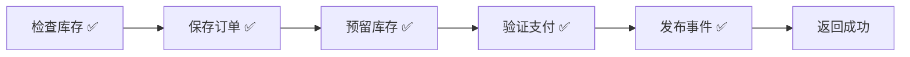
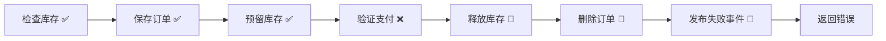

# OrderSystem.Api - Catga 框架完整示例

一个完整的订单系统示例，展示 Catga 框架的**所有核心特性**。

## 🎯 核心特性演示

| 特性 | 说明 | Demo 端点 |
|------|------|-----------|
| ✅ **Flow 服务编排** | 自动补偿，零配置 Saga | `/demo/flow/order-success`, `/demo/flow/order-failure` |
| ✅ **SafeRequestHandler** | 自动异常处理 | `/demo/order-success`, `/demo/order-failure` |
| ✅ **集群协调** | Leader 选举，单例任务 | `/demo/cluster/status`, `/demo/cluster/toggle-leader` |
| ✅ **事件驱动** | 多处理器并行执行 | `/demo/events` |
| ✅ **批处理** | 高效批量请求 | `/demo/batch` |
| ✅ **Source Generator** | 零反射，AOT 兼容 | 自动注册 |
| ✅ **分布式 ID** | Snowflake 算法 | 多节点模式 |
| ✅ **Outbox/Inbox** | 可靠消息传递 | 配置启用 |
| ✅ **死信队列** | 失败消息处理 | 配置启用 |
| ✅ **OpenTelemetry** | 分布式追踪 | Jaeger 集成 |

## 🚀 快速开始

### 启动应用

#### 单节点模式（开发/测试）

```bash
cd examples/OrderSystem.Api
dotnet run
```

#### 多节点模式（分布式/集群演示）

**终端 1 - 节点 1**：
```bash
dotnet run --project examples/OrderSystem.Api -- 1
# 启动在 http://localhost:5001, WorkerId=1
```

**终端 2 - 节点 2**：
```bash
dotnet run --project examples/OrderSystem.Api -- 2
# 启动在 http://localhost:5002, WorkerId=2
```

**终端 3 - 节点 3**：
```bash
dotnet run --project examples/OrderSystem.Api -- 3
# 启动在 http://localhost:5003, WorkerId=3
```

每个节点生成的 MessageId 都包含其唯一的 WorkerId，确保分布式环境下 ID 不冲突。
详见 [分布式部署指南](./DISTRIBUTED-DEPLOYMENT.md)。

### 访问界面

| 界面 | 地址 | 说明 |
|------|------|------|
| 📱 **订单管理** | http://localhost:5000 | 主界面，Demo 演示 + 订单列表 |
| 🐛 **调试器** | http://localhost:5000/debug | 时间旅行调试器 |
| 📚 **API 文档** | http://localhost:5000/swagger | Swagger UI |

### 运行 Demo

#### 方式 1: 使用 Swagger UI
打开 http://localhost:5000/swagger，找到对应的 Demo 端点执行。

#### 方式 2: 使用 curl

```bash
# ===== Flow 自动编排（真实 Handler）=====
# Flow 订单 - 成功（5步全部完成）
curl -X POST http://localhost:5000/demo/flow/order-success

# Flow 订单 - 失败（支付失败，自动逆序补偿）
curl -X POST http://localhost:5000/demo/flow/order-failure

# ===== 传统方式（手动 try-catch）=====
# 传统订单 - 成功
curl -X POST http://localhost:5000/demo/order-success

# 传统订单 - 失败（手动回滚）
curl -X POST http://localhost:5000/demo/order-failure

# ===== 对比说明 =====
curl http://localhost:5000/demo/compare

# ===== 集群协调（Leader 选举）=====
# 查看集群状态
curl http://localhost:5000/demo/cluster/status

# 切换 Leader 状态（模拟）
curl -X POST http://localhost:5000/demo/cluster/toggle-leader

# 执行 Leader-only 操作
curl -X POST http://localhost:5000/demo/cluster/leader-only

# 集群功能说明
curl http://localhost:5000/demo/cluster/info

# ===== 其他功能 =====
# 事件发布（多处理器并行）
curl -X POST http://localhost:5000/demo/events

# 批处理
curl -X POST http://localhost:5000/demo/batch

# Flow 功能说明
curl http://localhost:5000/demo/flow-info
```

#### 方式 3: 使用 Web UI
1. 打开 http://localhost:5000
2. 切换到 **"Demo 演示"** 标签
3. 点击对应按钮执行

## 🛡️ Resilience (Polly)

在默认“诊断模式”下仅记录指标与追踪；如需启用完整弹性策略，请在服务注册时调用一次 `UseResilience`（仅此一个示例）：

```csharp
builder.Services
    .AddCatga()
    .UseResilience(o =>
    {
        o.TransportRetryCount = 3;
        o.TransportRetryDelay = TimeSpan.FromMilliseconds(200);
    });
```

## 📂 项目结构

```
OrderSystem.Api/
├── Domain/              # 领域模型
│   └── Order.cs         # Order, OrderItem (2 个状态：Pending, Cancelled)
├── Messages/            # 消息定义
│   ├── Commands.cs      # CreateOrder, CancelOrder, GetOrder
│   └── Events.cs        # OrderCreated, OrderCancelled, OrderFailed
├── Handlers/            # 处理器（自动注册）
│   ├── OrderCommandHandlers.cs  # CreateOrderHandler, CancelOrderHandler
│   ├── OrderQueryHandlers.cs    # GetOrderHandler
│   └── OrderEventHandlers.cs    # 4 个事件处理器
├── Services/            # 服务层
│   ├── IOrderRepository.cs
│   ├── IInventoryService.cs
│   └── IPaymentService.cs
├── wwwroot/             # 前端 UI
│   └── index.html       # AlpineJS + Tailwind CSS
└── Program.cs           # 启动配置（50 行核心代码）
```

**代码行数**：~800 行（简洁而完整）

## ✨ 核心代码示例

### 1. Flow 服务编排 - 自动补偿（推荐）

```csharp
// 简洁 Flow API - 失败时自动逆序补偿
var result = await Flow.Create("CreateOrder")
    .Step(() => orderRepository.SaveAsync(order),
          () => orderRepository.DeleteAsync(order.Id))  // Compensation
    .Step(() => inventoryService.ReserveAsync(items),
          () => inventoryService.ReleaseAsync(items))   // Compensation
    .Step(() => paymentService.ChargeAsync(amount),
          () => paymentService.RefundAsync(amount))     // Compensation
    .ExecuteAsync();

if (result.IsSuccess) return Success(result.Value!);
else return Failure(result.Error!);
```

**关键点**：
- ✅ 最简 API，无需 step 名称
- ✅ 失败时自动逆序补偿
- ✅ 内置链路跟踪 (Activity)
- ✅ AOT 兼容

### 2. SafeRequestHandler - 自动异常处理 + 回滚

```csharp
public class CreateOrderHandler : SafeRequestHandler<CreateOrderCommand, OrderCreatedResult>
{
    // 追踪回滚状态
    private string? _orderId;
    private bool _inventoryReserved;
    private bool _orderSaved;

    // 核心业务逻辑 - 框架自动处理异常！
    protected override async Task<OrderCreatedResult> HandleCoreAsync(
        CreateOrderCommand request,
        CancellationToken cancellationToken)
    {
        // 1. 检查库存
        await _inventory.CheckStockAsync(request.Items, cancellationToken);

        // 2. 保存订单
        await _repository.SaveAsync(order, cancellationToken);
        _orderSaved = true;

        // 3. 预留库存
        await _inventory.ReserveStockAsync(_orderId, request.Items, cancellationToken);
        _inventoryReserved = true;

        // 4. 验证支付（Demo：包含 "FAIL" 时触发失败）
        if (request.PaymentMethod.Contains("FAIL"))
            throw new CatgaException("Payment validation failed");

        // 5. 发布事件
        await _mediator.PublishAsync(new OrderCreatedEvent(...), cancellationToken);

        return new OrderCreatedResult(_orderId, totalAmount, order.CreatedAt);
    }

    // 自定义回滚逻辑 - 失败时自动调用
    protected override async Task<CatgaResult<OrderCreatedResult>> OnBusinessErrorAsync(
        CreateOrderCommand request,
        CatgaException exception,
        CancellationToken cancellationToken)
    {
        // 反向回滚
        if (_inventoryReserved && _orderId != null)
            await _inventory.ReleaseStockAsync(_orderId, request.Items, cancellationToken);

        if (_orderSaved && _orderId != null)
            await _repository.DeleteAsync(_orderId, cancellationToken);

        // 发布失败事件
        await _mediator.PublishAsync(new OrderFailedEvent(...), cancellationToken);

        // 返回详细错误信息
        return CatgaResult<OrderCreatedResult>.Failure(
            $"Order creation failed: {exception.Message}. All changes rolled back."
        );
    }
}
```

**关键点**：
- ✅ 无需手动 `try-catch`
- ✅ 异常自动捕获并调用 `OnBusinessErrorAsync`
- ✅ 回滚逻辑清晰明了，易于维护

### 2. 事件处理器 - 自动并发执行

```csharp
// Handler 1: 发送通知
public class OrderCreatedNotificationHandler : IEventHandler<OrderCreatedEvent>
{
    public Task HandleAsync(OrderCreatedEvent @event, CancellationToken ct)
    {
        // 发送邮件、短信通知
        _logger.LogInformation("📧 Notification sent to {Customer}", @event.CustomerId);
        return Task.CompletedTask;
    }
}

// Handler 2: 更新统计
public class OrderCreatedAnalyticsHandler : IEventHandler<OrderCreatedEvent>
{
    public Task HandleAsync(OrderCreatedEvent @event, CancellationToken ct)
    {
        // 更新数据分析、指标
        _logger.LogInformation("📊 Analytics updated for order {OrderId}", @event.OrderId);
        return Task.CompletedTask;
    }
}
```

**关键点**：
- ✅ 一个事件 → 多个处理器（并发执行）
- ✅ 自动发现和注册（Source Generator）
- ✅ 完全解耦，添加新处理器无需修改发布代码

### 3. 配置 - 仅需 4 行代码

```csharp
builder.Services.AddCatga()
    .UseMemoryPack()                 // AOT-friendly 序列化
    .WithDebug()                     // 自动启用调试器（检测环境）
    .ForDevelopment();               // 开发环境设置

builder.Services.AddInMemoryTransport();         // 传输层（可替换为 NATS）
builder.Services.AddCatgaBuilder(b => b.UseGracefulLifecycle());

// 自动注册所有 Handler 和 Service（Source Generator）
builder.Services.AddGeneratedHandlers();
builder.Services.AddGeneratedServices();
```

### 4. 全局端点命名与可靠性开关（本示例已启用）

- 全局命名（源生成，零配置）：本项目在 `Properties/Catga.AssemblyNaming.cs` 中声明

```csharp
using Catga;
[assembly: CatgaMessageDefaults(App = "shop", BoundedContext = "orders", LowerCase = true)]
```

- 可靠性开关（条件式启用）：已在 `Program.cs` 启用，缺少依赖时自动跳过

```csharp
builder.Services
    .AddCatga()
    .UseInbox()
    .UseOutbox()
    .UseDeadLetterQueue();
```

说明：
- 传输层命名优先级：`TransportOptions.Naming` > 全局 `CatgaOptions.EndpointNamingConvention` > 类型名。
- InMemory 传输仅将命名用于可观测性标签/指标（不影响路由）。

## 📊 Demo 流程对比

### ✅ 成功流程



### ❌ 失败流程（自动回滚）



## 🔧 扩展指南

### 添加新命令

1. **定义命令**（`Messages/Commands.cs`）：

```csharp
[MemoryPackable]
public partial record ConfirmOrderCommand(string OrderId) : IRequest;
```

2. **创建处理器**（`Handlers/OrderCommandHandlers.cs`）：

```csharp
public class ConfirmOrderHandler : SafeRequestHandler<ConfirmOrderCommand>
{
    protected override async Task HandleCoreAsync(
        ConfirmOrderCommand request,
        CancellationToken cancellationToken)
    {
        var order = await _repository.GetByIdAsync(request.OrderId, cancellationToken);
        order = order with { Status = OrderStatus.Confirmed };
        await _repository.UpdateAsync(order, cancellationToken);
    }
}
```

3. **添加 API 端点**（`Program.cs`）：

```csharp
app.MapPost("/api/orders/confirm", async (ConfirmOrderCommand cmd, ICatgaMediator m) =>
{
    var result = await m.SendAsync(cmd);
    return result.IsSuccess ? Results.Ok() : Results.BadRequest(result.Error);
});
```

✅ **完成！** Source Generator 会自动发现并注册新的 Handler。

### 添加新事件处理器

```csharp
public class OrderConfirmedEmailHandler : IEventHandler<OrderConfirmedEvent>
{
    public Task HandleAsync(OrderConfirmedEvent @event, CancellationToken ct)
    {
        // 发送确认邮件
        return Task.CompletedTask;
    }
}
```

✅ **完成！** 自动注册，无需任何配置。

## 🧪 测试 API

### 创建订单（成功）

```bash
curl -X POST http://localhost:5000/api/orders \
  -H "Content-Type: application/json" \
  -d '{
    "customerId": "CUST-001",
    "items": [
      {"productId": "PROD-001", "productName": "iPhone 15", "quantity": 1, "unitPrice": 5999}
    ],
    "shippingAddress": "北京市朝阳区xxx街道",
    "paymentMethod": "Alipay"
  }'
```

### 创建订单（失败 - 触发回滚）

```bash
curl -X POST http://localhost:5000/api/orders \
  -H "Content-Type: application/json" \
  -d '{
    "customerId": "CUST-002",
    "items": [
      {"productId": "PROD-002", "productName": "MacBook Pro", "quantity": 1, "unitPrice": 16999}
    ],
    "shippingAddress": "上海市浦东新区xxx路",
    "paymentMethod": "FAIL-CreditCard"
  }'
```

**响应示例（失败）**：

```json
{
  "success": false,
  "error": "Order creation failed: Payment method 'FAIL-CreditCard' validation failed. All changes have been rolled back.",
  "rollbackDetails": {
    "OrderId": "ORD-20251016143022-abc12345",
    "CustomerId": "CUST-002",
    "RollbackCompleted": "true",
    "InventoryRolledBack": "true",
    "OrderDeleted": "true"
  }
}
```

### 查询订单

```bash
curl http://localhost:5000/api/orders/ORD-20251016143022-abc12345
```

### 取消订单

```bash
curl -X POST http://localhost:5000/api/orders/cancel \
  -H "Content-Type: application/json" \
  -d '{"orderId": "ORD-20251016143022-abc12345", "reason": "用户主动取消"}'
```

## 🐛 调试器功能

访问 http://localhost:5000/debug 可使用：

- ⏪ **时间旅行** - 回放历史执行
- 🔍 **详细日志** - 查看每个步骤的输入/输出
- 📊 **性能监控** - 实时查看延迟、吞吐量
- 🌐 **消息流** - 可视化消息流向

## 📦 部署

### Docker

```bash
docker build -t ordersystem .
docker run -p 5000:8080 ordersystem
```

### Kubernetes

```bash
kubectl apply -f k8s/deployment.yaml
```

### .NET Aspire（推荐）

```bash
cd ../../OrderSystem.AppHost
dotnet run
```

## 📚 相关资源

- [Catga 快速开始](../../docs/articles/getting-started.md)
- [SafeRequestHandler 指南](../../docs/guides/custom-error-handling.md)
- [Source Generator 文档](../../docs/guides/source-generator.md)
- [性能基准测试](../../docs/BENCHMARK-RESULTS.md)

## 🎓 学习路径

1. **入门**：运行 Demo，理解成功和失败流程
2. **探索**：查看 `OrderCommandHandlers.cs` 的回滚逻辑
3. **实践**：添加新的命令（如 `ConfirmOrder`）
4. **深入**：使用调试器观察消息流
5. **生产**：集成 NATS/Redis，部署到 Kubernetes

## 💡 设计理念

这个示例遵循 **"简洁但完整"** 的原则：

- ✅ **足够简单**：核心代码 ~800 行，易于理解
- ✅ **足够完整**：展示所有关键特性（CQRS、事件、回滚、调试）
- ✅ **易于扩展**：清晰的扩展指南，10 分钟添加新功能
- ✅ **生产就绪**：可直接作为项目模板使用

---

**问题反馈**：https://github.com/your-repo/Catga/issues
**贡献指南**：https://github.com/your-repo/Catga/blob/master/CONTRIBUTING.md
