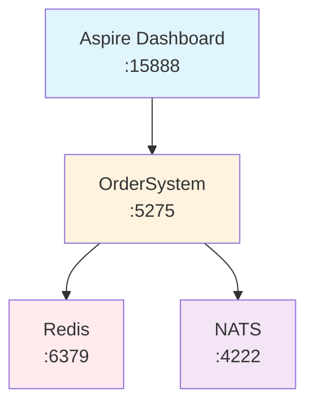

# Catga Examples

> **30 seconds to start, 3 lines of code** - Learn Catga through practical examples

[Back to Docs](../docs/README.md) · [Doc Index](../docs/INDEX.md)

---

## Quick Start

### One-Click Demo Scripts

```powershell
# Single instance mode (simplest)
.\run-demo.ps1 -Mode Single

# Cluster mode (3 nodes with Redis/NATS)
.\run-demo.ps1 -Mode Cluster

# Aspire mode (full orchestration with monitoring)
.\run-demo.ps1 -Mode Aspire
```

### Run Tests

```powershell
# Test single instance
.\test-demo.ps1

# Test cluster nodes
.\test-demo.ps1 -TestCluster
```

---

## Demo Modes

| Mode | Description | Requirements |
|------|-------------|--------------|
| **Single** | Single instance, in-memory | None |
| **Aspire** | Aspire + Redis/NATS/Jaeger (1 replica) | Docker |
| **Cluster** | Aspire + Redis/NATS/Jaeger (3 replicas) | Docker |

---

## OrderSystem.AppHost

**.NET Aspire orchestration - One-click distributed system**

### 30-Second Quick Start

```bash
cd examples/OrderSystem.AppHost
dotnet run
# Redis, NATS auto-start
# Visit http://localhost:15888 for Aspire Dashboard
```

### Core Features

| Feature | Description | Advantages |
|------|------|------|
| **Auto Orchestration** | One-click start Redis, NATS, and services | Zero configuration |
| **Service Discovery** | Auto service registration and endpoint resolution | No hard-coded addresses |
| **Observability** | Integrated logging, tracing, and metrics | One-stop monitoring |
| **Health Checks** | Auto monitoring service health | Quick problem discovery |
| **Elastic Scaling** | Declarative configuration of replicas | Easy scaling |

### Architecture



### Sample Code

```csharp
var builder = DistributedApplication.CreateBuilder(args);

// Add infrastructure
var nats = builder.AddNats("nats").WithDataVolume().WithJetStream();
var redis = builder.AddRedis("redis").WithDataVolume();

// Add application service
builder.AddProject<Projects.OrderSystem_Api>("order-api")
    .WithReference(nats)
    .WithReference(redis)
    .WithReplicas(3);  // Cluster mode

builder.Build().Run();
```

### Use Cases

| Scenario | Aspire | Standalone | K8s |
|----------|--------|------------|-----|
| **Local Dev** | Best | OK | Complex |
| **Team Collab** | Unified | Scattered | Needs Cluster |
| **Production** | Cloud Native | Not Recommended | Recommended |

---

## URLs Reference

| Service | URL |
|---------|-----|
| **OrderSystem UI** | http://localhost:5275 |
| **Swagger API** | http://localhost:5275/swagger |
| **Aspire Dashboard** | http://localhost:15888 |
| **Jaeger Tracing** | http://localhost:16686 |
| **Redis Commander** | http://localhost:8081 |

---

## Learning Path

1. **Run Single Mode** - Understand basic concepts
2. **Run Cluster Mode** - See distributed features
3. **Run Aspire Mode** - Full orchestration with monitoring
4. **Modify Handlers** - Add your own business logic

---

## Related Docs

- **[Doc Index](../docs/INDEX.md)** - Quick reference
- **[Architecture](../docs/architecture/ARCHITECTURE.md)** - Deep dive into Catga
- **[Serialization Guide](../docs/guides/serialization.md)** - MemoryPack vs JSON

---

<div align="center">

**Start with examples, master Catga in 30 seconds!**

[Back to Docs](../docs/README.md) · [Doc Index](../docs/INDEX.md)

</div>
