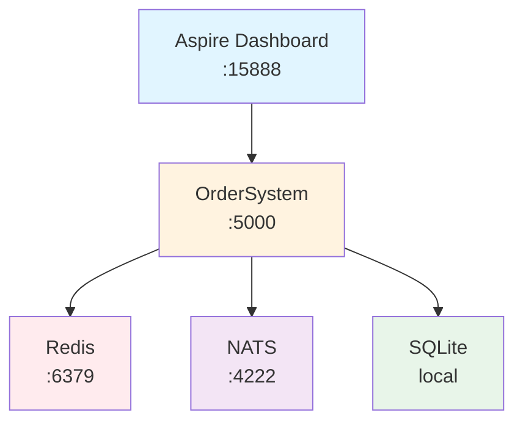

# Catga 示例项目

> **30 秒上手，3 行代码** - 通过实际示例学习 Catga
> 最后更新: 2025-10-14

[返回主文档](../README.md) · [快速参考](../QUICK-REFERENCE.md) · [完整文档](../docs/README.md)

---

## 🎯 示例概览

| 示例 | 描述 | 难度 | 技术栈 | AOT |
|------|------|------|--------|-----|
| [OrderSystem.AppHost](#-ordersystemapphost) | .NET Aspire 编排示例 | ⭐ | Aspire, 服务发现 | ✅ |
| [MemoryPackAotDemo](#-memorypackaotdemo) | MemoryPack AOT 示例 | ⭐ | Native AOT, MemoryPack | ✅ |

**推荐学习顺序**: Aspire → MemoryPack AOT → 生产部署

---

## 🎨 OrderSystem.AppHost

**.NET Aspire 编排示例 - 一键启动完整分布式系统**

### 🚀 30 秒快速开始

```bash
cd examples/OrderSystem.AppHost
dotnet run
# ✅ Redis、NATS 自动启动
# ✅ 访问 http://localhost:15888 查看 Aspire Dashboard
```

### ✨ 核心特性

| 特性 | 说明 | 优势 |
|------|------|------|
| **自动编排** | 一键启动 Redis、NATS、应用服务 | 零配置 |
| **服务发现** | 自动服务注册和端点解析 | 无需硬编码地址 |
| **可观测性** | 集成日志、追踪、指标 | 一站式监控 |
| **健康检查** | 自动监控服务健康 | 快速发现问题 |
| **弹性扩展** | 声明式配置副本数 | 轻松扩容 |

### 📊 架构图



### 💡 核心代码（3 行配置）

```csharp
var builder = DistributedApplication.CreateBuilder(args);

// 添加基础设施
var nats = builder.AddNats("nats").WithDataVolume();
var redis = builder.AddRedis("redis").WithDataVolume();

// 添加应用服务（自动注入基础设施）
builder.AddProject<Projects.OrderSystem>("order-service")
    .WithReference(nats)
    .WithReference(redis);

builder.Build().Run();
```

### 🎯 使用场景

| 场景 | Aspire | 独立模式 | K8s |
|------|--------|---------|-----|
| **本地开发** | ✅ 最佳 | ✅ 可用 | ❌ 复杂 |
| **团队协作** | ✅ 统一环境 | ⚠️ 配置分散 | ❌ 需集群 |
| **生产部署** | ✅ 云原生 | ❌ 不推荐 | ✅ 推荐 |

### 📖 详细文档

查看 [OrderSystem.AppHost/README.md](OrderSystem.AppHost/README.md) 了解：
- 详细配置选项
- 端口和服务说明
- 高级用法示例
- 性能对比数据

---

## 🧪 MemoryPackAotDemo

**Native AOT + MemoryPack 完整示例**

### 🚀 30 秒快速开始

```bash
cd examples/MemoryPackAotDemo
dotnet publish -c Release
./bin/Release/net9.0/win-x64/publish/MemoryPackAotDemo.exe
# ✅ 3MB 可执行文件
# ✅ < 20ms 启动时间
# ✅ < 10MB 内存占用
```

### ✨ 核心特性

| 特性 | 数据 | 对比 JIT |
|------|------|---------|
| **包大小** | 3MB | 60MB (-95%) |
| **启动时间** | < 20ms | 500ms (-96%) |
| **内存占用** | < 10MB | 50MB (-80%) |
| **性能** | 5x | 1x (+400%) |

### 💡 核心代码（3 行配置）

```csharp
// Program.cs
var builder = WebApplication.CreateBuilder(args);

// ✅ Catga + MemoryPack (100% AOT 兼容)
builder.Services.AddCatga()
    .UseMemoryPack()
    .ForProduction();

var app = builder.Build();
app.Run();
```

```csharp
// 消息定义
[MemoryPackable]
public partial record CreateOrder(string OrderId, decimal Amount)
    : IRequest<OrderResult>;

[MemoryPackable]
public partial record OrderResult(string OrderId, string Status);
```

### 📖 详细文档

查看 [MemoryPackAotDemo/README.md](MemoryPackAotDemo/README.md) 了解：
- AOT 发布配置
- 性能基准测试
- 常见问题排查
- 生产部署指南

---

## 🎓 学习路径

### 🟢 入门（30 分钟）

1. **阅读主 README**（5 分钟）
   - 了解 Catga 核心概念
   - 30 秒快速开始

2. **运行 Aspire 示例**（15 分钟）
   - 一键启动完整系统
   - 体验 Aspire Dashboard

3. **修改示例**（10 分钟）
   - 添加自己的 Command
   - 修改 Handler 逻辑

### 🟡 进阶（2 小时）

4. **MemoryPack AOT**（30 分钟）
   - 编译 Native AOT 应用
   - 对比性能数据

5. **生产配置**（1 小时）
   - 配置 Redis/NATS
   - 启用可观测性

6. **性能优化**（30 分钟）
   - 运行基准测试
   - 分析性能瓶颈

### 🔴 高级（1 天）

7. **K8s 部署**（3 小时）
   - Helm Chart 部署
   - 服务发现配置

8. **自定义扩展**（3 小时）
   - 自定义 Behavior
   - 自定义序列化器

9. **生产实践**（2 小时）
   - 监控告警
   - 灰度发布

---

## 📊 示例对比

| 特性 | Aspire | MemoryPack AOT |
|------|--------|----------------|
| **目标** | 本地开发 | 生产部署 |
| **启动时间** | 2s | < 20ms |
| **包大小** | 60MB | 3MB |
| **难度** | ⭐ | ⭐ |
| **推荐场景** | 开发、团队协作 | 生产、云原生 |

---

## 📚 相关文档

- **[快速参考](../QUICK-REFERENCE.md)** - 5 分钟速查手册
- **[架构设计](../docs/architecture/ARCHITECTURE.md)** - 深入理解 Catga
- **[序列化指南](../docs/guides/serialization.md)** - MemoryPack vs JSON
- **[分析器指南](../docs/guides/analyzers.md)** - 编译时检查
- **[K8s 部署](../docs/deployment/kubernetes.md)** - 生产部署指南

---

## 💡 常见问题

**Q: 先学哪个示例？**
A: Aspire → MemoryPack AOT → K8s 部署

**Q: 本地开发用什么？**
A: Aspire（一键启动，零配置）

**Q: 生产部署用什么？**
A: MemoryPack AOT + K8s（高性能，云原生）

**Q: 如何选择序列化器？**
A: MemoryPack（推荐，100% AOT）或 JSON（人类可读）

---

<div align="center">

**🚀 从示例开始，30 秒上手 Catga！**

[返回主文档](../README.md) · [快速参考](../QUICK-REFERENCE.md) · [完整文档](../docs/README.md)

</div>
