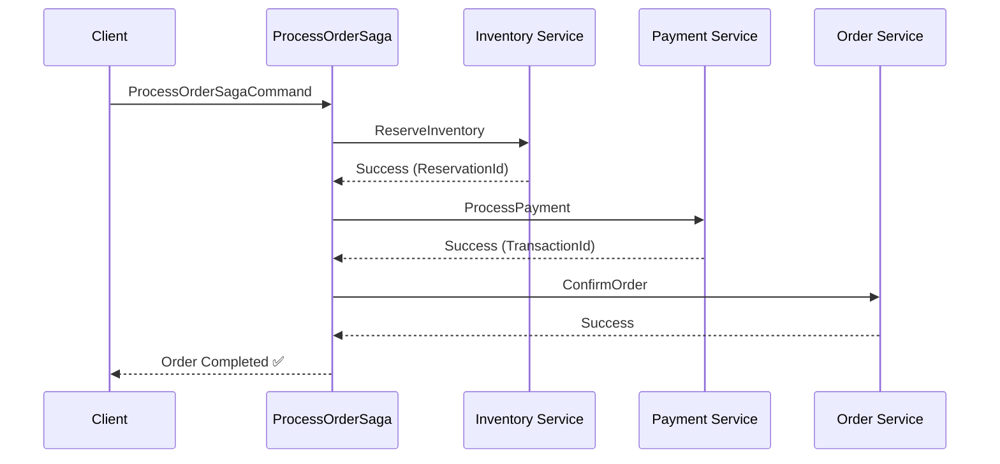
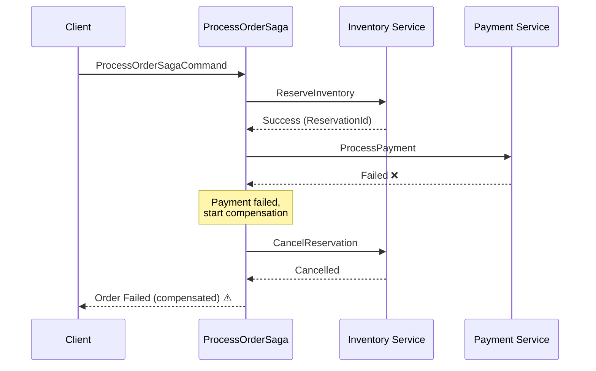

# 🔄 Saga Pattern示例指南

本指南演示如何在Catga中实现Saga模式来处理分布式事务。

---

## 📋 什么是Saga模式？

Saga是一种分布式事务模式，将长事务分解为一系列本地事务。每个本地事务都有对应的补偿事务，用于在失败时回滚已完成的操作。

### 为什么需要Saga？

在分布式系统中，传统的ACID事务（Two-Phase Commit）会导致：
- ❌ 高延迟
- ❌ 资源锁定时间长
- ❌ 可用性降低
- ❌ 不适合微服务架构

Saga提供了一种**最终一致性**的解决方案。

---

## 🎯 示例场景：订单处理

我们的示例实现了一个典型的订单处理流程：

```
1. Reserve Inventory (预留库存)
   ↓
2. Process Payment (处理支付)
   ↓
3. Confirm Order (确认订单)
```

### 成功流程



### 失败和补偿流程



---

## 💻 代码实现

### 1. Saga编排器

```csharp
public class ProcessOrderSaga : IRequestHandler<ProcessOrderSagaCommand, ProcessOrderSagaResponse>
{
    private readonly ICatgaMediator _mediator;
    private readonly ILogger<ProcessOrderSaga> _logger;

    public async Task<CatgaResult<ProcessOrderSagaResponse>> HandleAsync(
        ProcessOrderSagaCommand request,
        CancellationToken cancellationToken = default)
    {
        string? reservationId = null;
        string? transactionId = null;

        try
        {
            // Step 1: Reserve Inventory
            var inventoryResult = await _mediator.SendAsync(new ReserveInventoryCommand
            {
                OrderId = request.OrderId,
                ProductId = request.ProductId,
                Quantity = request.Quantity
            }, cancellationToken);

            if (!inventoryResult.IsSuccess)
            {
                return Failure("Inventory reservation failed");
            }

            reservationId = inventoryResult.Value.ReservationId;

            // Step 2: Process Payment
            var paymentResult = await _mediator.SendAsync(new ProcessPaymentCommand
            {
                OrderId = request.OrderId,
                CustomerId = request.CustomerId,
                Amount = request.Amount
            }, cancellationToken);

            if (!paymentResult.IsSuccess)
            {
                // Compensate inventory
                await CompensateInventory(reservationId, cancellationToken);
                return Failure("Payment failed");
            }

            transactionId = paymentResult.Value.TransactionId;

            // Step 3: Confirm Order
            var confirmResult = await _mediator.SendAsync(new ConfirmOrderCommand
            {
                OrderId = request.OrderId
            }, cancellationToken);

            if (!confirmResult.IsSuccess)
            {
                // Compensate payment and inventory
                await CompensatePayment(transactionId, cancellationToken);
                await CompensateInventory(reservationId, cancellationToken);
                return Failure("Order confirmation failed");
            }

            return Success();
        }
        catch (Exception ex)
        {
            // Compensate all completed steps
            if (transactionId != null)
                await CompensatePayment(transactionId, cancellationToken);
            if (reservationId != null)
                await CompensateInventory(reservationId, cancellationToken);

            return Failure("Saga failed with exception");
        }
    }
}
```

### 2. 补偿逻辑

```csharp
private async Task CompensateInventory(string reservationId, CancellationToken cancellationToken)
{
    try
    {
        await _mediator.SendAsync(new CancelInventoryReservationCommand
        {
            ReservationId = reservationId
        }, cancellationToken);

        _logger.LogInformation("Inventory compensated: {ReservationId}", reservationId);
    }
    catch (Exception ex)
    {
        _logger.LogError(ex, "Compensation failed: {ReservationId}", reservationId);
        // 💡 In production: Trigger retry or manual intervention
    }
}
```

---

## 🧪 测试Saga

### 启动应用

```bash
cd examples/SimpleWebApi
dotnet run
```

### 测试成功场景

```bash
curl -X POST http://localhost:5000/api/orders/saga \
  -H "Content-Type: application/json" \
  -d '{
    "orderId": "order-001",
    "customerId": "customer-123",
    "productId": "product-456",
    "quantity": 2,
    "amount": 199.99
  }'
```

**预期响应（90%概率成功）**:
```json
{
  "orderId": "order-001",
  "status": "Completed"
}
```

### 观察补偿场景

由于模拟了失败率（库存10%失败，支付5%失败），多次调用会触发补偿：

```bash
# 运行10次
for i in {1..10}; do
  curl -X POST http://localhost:5000/api/orders/saga \
    -H "Content-Type: application/json" \
    -d "{\"orderId\":\"order-$i\",\"customerId\":\"customer-123\",\"productId\":\"product-456\",\"quantity\":2,\"amount\":199.99}"
  echo ""
done
```

### 查看日志

```bash
# 成功的Saga
✅ Starting order saga for OrderId: order-001
✅ Step 1/3: Reserving inventory...
✅ Inventory reserved: INV-xxx
✅ Step 2/3: Processing payment...
✅ Payment processed: TXN-xxx
✅ Step 3/3: Confirming order...
✅ Order saga completed successfully: order-001

# 失败并补偿的Saga
⚠️ Starting order saga for OrderId: order-002
⚠️ Step 1/3: Reserving inventory...
⚠️ Inventory reserved: INV-yyy
⚠️ Step 2/3: Processing payment...
❌ Payment failed, compensating inventory reservation...
✅ Inventory reservation cancelled: INV-yyy
⚠️ Order saga failed: Payment processing failed
```

---

## 🎯 最佳实践

### 1. 幂等性

确保每个步骤和补偿操作都是幂等的：

```csharp
public async Task<CatgaResult> HandleAsync(
    CancelInventoryReservationCommand request,
    CancellationToken cancellationToken = default)
{
    // 检查是否已取消（幂等性）
    if (await IsAlreadyCancelled(request.ReservationId))
    {
        _logger.LogInformation("Reservation already cancelled: {Id}", request.ReservationId);
        return CatgaResult.Success(); // 幂等：返回成功
    }

    // 执行取消逻辑
    await CancelReservation(request.ReservationId);
    return CatgaResult.Success();
}
```

### 2. 补偿重试

补偿操作失败时应该重试：

```csharp
private async Task CompensateWithRetry(Func<Task> compensationAction, string actionName)
{
    const int maxRetries = 3;
    for (int i = 0; i < maxRetries; i++)
    {
        try
        {
            await compensationAction();
            return;
        }
        catch (Exception ex)
        {
            _logger.LogWarning(ex, "Compensation failed (attempt {Attempt}/{Max}): {Action}",
                i + 1, maxRetries, actionName);

            if (i == maxRetries - 1)
            {
                // 最后一次重试失败，记录到死信队列或人工干预队列
                await _deadLetterQueue.SendAsync(new CompensationFailedMessage
                {
                    Action = actionName,
                    Error = ex.Message
                });
            }
        }
    }
}
```

### 3. 状态持久化

在生产环境中，Saga状态应该持久化：

```csharp
public class StatefulSaga
{
    private readonly ISagaStateStore _stateStore;

    public async Task ExecuteAsync(ProcessOrderSagaCommand command)
    {
        var state = await _stateStore.GetOrCreateAsync(command.OrderId);

        if (!state.IsInventoryReserved)
        {
            var result = await ReserveInventory(command);
            state.ReservationId = result.ReservationId;
            state.IsInventoryReserved = true;
            await _stateStore.SaveAsync(state);
        }

        if (!state.IsPaymentProcessed)
        {
            var result = await ProcessPayment(command);
            state.TransactionId = result.TransactionId;
            state.IsPaymentProcessed = true;
            await _stateStore.SaveAsync(state);
        }

        // ... 其他步骤
    }
}
```

### 4. 超时处理

设置合理的超时：

```csharp
using var cts = new CancellationTokenSource(TimeSpan.FromSeconds(30));

var result = await _mediator.SendAsync(new ProcessPaymentCommand
{
    OrderId = request.OrderId,
    CustomerId = request.CustomerId,
    Amount = request.Amount
}, cts.Token);
```

---

## 🔍 Saga vs 2PC对比

| 特性 | Saga | Two-Phase Commit (2PC) |
|------|------|------------------------|
| 一致性 | 最终一致性 | 强一致性 |
| 性能 | 高 | 低 |
| 可用性 | 高 | 低 |
| 复杂度 | 中等（需要补偿逻辑） | 高（协调者和锁） |
| 适用场景 | 微服务、分布式系统 | 单体应用、数据库内 |
| 锁定时间 | 短 | 长 |

---

## 📚 扩展阅读

### Saga编排模式

**编排（Orchestration）** - 中央协调器（如本示例）
```
[Saga Orchestrator] ---> [Service A]
                    ---> [Service B]
                    ---> [Service C]
```

**优点**: 
- ✅ 集中控制流程
- ✅ 易于理解和维护
- ✅ 清晰的补偿逻辑

**缺点**:
- ⚠️ 单点故障风险
- ⚠️ Orchestrator复杂度高

### Saga编舞模式

**编舞（Choreography）** - 事件驱动
```
[Service A] --event--> [Service B] --event--> [Service C]
```

**优点**:
- ✅ 无单点故障
- ✅ 服务解耦
- ✅ 高扩展性

**缺点**:
- ⚠️ 难以追踪流程
- ⚠️ 调试复杂

---

## 🎯 生产环境建议

1. **使用Outbox Pattern**: 确保Saga状态和业务数据一致性
2. **实现Saga状态机**: 清晰定义所有状态转换
3. **监控和告警**: 跟踪补偿操作失败率
4. **死信队列**: 处理无法自动恢复的失败
5. **分布式追踪**: 使用OpenTelemetry跟踪完整Saga流程
6. **超时策略**: 防止Saga永久挂起

---

**🚀 现在您已经掌握了在Catga中实现Saga模式的最佳实践！**

